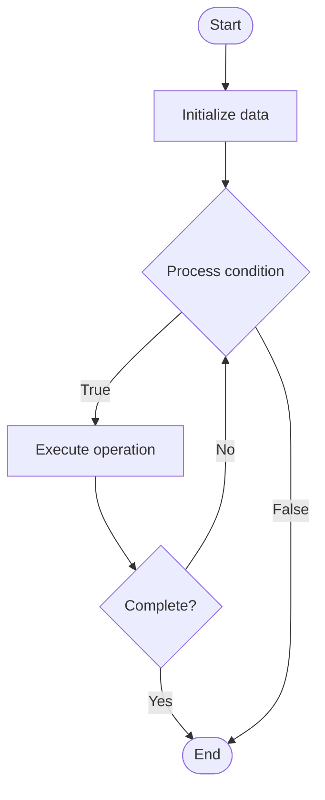

# Advanced Auto-Scaling

1. **Name of Algorithm**  

## Code Files


## Algorithm Visualization

### Flowchart (ASCII)


```
Advanced Auto-Scaling Flowchart:

┌─────────────┐
│   Start     │
└──────┬──────┘
       │
       ▼
┌─────────────┐
│  Initialize │
│   data      │
└──────┬──────┘
       │
       ▼
┌─────────────┐      Yes
│  Process   ├──────┐
│  condition?│      │
└──────┬──────┘      │
       │ No          │
       ▼             │
┌─────────────┐      │
│  Execute   │      │
│  operation │      │
└──────┬──────┘      │
       │             │
       └─────────────┘
       │
       ▼
┌─────────────┐
│    End      │
└─────────────┘
```


### Step-by-Step Execution


```
Advanced Auto-Scaling Step-by-Step Execution:

Input: [example data]

Step 1: Initialize
State: [initial state]

Step 2: Process
State: [intermediate state]

Step 3: Finalize
State: [final state]

Result: [output]
```


### Interactive Flowchart (Mermaid)





> **Note**: Mermaid diagrams are rendered automatically on GitHub. For local viewing, use a Mermaid-compatible Markdown viewer.
- [Python Implementation](semester_11/lecture_74_automation_advanced/auto_scaling_advanced/algorithm.py)
- [Java Implementation](semester_11/lecture_74_automation_advanced/auto_scaling_advanced/Algorithm.java)
- [Python Tests](semester_11/lecture_74_automation_advanced/auto_scaling_advanced/test_algorithm.py)


   Advanced Auto-Scaling

2. **What problem does it solve? (1 sentence)**  
   Automatically scales infrastructure resources up or down based on demand using advanced techniques like predictive scaling, multi-metric scaling, and custom scaling policies, optimizing performance and costs.

3. **Intuition (plain-language explanation)**  
   Like a smart thermostat: Advanced Auto-Scaling is like a smart thermostat that learns your patterns - it doesn't just react to temperature (current load), it predicts when you'll need heating/cooling (predictive scaling) and adjusts proactively - just as a smart thermostat saves energy and keeps you comfortable, advanced auto-scaling saves costs and maintains performance.

4. **Inputs & Outputs**  
   - Input: Metrics (CPU, memory, custom), scaling policies, predictive models, historical data, cost constraints.  
   - Output: Scaled resources, optimized capacity, cost savings, performance maintenance, adaptive infrastructure.

5. **Step-by-step description (5–10 lines max)**  
1. Monitor: monitor multiple metrics (CPU, memory, queue depth, custom).
2. Analyze: analyze metrics and trends.
3. Predict: predict future demand using ML models.
4. Evaluate: evaluate scaling policies and thresholds.
5. Decide: decide when and how much to scale.
6. Scale up: scale up resources when demand increases.
7. Scale down: scale down resources when demand decreases.
8. Optimize: optimize scaling for cost and performance.
9. Learn: learn from scaling decisions to improve predictions.
10. Adapt: adapt scaling policies based on patterns.

6. **Tiny example (hand-simulated)**  
   Advanced Auto-Scaling: metrics: CPU, memory, request rate → predict: traffic spike in 10 minutes → scale: preemptively scale up → result: handle spike without performance degradation → scale down: reduce after spike → cost: 30% savings vs fixed capacity → Advanced Auto-Scaling successful.

7. **Time & Space Complexity**  
   - Time: O(m + p + s) where m is monitoring time, p is prediction time, s is scaling time (continuous).  
   - Space: O(d + c) where d is data storage (metrics, history), c is configuration storage.

8. **Strengths**  
- Efficiency: optimizes resource usage and costs.
- Performance: maintains performance under varying load.
- Intelligence: uses predictive scaling for proactive adjustments.

9. **Weaknesses / limitations**  
- Complexity: advanced scaling can be complex to configure.
- Prediction: predictions may not always be accurate.
- Overscaling: may scale more than necessary.

10. **Compare with alternatives**  
    Alternatives: Manual Scaling, Basic Auto-Scaling, Fixed Capacity, Scheduled Scaling

11. **30-second explanation (your own words)**  
    Automatically scales infrastructure resources up or down based on demand using advanced techniques like predictive scaling, multi-metric scaling, and custom scaling policies, optimizing performance and costs.

*Sources: Adapted from standard university textbooks and Wikipedia summaries.*
