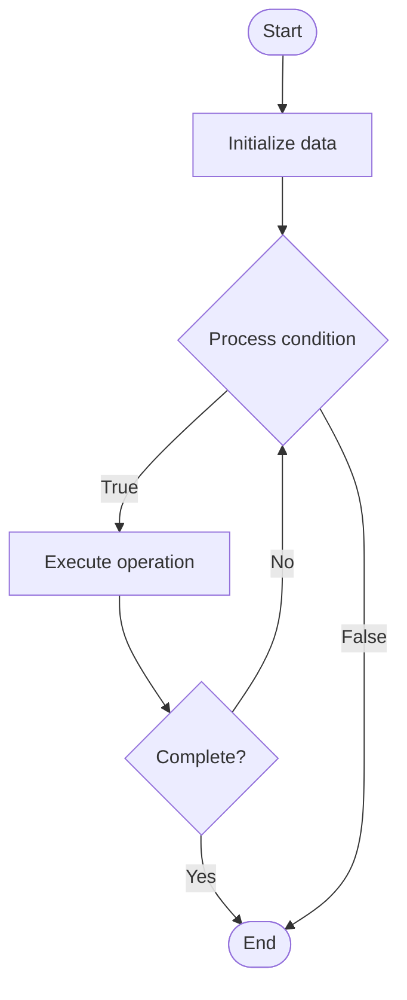

# Automated Remediation

## Учебные материалы

- [Школьный уровень](school.ru.md)
- [Университетский уровень](univer.ru.md)

## Algorithm Visualization

### Flowchart (ASCII)

```
Automated Remediation Flowchart:

┌─────────────┐
│   Start     │
└──────┬──────┘
       │
       ▼
┌─────────────┐
│  Initialize │
│   data      │
└──────┬──────┘
       │
       ▼
┌─────────────┐      Yes
│  Process   ├──────┐
│  condition?│      │
└──────┬──────┘      │
       │ No          │
       ▼             │
┌─────────────┐      │
│  Execute   │      │
│  operation │      │
└──────┬──────┘      │
       │             │
       └─────────────┘
       │
       ▼
┌─────────────┐
│    End      │
└─────────────┘
```

### Step-by-Step Execution

```
Automated Remediation Step-by-Step Execution:

Input: [example data]

Step 1: Initialize
State: [initial state]

Step 2: Process
State: [intermediate state]

Step 3: Finalize
State: [final state]

Result: [output]
```

### Interactive Flowchart (Mermaid)



> **Note**: Mermaid diagrams are rendered automatically on GitHub. For local viewing, use a Mermaid-compatible Markdown viewer.

- [Python Implementation](/code/semester_11/lecture_74_automation_advanced/automated_remediation/algorithm.py)
- [Java Implementation](/code/semester_11/lecture_74_automation_advanced/automated_remediation/Algorithm.java)
- [Python Tests](/code/semester_11/lecture_74_automation_advanced/automated_remediation/test_algorithm.py)

What problem does it solve? (1 sentence)  
   Automatically detects issues and applies fixes without human intervention, reducing mean time to resolution and improving system reliability.

Intuition (plain-language explanation)  
   Like a self-healing system: Automated Remediation is like a self-healing system - when something breaks (issue detected), it fixes itself automatically (remediation) without needing a doctor (human) - just as your body heals cuts automatically, automated remediation fixes system issues automatically, keeping systems healthy.

Inputs & Outputs  

  - Input: Monitoring alerts, issue patterns, remediation playbooks, system state, automation scripts.  
  - Output: Automated fixes, resolved issues, reduced downtime, improved reliability, remediation logs.

Step-by-step description (5–10 lines max)  
Detect: detect issues through monitoring and alerts.
Classify: classify issue type and severity.
Match: match issue to remediation playbook.
Validate: validate that automated remediation is safe.
Execute: execute remediation actions (restart, reconfigure, scale).
Verify: verify that remediation was successful.
Rollback: rollback if remediation causes problems.
Notify: notify team of remediation actions.
Learn: learn from remediation outcomes.
Improve: improve remediation playbooks based on experience.

Tiny example (hand-simulated)  
   Automated Remediation: alert: service unhealthy → classify: memory leak → match: restart playbook → validate: safe to restart → execute: restart service → verify: service healthy → notify: team notified → result: issue resolved in 2 minutes → Automated Remediation successful.

Time & Space Complexity  

  - Time: O(d + e + v) where d is detection time, e is execution time, v is verification time (automated, fast).  
  - Space: O(p + l) where p is playbook storage, l is log storage (remediation history).

Strengths  

- Speed: resolves issues much faster than manual intervention.
- Reliability: improves system reliability through quick fixes.
- Efficiency: reduces operational burden on teams.

Weaknesses / limitations  

- Safety: automated fixes must be carefully designed to avoid harm.
- Complexity: complex issues may require human intervention.
- Coverage: may not handle all types of issues.

Compare with alternatives  
    Alternatives: Manual Remediation, Alert-Only, Semi-Automated, Self-Healing Systems

30-second explanation (your own words)  

*Sources: Adapted from standard university textbooks and Wikipedia summaries.*


## References

- [Automated Remediation - Wikipedia](https://en.wikipedia.org/wiki/Automated%20Remediation)
