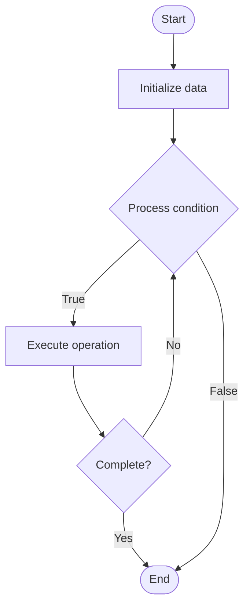

# Intelligent Automation

Name of Algorithm  

## Code Files


## Algorithm Visualization

### Flowchart (ASCII)


```
Intelligent Automation Flowchart:

┌─────────────┐
│   Start     │
└──────┬──────┘
       │
       ▼
┌─────────────┐
│  Initialize │
│   data      │
└──────┬──────┘
       │
       ▼
┌─────────────┐      Yes
│  Process   ├──────┐
│  condition?│      │
└──────┬──────┘      │
       │ No          │
       ▼             │
┌─────────────┐      │
│  Execute   │      │
│  operation │      │
└──────┬──────┘      │
       │             │
       └─────────────┘
       │
       ▼
┌─────────────┐
│    End      │
└─────────────┘
```


### Step-by-Step Execution


```
Intelligent Automation Step-by-Step Execution:

Input: [example data]

Step 1: Initialize
State: [initial state]

Step 2: Process
State: [intermediate state]

Step 3: Finalize
State: [final state]

Result: [output]
```


### Interactive Flowchart (Mermaid)





> **Note**: Mermaid diagrams are rendered automatically on GitHub. For local viewing, use a Mermaid-compatible Markdown viewer.
- [Python Implementation](/code/semester_11/lecture_74_automation_advanced/intelligent_automation/algorithm.py)
- [Java Implementation](/code/semester_11/lecture_74_automation_advanced/intelligent_automation/Algorithm.java)
- [Python Tests](/code/semester_11/lecture_74_automation_advanced/intelligent_automation/test_algorithm.py)


   Intelligent Automation

What problem does it solve? (1 sentence)  
   Uses AI and machine learning to automate complex decision-making and tasks that require intelligence, enabling automation of sophisticated operations beyond simple rule-based automation.

Intuition (plain-language explanation)  
   Like a smart assistant: Intelligent Automation is like having a smart assistant who doesn't just follow instructions (rule-based) but understands context and makes decisions (AI-powered) - they can handle complex situations, learn from experience, and adapt - just as a smart assistant can handle complex tasks, intelligent automation can automate sophisticated operations.

Inputs & Outputs  
   - Input: Complex tasks, context data, ML models, decision criteria, historical patterns, automation goals.  
   - Output: Intelligent decisions, automated actions, learned patterns, adaptive behavior, optimized outcomes.

Step-by-step description (5–10 lines max)  
Analyze: analyze task complexity and requirements.
Learn: learn patterns from historical data and examples.
Decide: make intelligent decisions using ML models.
Adapt: adapt behavior based on outcomes and feedback.
Execute: execute automated actions based on decisions.
Monitor: monitor outcomes and performance.
Learn: learn from results to improve decisions.
Optimize: optimize automation for better outcomes.
Evolve: evolve automation capabilities over time.
Integrate: integrate with other systems and processes.

Tiny example (hand-simulated)  
   Intelligent Automation: task: optimize resource allocation → learn: patterns from historical usage → decide: ML model predicts optimal allocation → adapt: adjust based on actual performance → execute: automatically allocate resources → result: 25% cost reduction → Intelligent Automation successful.

Time & Space Complexity  
   - Time: O(l + d + e) where l is learning time, d is decision time, e is execution time (varies by task).  
   - Space: O(m + d) where m is model storage, d is data storage (training data, patterns).

Strengths  
- Intelligence: handles complex tasks requiring intelligence.
- Adaptability: adapts to changing conditions and patterns.
- Optimization: optimizes outcomes through learning.

Weaknesses / limitations  
- Complexity: intelligent automation is complex to implement.
- Training: requires training data and model development.
- Explainability: decisions may be difficult to explain.

Compare with alternatives  
    Alternatives: Rule-Based Automation, Manual Operations, Script-Based Automation, ML-Assisted Automation

30-second explanation (your own words)  
    Uses AI and machine learning to automate complex decision-making and tasks that require intelligence, enabling automation of sophisticated operations beyond simple rule-based automation.

*Sources: Adapted from standard university textbooks and Wikipedia summaries.*
