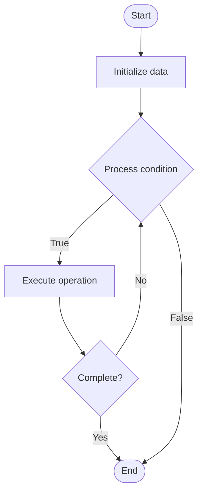

# Predictive Scaling

## Учебные материалы

- [Школьный уровень](school.ru.md)
- [Университетский уровень](univer.ru.md)

## Algorithm Visualization

### Flowchart (ASCII)

```
Predictive Scaling Flowchart:

┌─────────────┐
│   Start     │
└──────┬──────┘
       │
       ▼
┌─────────────┐
│  Initialize │
│   data      │
└──────┬──────┘
       │
       ▼
┌─────────────┐      Yes
│  Process   ├──────┐
│  condition?│      │
└──────┬──────┘      │
       │ No          │
       ▼             │
┌─────────────┐      │
│  Execute   │      │
│  operation │      │
└──────┬──────┘      │
       │             │
       └─────────────┘
       │
       ▼
┌─────────────┐
│    End      │
└─────────────┘
```

### Step-by-Step Execution

```
Predictive Scaling Step-by-Step Execution:

Input: [example data]

Step 1: Initialize
State: [initial state]

Step 2: Process
State: [intermediate state]

Step 3: Finalize
State: [final state]

Result: [output]
```

### Interactive Flowchart (Mermaid)



> **Note**: Mermaid diagrams are rendered automatically on GitHub. For local viewing, use a Mermaid-compatible Markdown viewer.

- [Python Implementation](/code/semester_11/lecture_74_automation_advanced/predictive_scaling/algorithm.py)
- [Java Implementation](/code/semester_11/lecture_74_automation_advanced/predictive_scaling/Algorithm.java)
- [Python Tests](/code/semester_11/lecture_74_automation_advanced/predictive_scaling/test_algorithm.py)

What problem does it solve? (1 sentence)  
   Predicts future demand using machine learning and historical patterns, scaling resources proactively before demand increases, reducing latency and improving user experience.

Intuition (plain-language explanation)  
   Like weather forecasting: Predictive Scaling is like weather forecasting for traffic - you predict when it will be busy (demand spike) and prepare ahead of time (scale up) - just as weather forecasts help you prepare for rain, predictive scaling helps you prepare for traffic spikes, ensuring smooth performance.

Inputs & Outputs  

  - Input: Historical metrics, time series data, patterns, ML models, scaling policies, prediction horizon.  
  - Output: Demand predictions, proactive scaling, reduced latency, optimized resources, improved performance.

Step-by-step description (5–10 lines max)  
Collect: collect historical metrics and patterns.
Train: train ML models on historical data.
Predict: predict future demand using models.
Analyze: analyze prediction confidence and patterns.
Decide: decide when to scale based on predictions.
Scale: scale resources proactively before demand spike.
Monitor: monitor actual demand vs predictions.
Adjust: adjust scaling based on actual demand.
Learn: learn from prediction accuracy to improve models.
Optimize: optimize predictions and scaling policies.

Tiny example (hand-simulated)  
   Predictive Scaling: history: traffic spikes at 9 AM daily → predict: spike expected in 15 minutes → scale: preemptively scale up → result: handle spike without latency → actual: spike occurs as predicted → adjust: scale down after spike → Predictive Scaling successful.

Time & Space Complexity  

  - Time: O(t + p + s) where t is training time, p is prediction time, s is scaling time (continuous).  
  - Space: O(m + d) where m is model storage, d is data storage (historical metrics).

Strengths  

- Proactive: scales before demand increases, reducing latency.
- Performance: maintains performance during traffic spikes.
- Efficiency: optimizes resource usage through predictions.

Weaknesses / limitations  

- Accuracy: predictions may not always be accurate.
- Complexity: requires ML models and historical data.
- Overscaling: may scale more than necessary.

Compare with alternatives  
    Alternatives: Reactive Scaling, Scheduled Scaling, Fixed Capacity, Basic Auto-Scaling

30-second explanation (your own words)  
    Predicts future demand using machine learning and historical patterns, scaling resources proactively before demand increases, reducing latency and improving user experience.

*Sources: Adapted from standard university textbooks and Wikipedia summaries.*
