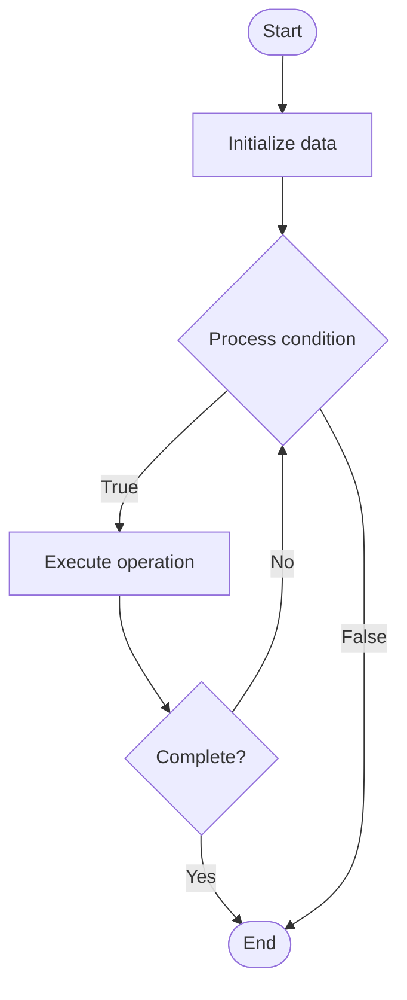

# Self-Healing Systems

## Учебные материалы

- [Школьный уровень](school.ru.md)
- [Университетский уровень](univer.ru.md)

## Algorithm Visualization

### Flowchart (ASCII)

```
Self-Healing Systems Flowchart:

┌─────────────┐
│   Start     │
└──────┬──────┘
       │
       ▼
┌─────────────┐
│  Initialize │
│   data      │
└──────┬──────┘
       │
       ▼
┌─────────────┐      Yes
│  Process   ├──────┐
│  condition?│      │
└──────┬──────┘      │
       │ No          │
       ▼             │
┌─────────────┐      │
│  Execute   │      │
│  operation │      │
└──────┬──────┘      │
       │             │
       └─────────────┘
       │
       ▼
┌─────────────┐
│    End      │
└─────────────┘
```

### Step-by-Step Execution

```
Self-Healing Systems Step-by-Step Execution:

Input: [example data]

Step 1: Initialize
State: [initial state]

Step 2: Process
State: [intermediate state]

Step 3: Finalize
State: [final state]

Result: [output]
```

### Interactive Flowchart (Mermaid)



> **Note**: Mermaid diagrams are rendered automatically on GitHub. For local viewing, use a Mermaid-compatible Markdown viewer.

- [Python Implementation](/code/semester_11/lecture_74_automation_advanced/self_healing_systems/algorithm.py)
- [Java Implementation](/code/semester_11/lecture_74_automation_advanced/self_healing_systems/Algorithm.java)
- [Python Tests](/code/semester_11/lecture_74_automation_advanced/self_healing_systems/test_algorithm.py)

   Self-Healing Systems

What problem does it solve? (1 sentence)  
   Automatically detects, diagnoses, and repairs system failures and issues without human intervention, maintaining system availability and reliability.

Intuition (plain-language explanation)  
Like the human immune system: Self-Healing Systems are like the human immune system - when you get sick (system failure), your body detects it (monitoring), identifies the problem (diagnosis), and fixes it (healing) automatically - just as your immune system keeps you healthy, self-healing systems keep infrastructure healthy by automatically fixing problems.

Inputs & Outputs  

  - Input: System metrics, health checks, failure patterns, healing strategies, recovery procedures, automation scripts.  
  - Output: Healed systems, recovered services, reduced downtime, improved reliability, healing logs.

Step-by-step description (5–10 lines max)  
Monitor: continuously monitor system health and metrics.
Detect: detect failures, anomalies, and issues.
Diagnose: diagnose root cause of issues.
Plan: plan healing strategy based on diagnosis.
Isolate: isolate affected components if needed.
Repair: execute healing actions (restart, reconfigure, replace).
Verify: verify that healing was successful.
Restore: restore normal operation.
Learn: learn from healing events to improve.
Prevent: take preventive measures to avoid recurrence.

Tiny example (hand-simulated)  
   Self-Healing Systems: monitor: service health checks → detect: service unhealthy → diagnose: memory leak → plan: restart strategy → isolate: route traffic away → repair: restart service → verify: service healthy → restore: route traffic back → result: auto-recovered in 3 minutes → Self-Healing Systems operational.

Time & Space Complexity  

  - Time: O(d + di + r) where d is detection time, di is diagnosis time, r is repair time (automated, fast).  
  - Space: O(s + l) where s is strategy storage, l is log storage (healing history).

Strengths  

- Reliability: improves system reliability through automatic recovery.
- Downtime: reduces downtime by quick automatic fixes.
- Efficiency: reduces need for manual intervention.

Weaknesses / limitations  

- Complexity: self-healing systems are complex to design.
- Coverage: may not handle all types of failures.
- Safety: healing actions must be carefully designed.

Compare with alternatives  
    Alternatives: Manual Recovery, Alert-Only, Automated Remediation, Reactive Systems

30-second explanation (your own words)  

*Sources: Adapted from standard university textbooks and Wikipedia summaries.*


## References

- [Self Healing Systems - Wikipedia](https://en.wikipedia.org/wiki/Self%20Healing%20Systems)
