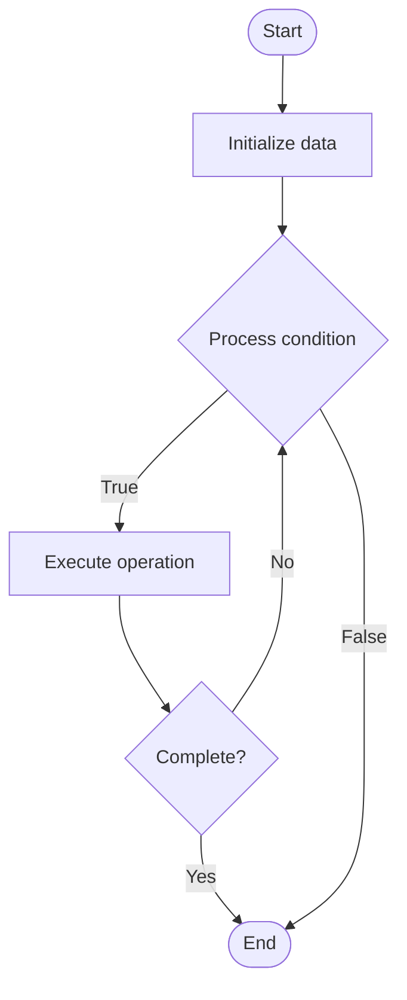

# Workflow Automation

## Учебные материалы

- [Школьный уровень](school.ru.md)
- [Университетский уровень](univer.ru.md)

## Algorithm Visualization

### Flowchart (ASCII)

```
Workflow Automation Flowchart:

┌─────────────┐
│   Start     │
└──────┬──────┘
       │
       ▼
┌─────────────┐
│  Initialize │
│   data      │
└──────┬──────┘
       │
       ▼
┌─────────────┐      Yes
│  Process   ├──────┐
│  condition?│      │
└──────┬──────┘      │
       │ No          │
       ▼             │
┌─────────────┐      │
│  Execute   │      │
│  operation │      │
└──────┬──────┘      │
       │             │
       └─────────────┘
       │
       ▼
┌─────────────┐
│    End      │
└─────────────┘
```

### Step-by-Step Execution

```
Workflow Automation Step-by-Step Execution:

Input: [example data]

Step 1: Initialize
State: [initial state]

Step 2: Process
State: [intermediate state]

Step 3: Finalize
State: [final state]

Result: [output]
```

### Interactive Flowchart (Mermaid)



> **Note**: Mermaid diagrams are rendered automatically on GitHub. For local viewing, use a Mermaid-compatible Markdown viewer.

- [Python Implementation](/code/semester_11/lecture_74_automation_advanced/workflow_automation/algorithm.py)
- [Java Implementation](/code/semester_11/lecture_74_automation_advanced/workflow_automation/Algorithm.java)
- [Python Tests](/code/semester_11/lecture_74_automation_advanced/workflow_automation/test_algorithm.py)

What problem does it solve? (1 sentence)  
   Automates complex business and technical workflows by orchestrating multiple steps, tasks, and systems, reducing manual effort and improving efficiency and consistency.

Intuition (plain-language explanation)  
   Like a production line: Workflow Automation is like an automated production line - instead of workers manually doing each step (manual workflow), machines do the steps automatically in sequence (automated workflow) - just as production lines make manufacturing faster and more consistent, workflow automation makes business processes faster and more reliable.

Inputs & Outputs  

  - Input: Workflow definitions, tasks, triggers, conditions, data, system integrations.  
  - Output: Automated workflows, executed tasks, workflow results, efficiency gains, consistent processes.

Step-by-step description (5–10 lines max)  
Define workflow: define workflow steps and dependencies.
Configure: configure tasks, triggers, and conditions.
Trigger: trigger workflow based on events or schedules.
Execute: execute workflow steps in sequence or parallel.
Monitor: monitor workflow execution and progress.
Handle: handle errors and retries.
Integrate: integrate with external systems and services.
Notify: notify stakeholders of workflow status.
Log: log workflow execution for audit.
Optimize: optimize workflows for efficiency.

Tiny example (hand-simulated)  
   Workflow Automation: trigger: new order → step 1: validate order → step 2: check inventory → step 3: process payment → step 4: send confirmation → step 5: update inventory → result: order processed automatically → Workflow Automation successful.

Time & Space Complexity  

  - Time: O(s·t) where s is number of steps, t is time per step (varies by workflow complexity).  
  - Space: O(w + d) where w is workflow definition storage, d is data storage (workflow state).

Strengths  

- Efficiency: automates repetitive tasks, saving time.
- Consistency: ensures consistent process execution.
- Reliability: reduces human error through automation.

Weaknesses / limitations  

- Complexity: complex workflows can be difficult to design.
- Flexibility: may be less flexible than manual processes.
- Maintenance: workflows require maintenance and updates.

Compare with alternatives  
    Alternatives: Manual Workflows, Script-Based Automation, Workflow Engines, Process Automation

30-second explanation (your own words)  
    Automates complex business and technical workflows by orchestrating multiple steps, tasks, and systems, reducing manual effort and improving efficiency and consistency.

*Sources: Adapted from standard university textbooks and Wikipedia summaries.*
