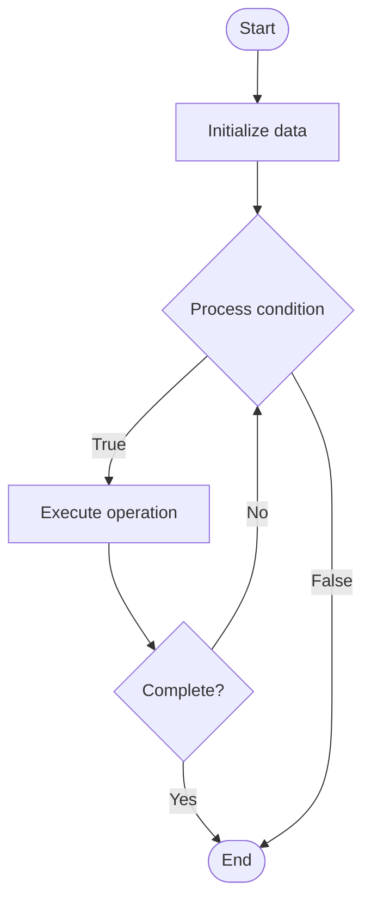

# Canary Analysis

1. **Name of Algorithm**  

## Code Files


## Algorithm Visualization

### Flowchart (ASCII)


```
Canary Analysis Flowchart:

┌─────────────┐
│   Start     │
└──────┬──────┘
       │
       ▼
┌─────────────┐
│  Initialize │
│   data      │
└──────┬──────┘
       │
       ▼
┌─────────────┐      Yes
│  Process   ├──────┐
│  condition?│      │
└──────┬──────┘      │
       │ No          │
       ▼             │
┌─────────────┐      │
│  Execute   │      │
│  operation │      │
└──────┬──────┘      │
       │             │
       └─────────────┘
       │
       ▼
┌─────────────┐
│    End      │
└─────────────┘
```


### Step-by-Step Execution


```
Canary Analysis Step-by-Step Execution:

Input: [example data]

Step 1: Initialize
State: [initial state]

Step 2: Process
State: [intermediate state]

Step 3: Finalize
State: [final state]

Result: [output]
```


### Interactive Flowchart (Mermaid)





> **Note**: Mermaid diagrams are rendered automatically on GitHub. For local viewing, use a Mermaid-compatible Markdown viewer.
- [Python Implementation](semester_11/lecture_75_gitops_advanced/canary_analysis/algorithm.py)
- [Java Implementation](semester_11/lecture_75_gitops_advanced/canary_analysis/Algorithm.java)
- [Python Tests](semester_11/lecture_75_gitops_advanced/canary_analysis/test_algorithm.py)


   Canary Analysis

2. **What problem does it solve? (1 sentence)**  
Analyzes metrics and behavior of canary deployments to automatically determine if a new version is safe to promote, enabling data-driven deployment decisions.

3. **Intuition (plain-language explanation)**  
Like a test flight: Canary Analysis is like analyzing a test flight before allowing all planes to use the new design - you test the new version (canary) with a small group, analyze how it performs (metrics, errors), and decide if it's safe to roll out to everyone - just as test flights ensure safety, canary analysis ensures new versions are safe before full deployment.

4. **Inputs & Outputs**  
   - Input: Canary metrics, baseline metrics, analysis criteria, success thresholds, error rates, performance data.  
   - Output: Analysis results, promotion decisions, risk assessments, metric comparisons, deployment recommendations.

5. **Step-by-step description (5–10 lines max)**  
1. Deploy canary: deploy new version to small percentage of traffic.
2. Collect metrics: collect metrics from canary and baseline.
3. Compare: compare canary metrics with baseline (error rate, latency, throughput).
4. Analyze: analyze differences and trends.
5. Evaluate: evaluate against success criteria and thresholds.
6. Detect: detect anomalies or regressions.
7. Decide: decide whether to promote, rollback, or continue canary.
8. Promote: automatically promote if analysis passes.
9. Rollback: automatically rollback if analysis fails.
10. Report: report analysis results and decisions.

6. **Tiny example (hand-simulated)**  
   Canary Analysis: canary: 10% traffic → metrics: error rate 0.1% (baseline: 0.05%), latency 50ms (baseline: 45ms) → analyze: slight increase but within threshold → evaluate: passes criteria → decide: promote to 50% → Canary Analysis successful.

7. **Time & Space Complexity**  
   - Time: O(m + a) where m is metric collection time, a is analysis time (continuous during canary).  
   - Space: O(d + m) where d is data storage, m is metric storage (time-series data).

8. **Strengths**  
- Data-driven: makes deployment decisions based on actual metrics.
- Safety: reduces risk by validating before full deployment.
- Automation: automates promotion/rollback decisions.

9. **Weaknesses / limitations**  
- Metrics: requires good metrics and monitoring.
- Thresholds: threshold selection can be challenging.
- Time: canary analysis takes time to collect sufficient data.

10. **Compare with alternatives**  
    Alternatives: Manual Review, Blue-Green Deployment, Rolling Deployment, Feature Flags

11. **30-second explanation (your own words)**  

*Sources: Adapted from standard university textbooks and Wikipedia summaries.*
