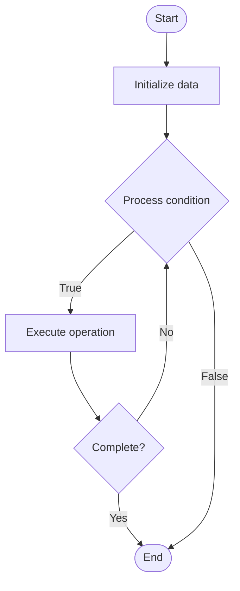

# Environment Management

1. **Name of Algorithm**  

## Code Files


## Algorithm Visualization

### Flowchart (ASCII)


```
Environment Management Flowchart:

┌─────────────┐
│   Start     │
└──────┬──────┘
       │
       ▼
┌─────────────┐
│  Initialize │
│   data      │
└──────┬──────┘
       │
       ▼
┌─────────────┐      Yes
│  Process   ├──────┐
│  condition?│      │
└──────┬──────┘      │
       │ No          │
       ▼             │
┌─────────────┐      │
│  Execute   │      │
│  operation │      │
└──────┬──────┘      │
       │             │
       └─────────────┘
       │
       ▼
┌─────────────┐
│    End      │
└─────────────┘
```


### Step-by-Step Execution


```
Environment Management Step-by-Step Execution:

Input: [example data]

Step 1: Initialize
State: [initial state]

Step 2: Process
State: [intermediate state]

Step 3: Finalize
State: [final state]

Result: [output]
```


### Interactive Flowchart (Mermaid)





> **Note**: Mermaid diagrams are rendered automatically on GitHub. For local viewing, use a Mermaid-compatible Markdown viewer.
- [Python Implementation](semester_11/lecture_75_gitops_advanced/environment_management/algorithm.py)
- [Java Implementation](semester_11/lecture_75_gitops_advanced/environment_management/Algorithm.java)
- [Python Tests](semester_11/lecture_75_gitops_advanced/environment_management/test_algorithm.py)


   Environment Management

2. **What problem does it solve? (1 sentence)**  
   Manages multiple deployment environments (dev, staging, prod) consistently through GitOps, ensuring environments are reproducible, versioned, and aligned with infrastructure as code.

3. **Intuition (plain-language explanation)**  
   Like managing multiple branches: Environment Management is like managing multiple branches of a store - you have dev (test store), staging (pilot store), and prod (real store), and you want them all to be consistent and managed the same way - GitOps ensures all environments are defined in code and managed consistently, like having the same blueprint for all stores.

4. **Inputs & Outputs**  
   - Input: Environment definitions, Git repositories, configuration files, infrastructure code, environment policies.  
   - Output: Managed environments, consistent configurations, versioned infrastructure, reproducible environments, environment state.

5. **Step-by-step description (5–10 lines max)**  
1. Define: define environments in Git (dev, staging, prod).
2. Version: version environment configurations.
3. Sync: sync Git state to environments (GitOps).
4. Provision: provision infrastructure for each environment.
5. Configure: configure environments with appropriate settings.
6. Deploy: deploy applications to environments.
7. Monitor: monitor environment health and state.
8. Update: update environments through Git commits.
9. Validate: validate environment consistency.
10. Maintain: maintain and update environments.

6. **Tiny example (hand-simulated)**  
   Environment Management: Git: environment configs → dev: auto-sync on commit → staging: manual approval → prod: approval + tests → sync: GitOps syncs to environments → result: all environments consistent → Environment Management operational.

7. **Time & Space Complexity**  
   - Time: O(e·s) where e is number of environments, s is sync time per environment (GitOps sync).  
   - Space: O(c + s) where c is configuration storage, s is state storage (environment state).

8. **Strengths**  
- Consistency: ensures environments are consistent and reproducible.
- Versioning: environments are versioned in Git.
- Automation: automates environment provisioning and updates.

9. **Weaknesses / limitations**  
- Complexity: managing multiple environments can be complex.
- Drift: environments may drift from Git state.
- Coordination: requires coordination across environments.

10. **Compare with alternatives**  
    Alternatives: Manual Environment Management, Infrastructure as Code, Environment Templates, Cloud Environments

11. **30-second explanation (your own words)**  
    Manages multiple deployment environments (dev, staging, prod) consistently through GitOps, ensuring environments are reproducible, versioned, and aligned with infrastructure as code.

*Sources: Adapted from standard university textbooks and Wikipedia summaries.*
