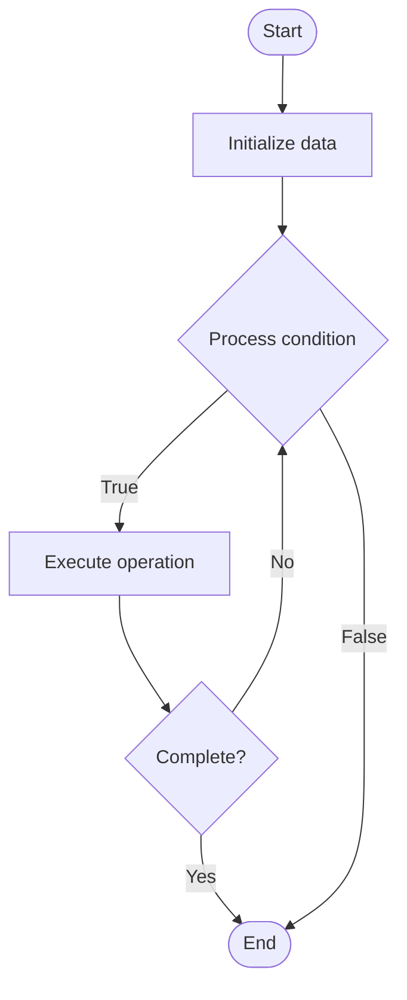

# Feature Management in GitOps

## Учебные материалы

- [Школьный уровень](school.ru.md)
- [Университетский уровень](univer.ru.md)

## Algorithm Visualization

### Flowchart (ASCII)

```
Feature Management in GitOps Flowchart:

┌─────────────┐
│   Start     │
└──────┬──────┘
       │
       ▼
┌─────────────┐
│  Initialize │
│   data      │
└──────┬──────┘
       │
       ▼
┌─────────────┐      Yes
│  Process   ├──────┐
│  condition?│      │
└──────┬──────┘      │
       │ No          │
       ▼             │
┌─────────────┐      │
│  Execute   │      │
│  operation │      │
└──────┬──────┘      │
       │             │
       └─────────────┘
       │
       ▼
┌─────────────┐
│    End      │
└─────────────┘
```

### Step-by-Step Execution

```
Feature Management in GitOps Step-by-Step Execution:

Input: [example data]

Step 1: Initialize
State: [initial state]

Step 2: Process
State: [intermediate state]

Step 3: Finalize
State: [final state]

Result: [output]
```

### Interactive Flowchart (Mermaid)



> **Note**: Mermaid diagrams are rendered automatically on GitHub. For local viewing, use a Mermaid-compatible Markdown viewer.

- [Python Implementation](/code/semester_11/lecture_75_gitops_advanced/feature_management/algorithm.py)
- [Java Implementation](/code/semester_11/lecture_75_gitops_advanced/feature_management/Algorithm.java)
- [Python Tests](/code/semester_11/lecture_75_gitops_advanced/feature_management/test_algorithm.py)

   Feature Management in GitOps

What problem does it solve? (1 sentence)  
   Manages feature flags and feature rollouts through GitOps workflows, enabling controlled feature releases and A/B testing with infrastructure as code principles.

Intuition (plain-language explanation)  
   Like a light switch: Feature Management in GitOps is like having light switches (feature flags) that you control through a central panel (Git) - you can turn features on/off (enable/disable flags) for different groups (environments, users) by changing the panel settings (Git config) - just as a central panel controls all lights, Git controls all feature flags.

Inputs & Outputs  

  - Input: Feature flags, Git repositories, rollout policies, target groups, feature configurations.  
  - Output: Managed feature flags, controlled rollouts, A/B test configurations, feature state, rollout status.

Step-by-step description (5–10 lines max)  
Define flags: define feature flags in Git configuration.
Configure: configure rollout policies and target groups.
Deploy: deploy feature flags to environments via GitOps.
Enable: enable features for specific groups or percentages.
Monitor: monitor feature usage and metrics.
Analyze: analyze feature performance and impact.
Adjust: adjust rollout percentage based on analysis.
Promote: promote features to more users gradually.
Disable: disable features if issues detected.
Version: version feature flag configurations in Git.

Tiny example (hand-simulated)  
   Feature Management: feature: new UI → flag: new-ui-enabled → Git: configure flag → deploy: GitOps deploys flag → enable: 10% users → monitor: metrics look good → promote: 50% users → result: controlled rollout → Feature Management successful.

Time & Space Complexity  

  - Time: O(f + d) where f is flag deployment time, d is decision time (GitOps sync).  
  - Space: O(c + s) where c is configuration storage, s is state storage (flag state).

Strengths  

- Control: enables controlled feature rollouts.
- Safety: allows quick feature disabling if issues occur.
- Testing: supports A/B testing and gradual rollouts.

Weaknesses / limitations  

- Complexity: managing many feature flags can be complex.
- Coordination: requires coordination between code and flags.
- Testing: requires testing flag combinations.

Compare with alternatives  
    Alternatives: Code-Based Features, Manual Feature Toggles, Feature Flag Services, Configuration Files

30-second explanation (your own words)  
    Manages feature flags and feature rollouts through GitOps workflows, enabling controlled feature releases and A/B testing with infrastructure as code principles.

*Sources: Adapted from standard university textbooks and Wikipedia summaries.*


## References

- [Feature Management - Wikipedia](https://en.wikipedia.org/wiki/Feature%20Management)
