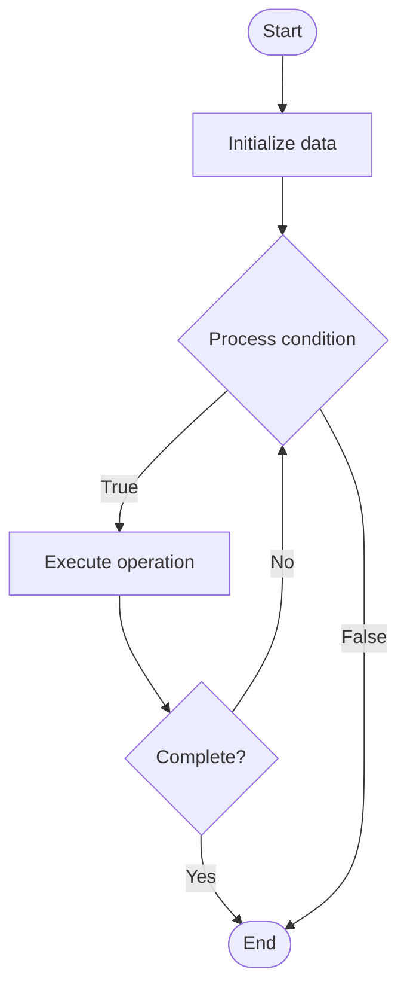

# GitOps Patterns

## Учебные материалы

- [Школьный уровень](school.ru.md)
- [Университетский уровень](univer.ru.md)

## Algorithm Visualization

### Flowchart (ASCII)

```
GitOps Patterns Flowchart:

┌─────────────┐
│   Start     │
└──────┬──────┘
       │
       ▼
┌─────────────┐
│  Initialize │
│   data      │
└──────┬──────┘
       │
       ▼
┌─────────────┐      Yes
│  Process   ├──────┐
│  condition?│      │
└──────┬──────┘      │
       │ No          │
       ▼             │
┌─────────────┐      │
│  Execute   │      │
│  operation │      │
└──────┬──────┘      │
       │             │
       └─────────────┘
       │
       ▼
┌─────────────┐
│    End      │
└─────────────┘
```

### Step-by-Step Execution

```
GitOps Patterns Step-by-Step Execution:

Input: [example data]

Step 1: Initialize
State: [initial state]

Step 2: Process
State: [intermediate state]

Step 3: Finalize
State: [final state]

Result: [output]
```

### Interactive Flowchart (Mermaid)



> **Note**: Mermaid diagrams are rendered automatically on GitHub. For local viewing, use a Mermaid-compatible Markdown viewer.

- [Python Implementation](/code/semester_11/lecture_75_gitops_advanced/gitops_patterns/algorithm.py)
- [Java Implementation](/code/semester_11/lecture_75_gitops_advanced/gitops_patterns/Algorithm.java)
- [Python Tests](/code/semester_11/lecture_75_gitops_advanced/gitops_patterns/test_algorithm.py)

   GitOps Patterns

What problem does it solve? (1 sentence)  
   Provides proven patterns and best practices for implementing GitOps workflows, enabling consistent, reliable, and scalable GitOps adoption across organizations.

Intuition (plain-language explanation)  
   Like design patterns: GitOps Patterns are like design patterns for GitOps - they provide proven ways (patterns) to structure GitOps workflows (push-based, pull-based, multi-repo, mono-repo) - just as design patterns help you build better software, GitOps patterns help you build better GitOps workflows.

Inputs & Outputs  

  - Input: GitOps requirements, repository structure, deployment needs, team structure, scalability requirements.  
  - Output: Pattern-based GitOps, consistent workflows, scalable architecture, best practices, proven solutions.

Step-by-step description (5–10 lines max)  
Assess: assess requirements and constraints.
Select pattern: select appropriate GitOps pattern (push, pull, multi-repo, mono-repo).
Design: design GitOps workflow using pattern.
Implement: implement pattern in Git and CI/CD.
Configure: configure GitOps operators and tools.
Validate: validate pattern implementation.
Document: document pattern usage and rationale.
Refine: refine pattern based on experience.
Reuse: reuse patterns across projects.
Evolve: evolve patterns as needs change.

Tiny example (hand-simulated)  
   GitOps Patterns: requirement: multiple teams, separate repos → pattern: multi-repo pattern → design: each team has own Git repo → implement: GitOps syncs from each repo → result: scalable, team-autonomous GitOps → GitOps Patterns successful.

Time & Space Complexity  

  - Time: O(d + i) where d is design time, i is implementation time (patterns reduce design time).  
  - Space: O(r + c) where r is repository storage, c is configuration storage.

Strengths  

- Proven: patterns are proven solutions to common problems.
- Consistency: ensures consistent GitOps implementation.
- Scalability: patterns support scalable GitOps adoption.

Weaknesses / limitations  

- Flexibility: patterns may be less flexible than custom solutions.
- Learning: requires understanding of patterns.
- Context: patterns must be adapted to specific contexts.

Compare with alternatives  
    Alternatives: Ad-Hoc GitOps, Custom Workflows, Template-Based, Pattern Libraries

30-second explanation (your own words)  

*Sources: Adapted from standard university textbooks and Wikipedia summaries.*
