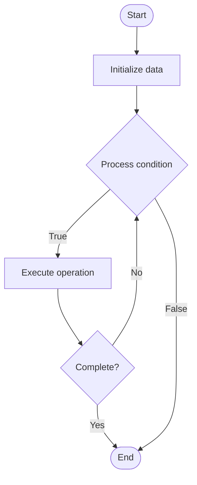

# GitOps Security

1. **Name of Algorithm**  

## Code Files


## Algorithm Visualization

### Flowchart (ASCII)


```
GitOps Security Flowchart:

┌─────────────┐
│   Start     │
└──────┬──────┘
       │
       ▼
┌─────────────┐
│  Initialize │
│   data      │
└──────┬──────┘
       │
       ▼
┌─────────────┐      Yes
│  Process   ├──────┐
│  condition?│      │
└──────┬──────┘      │
       │ No          │
       ▼             │
┌─────────────┐      │
│  Execute   │      │
│  operation │      │
└──────┬──────┘      │
       │             │
       └─────────────┘
       │
       ▼
┌─────────────┐
│    End      │
└─────────────┘
```


### Step-by-Step Execution


```
GitOps Security Step-by-Step Execution:

Input: [example data]

Step 1: Initialize
State: [initial state]

Step 2: Process
State: [intermediate state]

Step 3: Finalize
State: [final state]

Result: [output]
```


### Interactive Flowchart (Mermaid)





> **Note**: Mermaid diagrams are rendered automatically on GitHub. For local viewing, use a Mermaid-compatible Markdown viewer.
- [Python Implementation](semester_11/lecture_75_gitops_advanced/gitops_security/algorithm.py)
- [Java Implementation](semester_11/lecture_75_gitops_advanced/gitops_security/Algorithm.java)
- [Python Tests](semester_11/lecture_75_gitops_advanced/gitops_security/test_algorithm.py)


   GitOps Security

2. **What problem does it solve? (1 sentence)**  
   Secures GitOps workflows through access controls, secret management, policy enforcement, and audit trails, ensuring secure infrastructure and application deployments.

3. **Intuition (plain-language explanation)**  
Like a secure vault: GitOps Security is like securing a vault that controls important systems - you control who can access it (access controls), protect the keys (secret management), enforce rules (policies), and keep records of who did what (audit trails) - just as a secure vault protects valuable items, GitOps security protects your infrastructure and applications.

4. **Inputs & Outputs**  
   - Input: Git repositories, access policies, secrets, security policies, audit requirements, compliance needs.  
   - Output: Secured GitOps, access controls, managed secrets, policy enforcement, audit trails, compliance.

5. **Step-by-step description (5–10 lines max)**  
1. Control access: implement access controls for Git repositories.
2. Manage secrets: manage secrets securely (external secret management).
3. Enforce policies: enforce security policies (OPA, admission controllers).
4. Scan: scan Git commits for secrets and vulnerabilities.
5. Validate: validate configurations before deployment.
6. Audit: maintain audit trails of all GitOps operations.
7. Comply: ensure compliance with security standards.
8. Monitor: monitor GitOps operations for security issues.
9. Respond: respond to security incidents.
10. Improve: continuously improve GitOps security.

6. **Tiny example (hand-simulated)**  
   GitOps Security: Git: access control (RBAC) → secrets: external secret manager → policies: OPA validates configs → scan: detect secrets in commits → validate: security checks before deploy → audit: log all operations → result: secure GitOps → GitOps Security operational.

7. **Time & Space Complexity**  
   - Time: O(s + v) where s is scan time, v is validation time (security checks).  
   - Space: O(p + a) where p is policy storage, a is audit log storage.

8. **Strengths**  
- Security: ensures secure infrastructure and application deployments.
- Compliance: supports compliance with security standards.
- Auditability: provides audit trails for security and compliance.

9. **Weaknesses / limitations**  
- Complexity: security adds complexity to GitOps workflows.
- Overhead: security checks add overhead to deployments.
- Balance: balancing security with developer productivity.

10. **Compare with alternatives**  
    Alternatives: Unsecured GitOps, Manual Security, Post-Deployment Security, Security Tools

11. **30-second explanation (your own words)**  
    Secures GitOps workflows through access controls, secret management, policy enforcement, and audit trails, ensuring secure infrastructure and application deployments.

*Sources: Adapted from standard university textbooks and Wikipedia summaries.*
