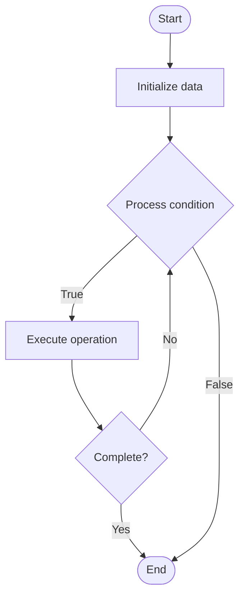

# Progressive Delivery

1. **Name of Algorithm**  

## Code Files


## Algorithm Visualization

### Flowchart (ASCII)


```
Progressive Delivery Flowchart:

┌─────────────┐
│   Start     │
└──────┬──────┘
       │
       ▼
┌─────────────┐
│  Initialize │
│   data      │
└──────┬──────┘
       │
       ▼
┌─────────────┐      Yes
│  Process   ├──────┐
│  condition?│      │
└──────┬──────┘      │
       │ No          │
       ▼             │
┌─────────────┐      │
│  Execute   │      │
│  operation │      │
└──────┬──────┘      │
       │             │
       └─────────────┘
       │
       ▼
┌─────────────┐
│    End      │
└─────────────┘
```


### Step-by-Step Execution


```
Progressive Delivery Step-by-Step Execution:

Input: [example data]

Step 1: Initialize
State: [initial state]

Step 2: Process
State: [intermediate state]

Step 3: Finalize
State: [final state]

Result: [output]
```


### Interactive Flowchart (Mermaid)





> **Note**: Mermaid diagrams are rendered automatically on GitHub. For local viewing, use a Mermaid-compatible Markdown viewer.
- [Python Implementation](semester_11/lecture_75_gitops_advanced/progressive_delivery/algorithm.py)
- [Java Implementation](semester_11/lecture_75_gitops_advanced/progressive_delivery/Algorithm.java)
- [Python Tests](semester_11/lecture_75_gitops_advanced/progressive_delivery/test_algorithm.py)


   Progressive Delivery

2. **What problem does it solve? (1 sentence)**  
   Deploys new versions gradually to users through techniques like canary deployments, feature flags, and A/B testing, reducing deployment risk and enabling data-driven rollouts.

3. **Intuition (plain-language explanation)**  
   Like a gradual rollout: Progressive Delivery is like gradually introducing a new product - instead of launching everywhere at once (risky), you start with a small group (canary), then expand gradually based on feedback - just as gradual product launches reduce risk, progressive delivery reduces deployment risk by testing with small groups first.

4. **Inputs & Outputs**  
   - Input: New version, deployment strategy, metrics, analysis criteria, rollout policies, target groups.  
   - Output: Progressive rollout, canary deployments, feature flags, A/B tests, deployment decisions, risk reduction.

5. **Step-by-step description (5–10 lines max)**  
1. Deploy canary: deploy new version to small percentage (canary).
2. Monitor: monitor canary metrics and behavior.
3. Analyze: analyze canary performance vs baseline.
4. Decide: decide whether to proceed, rollback, or continue.
5. Expand: gradually expand to more users if successful.
6. Feature flags: use feature flags for fine-grained control.
7. A/B test: optionally run A/B tests for comparison.
8. Promote: promote to full deployment if all checks pass.
9. Rollback: rollback if issues detected.
10. Iterate: iterate based on feedback and metrics.

6. **Tiny example (hand-simulated)**  
   Progressive Delivery: version: v2.0 → canary: 5% users → monitor: metrics good → expand: 25% users → analyze: still good → expand: 50% users → promote: 100% users → result: safe, gradual rollout → Progressive Delivery successful.

7. **Time & Space Complexity**  
   - Time: O(d + m + a) where d is deployment time, m is monitoring time, a is analysis time (gradual process).  
   - Space: O(c + m) where c is configuration storage, m is metric storage (monitoring data).

8. **Strengths**  
- Risk reduction: reduces deployment risk through gradual rollouts.
- Data-driven: makes decisions based on actual metrics.
- Flexibility: allows quick rollback if issues detected.

9. **Weaknesses / limitations**  
- Time: progressive delivery takes longer than immediate deployment.
- Complexity: managing progressive rollouts can be complex.
- Metrics: requires good metrics and monitoring.

10. **Compare with alternatives**  
    Alternatives: Immediate Deployment, Blue-Green Deployment, Rolling Deployment, Feature Flags

11. **30-second explanation (your own words)**  
    Deploys new versions gradually to users through techniques like canary deployments, feature flags, and A/B testing, reducing deployment risk and enabling data-driven rollouts.

*Sources: Adapted from standard university textbooks and Wikipedia summaries.*
