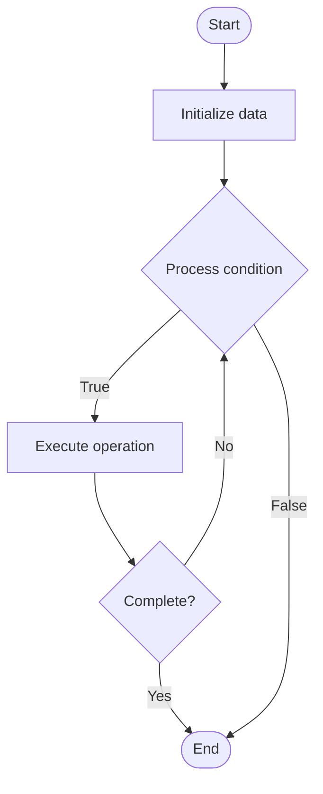

# Developer Experience (DX)

1. **Name of Algorithm**  

## Code Files


## Algorithm Visualization

### Flowchart (ASCII)


```
Developer Experience (DX) Flowchart:

┌─────────────┐
│   Start     │
└──────┬──────┘
       │
       ▼
┌─────────────┐
│  Initialize │
│   data      │
└──────┬──────┘
       │
       ▼
┌─────────────┐      Yes
│  Process   ├──────┐
│  condition?│      │
└──────┬──────┘      │
       │ No          │
       ▼             │
┌─────────────┐      │
│  Execute   │      │
│  operation │      │
└──────┬──────┘      │
       │             │
       └─────────────┘
       │
       ▼
┌─────────────┐
│    End      │
└─────────────┘
```


### Step-by-Step Execution


```
Developer Experience (DX) Step-by-Step Execution:

Input: [example data]

Step 1: Initialize
State: [initial state]

Step 2: Process
State: [intermediate state]

Step 3: Finalize
State: [final state]

Result: [output]
```


### Interactive Flowchart (Mermaid)





> **Note**: Mermaid diagrams are rendered automatically on GitHub. For local viewing, use a Mermaid-compatible Markdown viewer.
- [Python Implementation](semester_11/lecture_76_platform_engineering/developer_experience/algorithm.py)
- [Java Implementation](semester_11/lecture_76_platform_engineering/developer_experience/Algorithm.java)
- [Python Tests](semester_11/lecture_76_platform_engineering/developer_experience/test_algorithm.py)


   Developer Experience (DX)

2. **What problem does it solve? (1 sentence)**  
   Optimizes the experience of developers using platforms and tools by reducing friction, improving productivity, and providing intuitive interfaces and workflows.

3. **Intuition (plain-language explanation)**  
   Like user experience for developers: Developer Experience is like user experience (UX) but for developers - you design tools and platforms to be easy to use, fast, and helpful - just as good UX makes apps enjoyable for users, good DX makes development enjoyable and productive for developers.

4. **Inputs & Outputs**  
   - Input: Developer feedback, usage metrics, pain points, productivity data, tool interfaces, workflow designs.  
   - Output: Improved DX, optimized workflows, better tools, developer satisfaction, productivity gains, reduced friction.

5. **Step-by-step description (5–10 lines max)**  
1. Measure: measure current developer experience (surveys, metrics).
2. Identify: identify pain points and friction areas.
3. Design: design improved workflows and interfaces.
4. Simplify: simplify complex processes and tools.
5. Automate: automate repetitive tasks.
6. Document: provide clear documentation and examples.
7. Optimize: optimize for speed and efficiency.
8. Test: test improvements with developers.
9. Iterate: iterate based on feedback.
10. Monitor: continuously monitor and improve DX.

6. **Tiny example (hand-simulated)**  
   Developer Experience: pain point: slow local setup → improve: one-command setup script → result: setup time 2 hours → 10 minutes → developer satisfaction: 3/5 → 4.5/5 → Developer Experience improved.

7. **Time & Space Complexity**  
   - Time: O(m + i) where m is measurement time, i is improvement implementation time (ongoing process).  
   - Space: O(t + d) where t is tool storage, d is documentation storage.

8. **Strengths**  
- Productivity: improves developer productivity.
- Satisfaction: increases developer satisfaction and retention.
- Efficiency: reduces time spent on non-coding tasks.

9. **Weaknesses / limitations**  
- Subjectivity: DX is subjective and varies by developer.
- Investment: improving DX requires investment.
- Balance: balancing simplicity with functionality.

10. **Compare with alternatives**  
    Alternatives: Tool-Focused, Process-Focused, Manual Workflows, Developer Portals

11. **30-second explanation (your own words)**  

*Sources: Adapted from standard university textbooks and Wikipedia summaries.*
