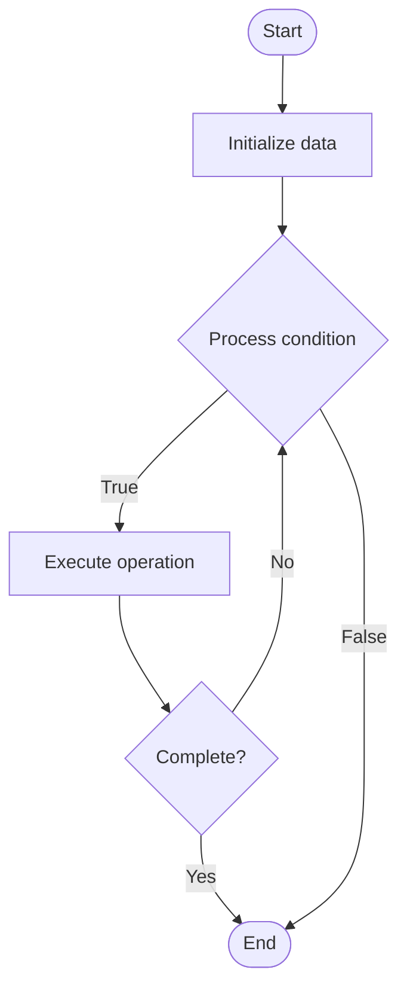

# Developer Portals

1. **Name of Algorithm**  

## Code Files


## Algorithm Visualization

### Flowchart (ASCII)


```
Developer Portals Flowchart:

┌─────────────┐
│   Start     │
└──────┬──────┘
       │
       ▼
┌─────────────┐
│  Initialize │
│   data      │
└──────┬──────┘
       │
       ▼
┌─────────────┐      Yes
│  Process   ├──────┐
│  condition?│      │
└──────┬──────┘      │
       │ No          │
       ▼             │
┌─────────────┐      │
│  Execute   │      │
│  operation │      │
└──────┬──────┘      │
       │             │
       └─────────────┘
       │
       ▼
┌─────────────┐
│    End      │
└─────────────┘
```


### Step-by-Step Execution


```
Developer Portals Step-by-Step Execution:

Input: [example data]

Step 1: Initialize
State: [initial state]

Step 2: Process
State: [intermediate state]

Step 3: Finalize
State: [final state]

Result: [output]
```


### Interactive Flowchart (Mermaid)





> **Note**: Mermaid diagrams are rendered automatically on GitHub. For local viewing, use a Mermaid-compatible Markdown viewer.
- [Python Implementation](semester_11/lecture_76_platform_engineering/developer_portals/algorithm.py)
- [Java Implementation](semester_11/lecture_76_platform_engineering/developer_portals/Algorithm.java)
- [Python Tests](semester_11/lecture_76_platform_engineering/developer_portals/test_algorithm.py)


   Developer Portals

2. **What problem does it solve? (1 sentence)**  
   Provides centralized portals where developers can discover, access, and manage services, APIs, documentation, and tools, improving developer productivity and self-service capabilities.

3. **Intuition (plain-language explanation)**  
   Like a developer's dashboard: Developer Portals are like a dashboard for developers - it's a central place where you can see all available services (catalog), access documentation (guides), manage your projects (self-service), and get help (support) - just as a dashboard gives you everything in one place, a developer portal gives developers everything they need in one place.

4. **Inputs & Outputs**  
   - Input: Service catalogs, API documentation, tools, developer resources, self-service capabilities, portal interfaces.  
   - Output: Developer portals, service discovery, self-service access, improved productivity, centralized resources.

5. **Step-by-step description (5–10 lines max)**  
1. Catalog services: catalog all available services and APIs.
2. Document: provide documentation for services and tools.
3. Create portal: create developer portal interface.
4. Enable discovery: enable service and API discovery.
5. Self-service: provide self-service capabilities (provisioning, access).
6. Integrate: integrate with development tools and workflows.
7. Support: provide support and help resources.
8. Monitor: monitor portal usage and feedback.
9. Update: continuously update portal content.
10. Improve: improve portal based on developer feedback.

6. **Tiny example (hand-simulated)**  
   Developer Portals: portal: developer.company.com → catalog: 50 services → docs: API documentation → self-service: provision databases → tools: integrated with Git, CI/CD → result: developers find and use services easily → Developer Portals successful.

7. **Time & Space Complexity**  
   - Time: O(c + d) where c is cataloging time, d is documentation time (ongoing maintenance).  
   - Space: O(p + c) where p is portal storage, c is catalog storage (service metadata).

8. **Strengths**  
- Discovery: enables easy discovery of services and tools.
- Self-service: reduces dependency on operations teams.
- Productivity: improves developer productivity through centralization.

9. **Weaknesses / limitations**  
- Maintenance: portals require ongoing maintenance.
- Content: keeping content up-to-date can be challenging.
- Adoption: requires developer adoption to be effective.

10. **Compare with alternatives**  
    Alternatives: Documentation Sites, Service Catalogs, API Gateways, Internal Wikis

11. **30-second explanation (your own words)**  
    Provides centralized portals where developers can discover, access, and manage services, APIs, documentation, and tools, improving developer productivity and self-service capabilities.

*Sources: Adapted from standard university textbooks and Wikipedia summaries.*
