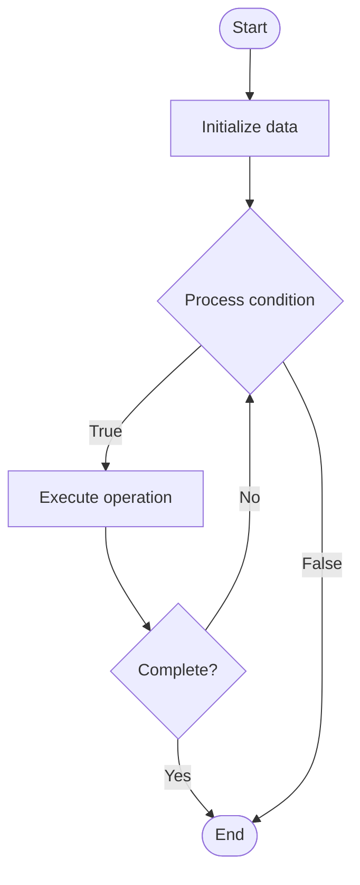

# Internal Developer Platforms (IDP)

Name of Algorithm  

## Code Files


## Algorithm Visualization

### Flowchart (ASCII)


```
Internal Developer Platforms (IDP) Flowchart:

┌─────────────┐
│   Start     │
└──────┬──────┘
       │
       ▼
┌─────────────┐
│  Initialize │
│   data      │
└──────┬──────┘
       │
       ▼
┌─────────────┐      Yes
│  Process   ├──────┐
│  condition?│      │
└──────┬──────┘      │
       │ No          │
       ▼             │
┌─────────────┐      │
│  Execute   │      │
│  operation │      │
└──────┬──────┘      │
       │             │
       └─────────────┘
       │
       ▼
┌─────────────┐
│    End      │
└─────────────┘
```


### Step-by-Step Execution


```
Internal Developer Platforms (IDP) Step-by-Step Execution:

Input: [example data]

Step 1: Initialize
State: [initial state]

Step 2: Process
State: [intermediate state]

Step 3: Finalize
State: [final state]

Result: [output]
```


### Interactive Flowchart (Mermaid)





> **Note**: Mermaid diagrams are rendered automatically on GitHub. For local viewing, use a Mermaid-compatible Markdown viewer.
- [Python Implementation](/code/semester_11/lecture_76_platform_engineering/internal_developer_platforms/algorithm.py)
- [Java Implementation](/code/semester_11/lecture_76_platform_engineering/internal_developer_platforms/Algorithm.java)
- [Python Tests](/code/semester_11/lecture_76_platform_engineering/internal_developer_platforms/test_algorithm.py)


   Internal Developer Platforms (IDP)

What problem does it solve? (1 sentence)  
   Provides self-service platforms that abstract infrastructure complexity and enable developers to deploy, scale, and manage applications without deep infrastructure knowledge.

Intuition (plain-language explanation)  
   Like a simplified control panel: Internal Developer Platforms are like a simplified control panel for complex machinery - instead of developers needing to understand all the machinery (infrastructure), they use a simple control panel (platform) that handles the complexity - just as a control panel makes complex machinery easy to use, an IDP makes complex infrastructure easy to use.

Inputs & Outputs  
   - Input: Infrastructure resources, platform services, developer requests, application requirements, platform APIs.  
   - Output: Self-service platform, abstracted infrastructure, deployed applications, managed services, developer productivity.

Step-by-step description (5–10 lines max)  
Abstract: abstract infrastructure complexity behind platform APIs.
Provide services: provide platform services (compute, storage, databases).
Enable self-service: enable developers to provision resources themselves.
Automate: automate deployment, scaling, and management.
Standardize: standardize development and deployment workflows.
Monitor: monitor platform usage and performance.
Optimize: optimize platform for developer needs.
Document: document platform capabilities and usage.
Support: provide platform support and training.
Evolve: evolve platform based on developer feedback.

Tiny example (hand-simulated)  
   Internal Developer Platform: developer: needs database → platform: self-service database provisioning → deploy: one-click deployment → scale: auto-scaling → monitor: built-in monitoring → result: developer deploys without ops knowledge → IDP successful.

Time & Space Complexity  
   - Time: O(p + d) where p is platform operation time, d is deployment time (abstracted, faster).  
   - Space: O(s + c) where s is service storage, c is configuration storage (platform state).

Strengths  
- Productivity: significantly improves developer productivity.
- Abstraction: abstracts infrastructure complexity.
- Self-service: enables self-service resource provisioning.

Weaknesses / limitations  
- Complexity: building and maintaining IDPs is complex.
- Investment: requires significant investment in platform development.
- Balance: balancing abstraction with flexibility.

Compare with alternatives  
    Alternatives: Direct Infrastructure Access, Manual Operations, Cloud Services, Platform as a Service

30-second explanation (your own words)  
    Provides self-service platforms that abstract infrastructure complexity and enable developers to deploy, scale, and manage applications without deep infrastructure knowledge.

*Sources: Adapted from standard university textbooks and Wikipedia summaries.*
