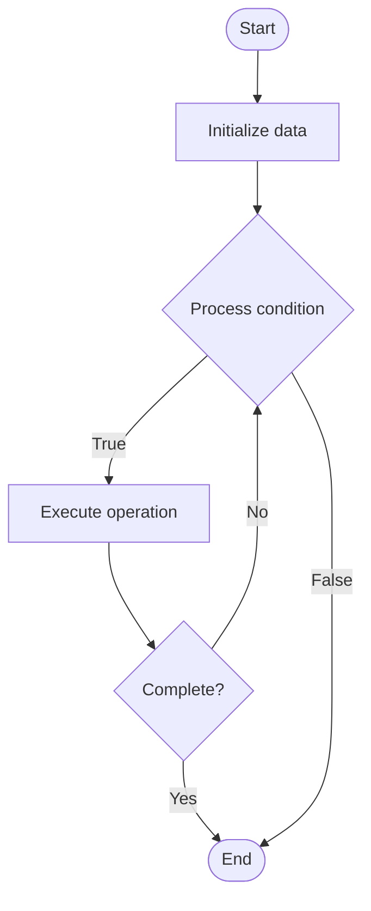

# Platform Abstraction

## Учебные материалы

- [Школьный уровень](school.ru.md)
- [Университетский уровень](univer.ru.md)

## Algorithm Visualization

### Flowchart (ASCII)

```
Platform Abstraction Flowchart:

┌─────────────┐
│   Start     │
└──────┬──────┘
       │
       ▼
┌─────────────┐
│  Initialize │
│   data      │
└──────┬──────┘
       │
       ▼
┌─────────────┐      Yes
│  Process   ├──────┐
│  condition?│      │
└──────┬──────┘      │
       │ No          │
       ▼             │
┌─────────────┐      │
│  Execute   │      │
│  operation │      │
└──────┬──────┘      │
       │             │
       └─────────────┘
       │
       ▼
┌─────────────┐
│    End      │
└─────────────┘
```

### Step-by-Step Execution

```
Platform Abstraction Step-by-Step Execution:

Input: [example data]

Step 1: Initialize
State: [initial state]

Step 2: Process
State: [intermediate state]

Step 3: Finalize
State: [final state]

Result: [output]
```

### Interactive Flowchart (Mermaid)



> **Note**: Mermaid diagrams are rendered automatically on GitHub. For local viewing, use a Mermaid-compatible Markdown viewer.

- [Python Implementation](/code/semester_11/lecture_76_platform_engineering/platform_abstraction/algorithm.py)
- [Java Implementation](/code/semester_11/lecture_76_platform_engineering/platform_abstraction/Algorithm.java)
- [Python Tests](/code/semester_11/lecture_76_platform_engineering/platform_abstraction/test_algorithm.py)

What problem does it solve? (1 sentence)  
   Abstracts underlying infrastructure and platform complexity behind simple, consistent APIs and interfaces, enabling developers to work at higher levels without dealing with low-level details.

Intuition (plain-language explanation)  
   Like a car's interface: Platform Abstraction is like a car's interface - you don't need to understand the engine (infrastructure) to drive, you just use the steering wheel and pedals (abstracted interface) - just as a car's interface hides engine complexity, platform abstraction hides infrastructure complexity, making it easier to use.

Inputs & Outputs  

  - Input: Infrastructure complexity, platform services, abstraction layers, APIs, developer needs.  
  - Output: Abstracted platform, simplified interfaces, consistent APIs, reduced complexity, improved usability.

Step-by-step description (5–10 lines max)  
Identify complexity: identify infrastructure and platform complexity.
Design abstraction: design abstraction layers and interfaces.
Create APIs: create simple, consistent APIs.
Hide details: hide low-level implementation details.
Standardize: standardize interfaces across services.
Document: document abstracted interfaces clearly.
Implement: implement abstraction layers.
Validate: validate that abstraction meets developer needs.
Optimize: optimize abstraction for usability.
Evolve: evolve abstraction as needs change.

Tiny example (hand-simulated)  
   Platform Abstraction: complexity: Kubernetes, networking, storage → abstract: simple 'deploy app' API → hide: Kubernetes details → result: developer deploys with one command → Platform Abstraction successful.

Time & Space Complexity  

  - Time: O(a + i) where a is abstraction design time, i is implementation time (one-time, then faster usage).  
  - Space: O(l + a) where l is abstraction layer storage, a is API storage.

Strengths  

- Simplicity: simplifies complex infrastructure for developers.
- Consistency: provides consistent interfaces across services.
- Productivity: improves developer productivity through abstraction.

Weaknesses / limitations  

- Flexibility: abstraction may limit flexibility for advanced use cases.
- Complexity: building good abstractions is complex.
- Learning: developers need to learn abstracted interfaces.

Compare with alternatives  
    Alternatives: Direct Access, Low-Level APIs, Manual Configuration, Service-Specific Interfaces

30-second explanation (your own words)  
    Abstracts underlying infrastructure and platform complexity behind simple, consistent APIs and interfaces, enabling developers to work at higher levels without dealing with low-level details.

*Sources: Adapted from standard university textbooks and Wikipedia summaries.*
