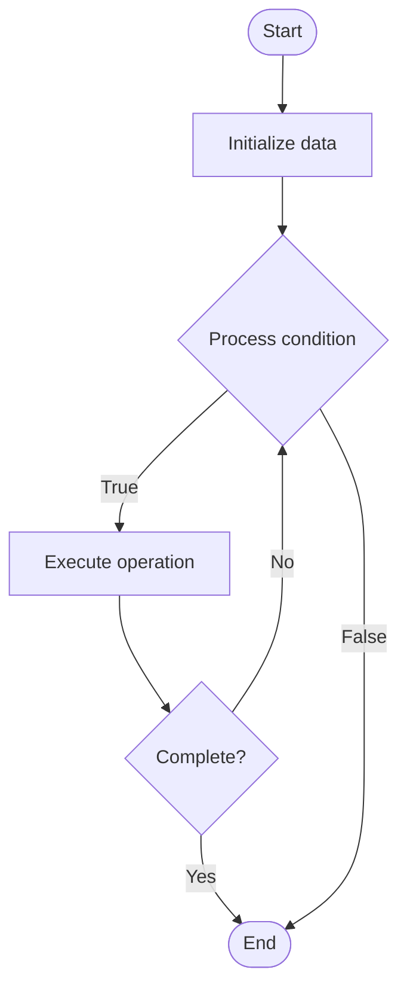

# Platform Metrics

## Учебные материалы

- [Школьный уровень](school.ru.md)
- [Университетский уровень](univer.ru.md)

## Algorithm Visualization

### Flowchart (ASCII)

```
Platform Metrics Flowchart:

┌─────────────┐
│   Start     │
└──────┬──────┘
       │
       ▼
┌─────────────┐
│  Initialize │
│   data      │
└──────┬──────┘
       │
       ▼
┌─────────────┐      Yes
│  Process   ├──────┐
│  condition?│      │
└──────┬──────┘      │
       │ No          │
       ▼             │
┌─────────────┐      │
│  Execute   │      │
│  operation │      │
└──────┬──────┘      │
       │             │
       └─────────────┘
       │
       ▼
┌─────────────┐
│    End      │
└─────────────┘
```

### Step-by-Step Execution

```
Platform Metrics Step-by-Step Execution:

Input: [example data]

Step 1: Initialize
State: [initial state]

Step 2: Process
State: [intermediate state]

Step 3: Finalize
State: [final state]

Result: [output]
```

### Interactive Flowchart (Mermaid)



> **Note**: Mermaid diagrams are rendered automatically on GitHub. For local viewing, use a Mermaid-compatible Markdown viewer.

- [Python Implementation](/code/semester_11/lecture_76_platform_engineering/platform_metrics/algorithm.py)
- [Java Implementation](/code/semester_11/lecture_76_platform_engineering/platform_metrics/Algorithm.java)
- [Python Tests](/code/semester_11/lecture_76_platform_engineering/platform_metrics/test_algorithm.py)

What problem does it solve? (1 sentence)  
Collects, analyzes, and presents metrics about platform usage, performance, and health, enabling platform teams to optimize platforms and demonstrate value.

Intuition (plain-language explanation)  
   Like business metrics: Platform Metrics are like business metrics for a platform - you track how many customers (developers) use it, how satisfied they are (adoption), and how well it performs (performance) - just as business metrics help improve a business, platform metrics help improve a platform.

Inputs & Outputs  

  - Input: Platform usage data, performance metrics, developer feedback, resource usage, adoption data.  
  - Output: Platform metrics, usage analytics, performance dashboards, adoption reports, optimization insights.

Step-by-step description (5–10 lines max)  
Define metrics: define key platform metrics (adoption, usage, performance).
Collect: collect metrics from platform services and tools.
Aggregate: aggregate metrics across services and time.
Analyze: analyze metrics for trends and patterns.
Visualize: visualize metrics in dashboards.
Report: generate platform metrics reports.
Benchmark: benchmark metrics against goals.
Identify: identify areas for improvement.
Optimize: optimize platform based on metrics.
Iterate: continuously measure and improve.

Tiny example (hand-simulated)  
   Platform Metrics: metrics: developer adoption (80%), average deployment time (5 min), platform uptime (99.9%) → analyze: adoption increasing, deployment time decreasing → report: platform value demonstrated → optimize: improve deployment time → Platform Metrics operational.

Time & Space Complexity  

  - Time: O(c + a) where c is collection time, a is analysis time (continuous monitoring).  
  - Space: O(m + d) where m is metric storage, d is dashboard storage (time-series data).

Strengths  

- Visibility: provides visibility into platform usage and performance.
- Optimization: enables data-driven platform optimization.
- Value: demonstrates platform value to stakeholders.

Weaknesses / limitations  

- Metrics: selecting right metrics can be challenging.
- Noise: too many metrics can cause information overload.
- Action: metrics must lead to actionable insights.

Compare with alternatives  
    Alternatives: No Metrics, Ad-Hoc Monitoring, Basic Metrics, Advanced Analytics

30-second explanation (your own words)  
Collects, analyzes, and presents metrics about platform usage, performance, and health, enabling platform teams to optimize platforms and demonstrate value.

*Sources: Adapted from standard university textbooks and Wikipedia summaries.*
