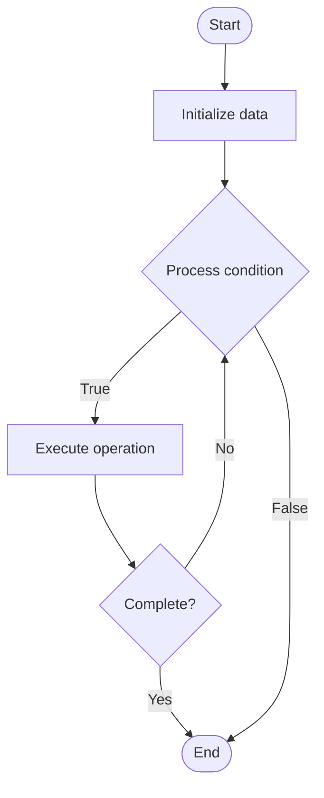

# Self-Service Platforms

## Учебные материалы

- [Школьный уровень](school.ru.md)
- [Университетский уровень](univer.ru.md)

## Algorithm Visualization

### Flowchart (ASCII)

```
Self-Service Platforms Flowchart:

┌─────────────┐
│   Start     │
└──────┬──────┘
       │
       ▼
┌─────────────┐
│  Initialize │
│   data      │
└──────┬──────┘
       │
       ▼
┌─────────────┐      Yes
│  Process   ├──────┐
│  condition?│      │
└──────┬──────┘      │
       │ No          │
       ▼             │
┌─────────────┐      │
│  Execute   │      │
│  operation │      │
└──────┬──────┘      │
       │             │
       └─────────────┘
       │
       ▼
┌─────────────┐
│    End      │
└─────────────┘
```

### Step-by-Step Execution

```
Self-Service Platforms Step-by-Step Execution:

Input: [example data]

Step 1: Initialize
State: [initial state]

Step 2: Process
State: [intermediate state]

Step 3: Finalize
State: [final state]

Result: [output]
```

### Interactive Flowchart (Mermaid)



> **Note**: Mermaid diagrams are rendered automatically on GitHub. For local viewing, use a Mermaid-compatible Markdown viewer.

- [Python Implementation](/code/semester_11/lecture_76_platform_engineering/self_service_platforms/algorithm.py)
- [Java Implementation](/code/semester_11/lecture_76_platform_engineering/self_service_platforms/Algorithm.java)
- [Python Tests](/code/semester_11/lecture_76_platform_engineering/self_service_platforms/test_algorithm.py)

   Self-Service Platforms

What problem does it solve? (1 sentence)  
   Enables developers to provision, configure, and manage resources and services independently through self-service interfaces, reducing dependency on operations teams and improving developer velocity.

Intuition (plain-language explanation)  
   Like self-checkout: Self-Service Platforms are like self-checkout at stores - instead of waiting for a cashier (operations team), you check out yourself (self-service) - just as self-checkout makes shopping faster, self-service platforms make development faster by letting developers help themselves.

Inputs & Outputs  

  - Input: Developer requests, resource requirements, platform services, self-service interfaces, automation capabilities.  
  - Output: Self-service access, provisioned resources, automated workflows, reduced wait times, improved velocity.

Step-by-step description (5–10 lines max)  
Provide interface: provide self-service interface (portal, CLI, API).
Catalog resources: catalog available resources and services.
Enable provisioning: enable self-service resource provisioning.
Automate: automate provisioning and configuration.
Govern: implement governance and policies.
Monitor: monitor self-service usage and costs.
Support: provide support and documentation.
Optimize: optimize self-service workflows.
Scale: scale self-service capabilities.
Iterate: iterate based on developer feedback.

Tiny example (hand-simulated)  
   Self-Service Platforms: developer: needs database → portal: self-service database provisioning → select: database type, size → provision: automated provisioning → result: database ready in 2 minutes (vs 2 days with ops) → Self-Service Platforms successful.

Time & Space Complexity  

  - Time: O(p + a) where p is provisioning time, a is automation time (much faster than manual).  
  - Space: O(i + r) where i is interface storage, r is resource storage (provisioned resources).

Strengths  

- Velocity: significantly improves developer velocity.
- Independence: reduces dependency on operations teams.
- Efficiency: automates repetitive provisioning tasks.

Weaknesses / limitations  

- Governance: requires governance to prevent misuse.
- Cost: self-service may lead to resource sprawl.
- Support: still requires support and documentation.

Compare with alternatives  
    Alternatives: Manual Provisioning, Ticket-Based, Approval Workflows, Automated Provisioning

30-second explanation (your own words)  
    Enables developers to provision, configure, and manage resources and services independently through self-service interfaces, reducing dependency on operations teams and improving developer velocity.

*Sources: Adapted from standard university textbooks and Wikipedia summaries.*
