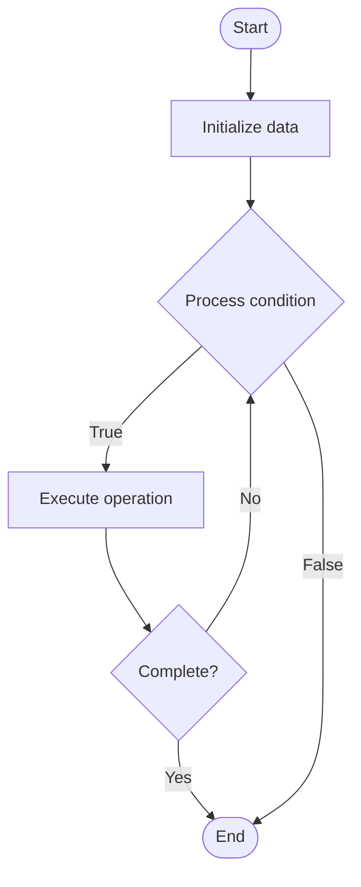

# Chaos Automation

1. **Name of Algorithm**  

## Code Files


## Algorithm Visualization

### Flowchart (ASCII)


```
Chaos Automation Flowchart:

┌─────────────┐
│   Start     │
└──────┬──────┘
       │
       ▼
┌─────────────┐
│  Initialize │
│   data      │
└──────┬──────┘
       │
       ▼
┌─────────────┐      Yes
│  Process   ├──────┐
│  condition?│      │
└──────┬──────┘      │
       │ No          │
       ▼             │
┌─────────────┐      │
│  Execute   │      │
│  operation │      │
└──────┬──────┘      │
       │             │
       └─────────────┘
       │
       ▼
┌─────────────┐
│    End      │
└─────────────┘
```


### Step-by-Step Execution


```
Chaos Automation Step-by-Step Execution:

Input: [example data]

Step 1: Initialize
State: [initial state]

Step 2: Process
State: [intermediate state]

Step 3: Finalize
State: [final state]

Result: [output]
```


### Interactive Flowchart (Mermaid)





> **Note**: Mermaid diagrams are rendered automatically on GitHub. For local viewing, use a Mermaid-compatible Markdown viewer.
- [Python Implementation](semester_11/lecture_77_chaos_engineering_advanced/chaos_automation/algorithm.py)
- [Java Implementation](semester_11/lecture_77_chaos_engineering_advanced/chaos_automation/Algorithm.java)
- [Python Tests](semester_11/lecture_77_chaos_engineering_advanced/chaos_automation/test_algorithm.py)


   Chaos Automation

2. **What problem does it solve? (1 sentence)**  
   Automates chaos engineering experiments through scheduled, continuous, and programmatic execution of chaos tests, enabling systematic resilience validation without manual intervention.

3. **Intuition (plain-language explanation)**  
   Like automated stress tests: Chaos Automation is like automated stress tests for systems - instead of manually testing resilience (manual chaos), automated systems continuously test resilience (automated chaos) - just as automated stress tests keep systems strong, chaos automation keeps systems resilient through continuous testing.

4. **Inputs & Outputs**  
   - Input: Chaos experiment definitions, schedules, automation scripts, system targets, safety rules, rollback procedures.  
   - Output: Automated chaos experiments, resilience reports, system validation, continuous testing, automated rollbacks.

5. **Step-by-step description (5–10 lines max)**  
1. Define experiments: define chaos experiments and scenarios.
2. Schedule: schedule experiments (continuous, periodic, event-driven).
3. Automate: automate experiment execution.
4. Inject faults: automatically inject faults into systems.
5. Monitor: monitor system behavior during experiments.
6. Analyze: analyze system resilience and recovery.
7. Rollback: automatically rollback if critical issues detected.
8. Report: generate resilience reports automatically.
9. Iterate: iterate experiments based on results.
10. Improve: continuously improve system resilience.

6. **Tiny example (hand-simulated)**  
   Chaos Automation: schedule: daily chaos experiments → inject: kill random pod → monitor: system recovers in 30s → analyze: resilience validated → report: daily resilience report → result: continuous resilience validation → Chaos Automation operational.

7. **Time & Space Complexity**  
   - Time: O(e + m + a) where e is experiment execution time, m is monitoring time, a is analysis time (automated, continuous).  
   - Space: O(d + r) where d is experiment definition storage, r is result storage (experiment history).

8. **Strengths**  
- Continuous: enables continuous resilience validation.
- Automation: reduces manual effort in chaos engineering.
- Systematic: provides systematic approach to resilience testing.

9. **Weaknesses / limitations**  
- Safety: requires careful safety rules to prevent damage.
- Complexity: automating chaos experiments can be complex.
- Coverage: may not cover all failure scenarios.

10. **Compare with alternatives**  
    Alternatives: Manual Chaos Engineering, Scheduled Chaos, Event-Driven Chaos, Chaos Platforms

11. **30-second explanation (your own words)**  
    Automates chaos engineering experiments through scheduled, continuous, and programmatic execution of chaos tests, enabling systematic resilience validation without manual intervention.

*Sources: Adapted from standard university textbooks and Wikipedia summaries.*
