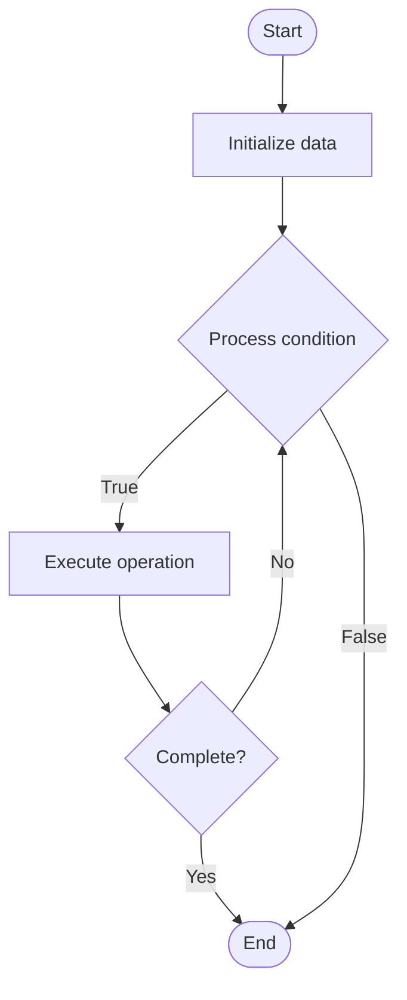

# Chaos Experiments

1. **Name of Algorithm**  

## Code Files


## Algorithm Visualization

### Flowchart (ASCII)


```
Chaos Experiments Flowchart:

┌─────────────┐
│   Start     │
└──────┬──────┘
       │
       ▼
┌─────────────┐
│  Initialize │
│   data      │
└──────┬──────┘
       │
       ▼
┌─────────────┐      Yes
│  Process   ├──────┐
│  condition?│      │
└──────┬──────┘      │
       │ No          │
       ▼             │
┌─────────────┐      │
│  Execute   │      │
│  operation │      │
└──────┬──────┘      │
       │             │
       └─────────────┘
       │
       ▼
┌─────────────┐
│    End      │
└─────────────┘
```


### Step-by-Step Execution


```
Chaos Experiments Step-by-Step Execution:

Input: [example data]

Step 1: Initialize
State: [initial state]

Step 2: Process
State: [intermediate state]

Step 3: Finalize
State: [final state]

Result: [output]
```


### Interactive Flowchart (Mermaid)





> **Note**: Mermaid diagrams are rendered automatically on GitHub. For local viewing, use a Mermaid-compatible Markdown viewer.
- [Python Implementation](semester_11/lecture_77_chaos_engineering_advanced/chaos_experiments/algorithm.py)
- [Java Implementation](semester_11/lecture_77_chaos_engineering_advanced/chaos_experiments/Algorithm.java)
- [Python Tests](semester_11/lecture_77_chaos_engineering_advanced/chaos_experiments/test_algorithm.py)


   Chaos Experiments

2. **What problem does it solve? (1 sentence)**  
   Designs and executes controlled experiments that inject failures into systems to test resilience, identify weaknesses, and validate recovery mechanisms.

3. **Intuition (plain-language explanation)**  
   Like fire drills: Chaos Experiments are like fire drills for systems - you intentionally create problems (inject failures) to test if your systems can handle them (resilience) - just as fire drills prepare you for real fires, chaos experiments prepare systems for real failures.

4. **Inputs & Outputs**  
   - Input: System architecture, failure scenarios, experiment hypotheses, safety rules, monitoring tools, rollback procedures.  
   - Output: Chaos experiments, resilience insights, failure points, recovery validation, improvement recommendations.

5. **Step-by-step description (5–10 lines max)**  
1. Hypothesize: form hypothesis about system behavior under failure.
2. Design: design experiment to test hypothesis.
3. Prepare: prepare system and monitoring.
4. Inject: inject failure (kill service, network partition, etc.).
5. Observe: observe system behavior and recovery.
6. Measure: measure recovery time and impact.
7. Analyze: analyze results and validate hypothesis.
8. Document: document findings and learnings.
9. Improve: improve system based on findings.
10. Iterate: iterate with new experiments.

6. **Tiny example (hand-simulated)**  
   Chaos Experiments: hypothesis: system recovers from database failure → inject: kill database pod → observe: system switches to replica in 10s → measure: 10s downtime → analyze: hypothesis validated, recovery works → improve: reduce recovery time → Chaos Experiments successful.

7. **Time & Space Complexity**  
   - Time: O(d + e + a) where d is design time, e is execution time, a is analysis time (varies by experiment).  
   - Space: O(e + r) where e is experiment storage, r is result storage (experiment data).

8. **Strengths**  
- Validation: validates system resilience in controlled manner.
- Learning: reveals system weaknesses before production failures.
- Confidence: builds confidence in system resilience.

9. **Weaknesses / limitations**  
- Risk: experiments can cause production issues if not careful.
- Time: designing and executing experiments takes time.
- Coverage: may not test all failure scenarios.

10. **Compare with alternatives**  
    Alternatives: No Testing, Manual Testing, Simulation, Production Incidents

11. **30-second explanation (your own words)**  

*Sources: Adapted from standard university textbooks and Wikipedia summaries.*
