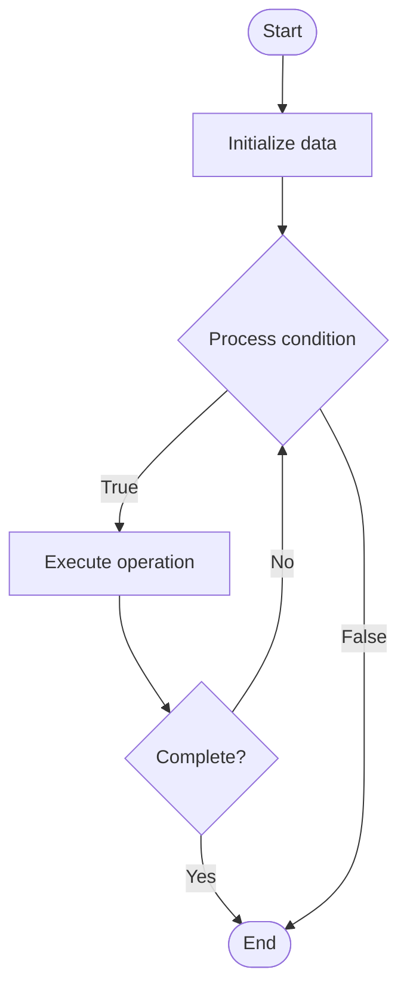

# Chaos Metrics

1. **Name of Algorithm**  

## Code Files


## Algorithm Visualization

### Flowchart (ASCII)


```
Chaos Metrics Flowchart:

┌─────────────┐
│   Start     │
└──────┬──────┘
       │
       ▼
┌─────────────┐
│  Initialize │
│   data      │
└──────┬──────┘
       │
       ▼
┌─────────────┐      Yes
│  Process   ├──────┐
│  condition?│      │
└──────┬──────┘      │
       │ No          │
       ▼             │
┌─────────────┐      │
│  Execute   │      │
│  operation │      │
└──────┬──────┘      │
       │             │
       └─────────────┘
       │
       ▼
┌─────────────┐
│    End      │
└─────────────┘
```


### Step-by-Step Execution


```
Chaos Metrics Step-by-Step Execution:

Input: [example data]

Step 1: Initialize
State: [initial state]

Step 2: Process
State: [intermediate state]

Step 3: Finalize
State: [final state]

Result: [output]
```


### Interactive Flowchart (Mermaid)





> **Note**: Mermaid diagrams are rendered automatically on GitHub. For local viewing, use a Mermaid-compatible Markdown viewer.
- [Python Implementation](semester_11/lecture_77_chaos_engineering_advanced/chaos_metrics/algorithm.py)
- [Java Implementation](semester_11/lecture_77_chaos_engineering_advanced/chaos_metrics/Algorithm.java)
- [Python Tests](semester_11/lecture_77_chaos_engineering_advanced/chaos_metrics/test_algorithm.py)


   Chaos Metrics

2. **What problem does it solve? (1 sentence)**  
   Defines and tracks metrics to measure system resilience during chaos experiments, enabling quantitative assessment of system behavior under failure conditions.

3. **Intuition (plain-language explanation)**  
   Like health metrics: Chaos Metrics are like health metrics during exercise - you measure heart rate, recovery time, etc. to see how your body handles stress - similarly, chaos metrics measure how systems handle failures (error rates, recovery time) to assess resilience.

4. **Inputs & Outputs**  
   - Input: System metrics, chaos experiment data, baseline metrics, resilience criteria, monitoring data.  
   - Output: Chaos metrics, resilience scores, recovery measurements, system health indicators, quantitative assessments.

5. **Step-by-step description (5–10 lines max)**  
1. Define metrics: define metrics to measure resilience (MTTR, error rate, availability).
2. Establish baseline: establish baseline metrics before chaos.
3. Collect: collect metrics during chaos experiments.
4. Compare: compare chaos metrics with baseline.
5. Calculate: calculate resilience scores and recovery times.
6. Analyze: analyze metric trends and patterns.
7. Assess: assess system resilience quantitatively.
8. Report: report metrics and resilience assessment.
9. Track: track metrics over time.
10. Improve: improve metrics through system improvements.

6. **Tiny example (hand-simulated)**  
   Chaos Metrics: baseline: 99.9% availability → chaos: inject failure → metrics: availability drops to 99.5%, MTTR 30s → compare: 0.4% drop, recovery in 30s → assess: good resilience → report: resilience score 8/10 → Chaos Metrics operational.

7. **Time & Space Complexity**  
   - Time: O(c + a) where c is collection time, a is analysis time (continuous during experiments).  
   - Space: O(m + h) where m is metric storage, h is historical data storage (time-series metrics).

8. **Strengths**  
- Quantitative: provides quantitative assessment of resilience.
- Objective: enables objective comparison of system resilience.
- Tracking: enables tracking of resilience improvements over time.

9. **Weaknesses / limitations**  
- Metrics: selecting right metrics can be challenging.
- Baseline: requires good baseline metrics for comparison.
- Interpretation: metrics require interpretation and context.

10. **Compare with alternatives**  
    Alternatives: Qualitative Assessment, No Metrics, Basic Metrics, Advanced Analytics

11. **30-second explanation (your own words)**  
    Defines and tracks metrics to measure system resilience during chaos experiments, enabling quantitative assessment of system behavior under failure conditions.

*Sources: Adapted from standard university textbooks and Wikipedia summaries.*
