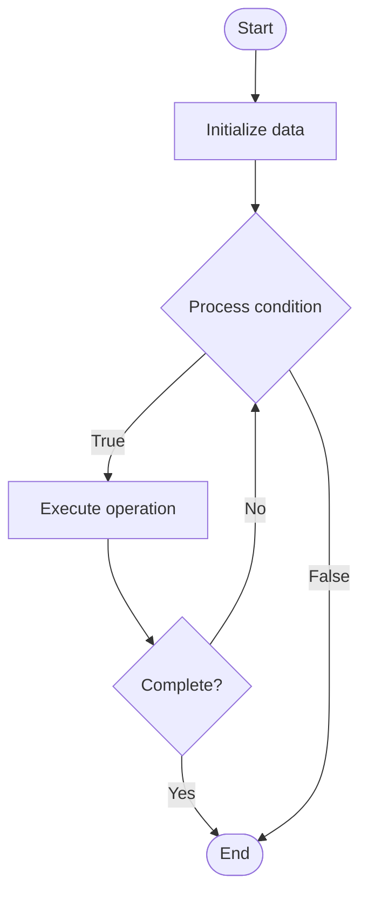

# Fault Injection

## Учебные материалы

- [Школьный уровень](school.ru.md)
- [Университетский уровень](univer.ru.md)

## Algorithm Visualization

### Flowchart (ASCII)

```
Fault Injection Flowchart:

┌─────────────┐
│   Start     │
└──────┬──────┘
       │
       ▼
┌─────────────┐
│  Initialize │
│   data      │
└──────┬──────┘
       │
       ▼
┌─────────────┐      Yes
│  Process   ├──────┐
│  condition?│      │
└──────┬──────┘      │
       │ No          │
       ▼             │
┌─────────────┐      │
│  Execute   │      │
│  operation │      │
└──────┬──────┘      │
       │             │
       └─────────────┘
       │
       ▼
┌─────────────┐
│    End      │
└─────────────┘
```

### Step-by-Step Execution

```
Fault Injection Step-by-Step Execution:

Input: [example data]

Step 1: Initialize
State: [initial state]

Step 2: Process
State: [intermediate state]

Step 3: Finalize
State: [final state]

Result: [output]
```

### Interactive Flowchart (Mermaid)



> **Note**: Mermaid diagrams are rendered automatically on GitHub. For local viewing, use a Mermaid-compatible Markdown viewer.

- [Python Implementation](/code/semester_11/lecture_77_chaos_engineering_advanced/fault_injection/algorithm.py)
- [Java Implementation](/code/semester_11/lecture_77_chaos_engineering_advanced/fault_injection/Algorithm.java)
- [Python Tests](/code/semester_11/lecture_77_chaos_engineering_advanced/fault_injection/test_algorithm.py)

What problem does it solve? (1 sentence)  
   Intentionally injects faults (failures, errors, delays) into systems to test resilience, validate error handling, and identify failure modes.

Intuition (plain-language explanation)  
   Like stress testing: Fault Injection is like stress testing for systems - you intentionally create problems (inject faults) to see how the system handles them - just as stress tests reveal weaknesses, fault injection reveals how systems handle failures.

Inputs & Outputs  

  - Input: System components, fault types, injection points, fault parameters, monitoring tools, safety rules.  
  - Output: Injected faults, system behavior, error handling validation, failure modes, resilience insights.

Step-by-step description (5–10 lines max)  
Identify targets: identify components to inject faults into.
Select faults: select fault types (crash, delay, error, resource exhaustion).
Configure: configure fault injection parameters.
Inject: inject fault into target component.
Observe: observe system behavior and error handling.
Measure: measure impact and recovery.
Analyze: analyze how system handles fault.
Document: document fault injection results.
Improve: improve error handling based on findings.
Iterate: iterate with different fault types.

Tiny example (hand-simulated)  
   Fault Injection: target: database service → fault: network delay 5s → inject: delay database requests → observe: system times out, retries, uses cache → measure: 5s delay, graceful degradation → analyze: good error handling → Fault Injection successful.

Time & Space Complexity  

  - Time: O(i + o + a) where i is injection time, o is observation time, a is analysis time (varies by fault type).  
  - Space: O(f + d) where f is fault configuration storage, d is data storage (injection logs).

Strengths  

- Testing: enables testing of error handling and recovery.
- Discovery: discovers failure modes before production.
- Validation: validates system resilience under faults.

Weaknesses / limitations  

- Risk: fault injection can cause production issues.
- Coverage: may not cover all fault types.
- Complexity: requires understanding of system architecture.

Compare with alternatives  
    Alternatives: No Testing, Manual Testing, Simulation, Chaos Engineering

30-second explanation (your own words)  
    Intentionally injects faults (failures, errors, delays) into systems to test resilience, validate error handling, and identify failure modes.

*Sources: Adapted from standard university textbooks and Wikipedia summaries.*
