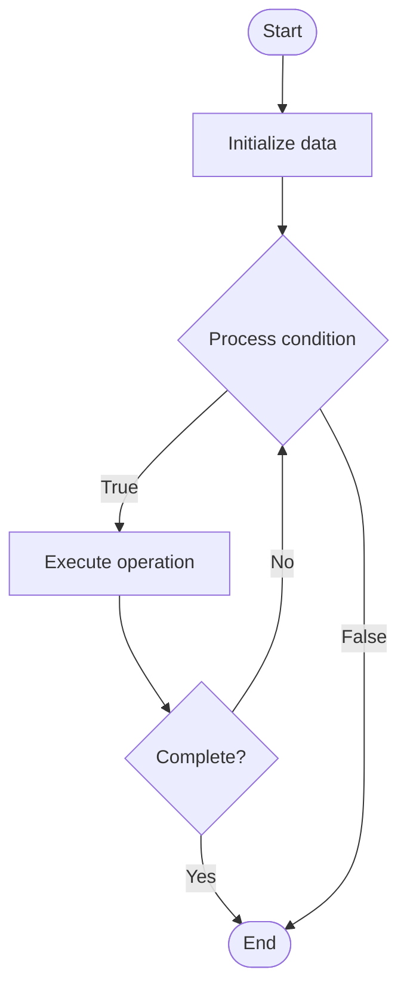

# Game Day Exercises

1. **Name of Algorithm**  

## Code Files


## Algorithm Visualization

### Flowchart (ASCII)


```
Game Day Exercises Flowchart:

┌─────────────┐
│   Start     │
└──────┬──────┘
       │
       ▼
┌─────────────┐
│  Initialize │
│   data      │
└──────┬──────┘
       │
       ▼
┌─────────────┐      Yes
│  Process   ├──────┐
│  condition?│      │
└──────┬──────┘      │
       │ No          │
       ▼             │
┌─────────────┐      │
│  Execute   │      │
│  operation │      │
└──────┬──────┘      │
       │             │
       └─────────────┘
       │
       ▼
┌─────────────┐
│    End      │
└─────────────┘
```


### Step-by-Step Execution


```
Game Day Exercises Step-by-Step Execution:

Input: [example data]

Step 1: Initialize
State: [initial state]

Step 2: Process
State: [intermediate state]

Step 3: Finalize
State: [final state]

Result: [output]
```


### Interactive Flowchart (Mermaid)





> **Note**: Mermaid diagrams are rendered automatically on GitHub. For local viewing, use a Mermaid-compatible Markdown viewer.
- [Python Implementation](semester_11/lecture_77_chaos_engineering_advanced/game_day_exercises/algorithm.py)
- [Java Implementation](semester_11/lecture_77_chaos_engineering_advanced/game_day_exercises/Algorithm.java)
- [Python Tests](semester_11/lecture_77_chaos_engineering_advanced/game_day_exercises/test_algorithm.py)


   Game Day Exercises

2. **What problem does it solve? (1 sentence)**  
   Conducts planned, team-based exercises where real failures are simulated in production-like environments to test incident response, team coordination, and system resilience.

3. **Intuition (plain-language explanation)**  
   Like fire drills: Game Day Exercises are like fire drills for tech teams - you simulate a real emergency (system failure) and practice responding to it (incident response) - just as fire drills prepare teams for real fires, game days prepare teams for real incidents.

4. **Inputs & Outputs**  
   - Input: Exercise scenarios, team members, production-like environment, monitoring tools, incident response procedures.  
   - Output: Exercise execution, team performance assessment, incident response validation, improvement recommendations, team learning.

5. **Step-by-step description (5–10 lines max)**  
1. Plan: plan exercise scenario and objectives.
2. Prepare: prepare environment and team.
3. Execute: execute exercise (simulate failure).
4. Respond: team responds to simulated incident.
5. Observe: observe team coordination and response.
6. Measure: measure response time and effectiveness.
7. Debrief: debrief with team after exercise.
8. Assess: assess team performance and procedures.
9. Improve: improve procedures based on learnings.
10. Iterate: iterate with new exercises.

6. **Tiny example (hand-simulated)**  
   Game Day Exercises: scenario: database failure → execute: simulate database crash → respond: team follows incident response → measure: 15 min to identify, 30 min to resolve → debrief: discuss learnings → improve: update runbooks → Game Day Exercises successful.

7. **Time & Space Complexity**  
   - Time: O(p + e + d) where p is planning time, e is execution time, d is debrief time (hours to days).  
   - Space: O(s + d) where s is scenario storage, d is documentation storage (exercise reports).

8. **Strengths**  
- Realistic: provides realistic practice in safe environment.
- Team building: improves team coordination and communication.
- Learning: reveals gaps in incident response procedures.

9. **Weaknesses / limitations**  
- Time: game days require significant time investment.
- Planning: requires careful planning to be effective.
- Resources: requires resources and environment setup.

10. **Compare with alternatives**  
    Alternatives: No Exercises, Tabletop Exercises, Simulations, Real Incidents

11. **30-second explanation (your own words)**  
    Conducts planned, team-based exercises where real failures are simulated in production-like environments to test incident response, team coordination, and system resilience.

*Sources: Adapted from standard university textbooks and Wikipedia summaries.*
