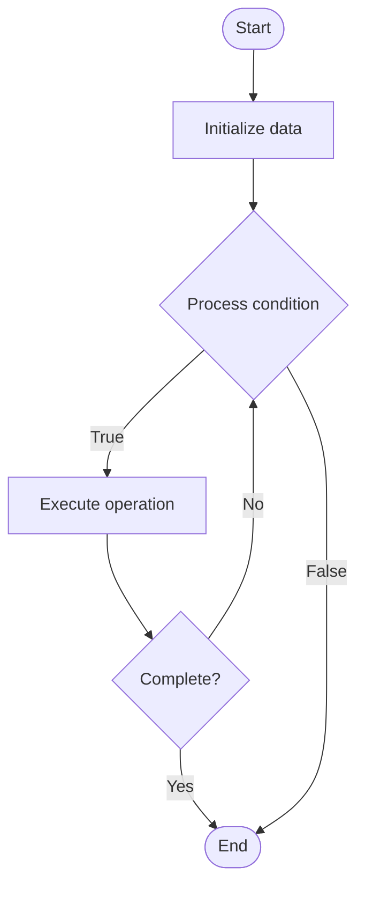

# Resilience Testing

1. **Name of Algorithm**  

## Code Files


## Algorithm Visualization

### Flowchart (ASCII)


```
Resilience Testing Flowchart:

┌─────────────┐
│   Start     │
└──────┬──────┘
       │
       ▼
┌─────────────┐
│  Initialize │
│   data      │
└──────┬──────┘
       │
       ▼
┌─────────────┐      Yes
│  Process   ├──────┐
│  condition?│      │
└──────┬──────┘      │
       │ No          │
       ▼             │
┌─────────────┐      │
│  Execute   │      │
│  operation │      │
└──────┬──────┘      │
       │             │
       └─────────────┘
       │
       ▼
┌─────────────┐
│    End      │
└─────────────┘
```


### Step-by-Step Execution


```
Resilience Testing Step-by-Step Execution:

Input: [example data]

Step 1: Initialize
State: [initial state]

Step 2: Process
State: [intermediate state]

Step 3: Finalize
State: [final state]

Result: [output]
```


### Interactive Flowchart (Mermaid)





> **Note**: Mermaid diagrams are rendered automatically on GitHub. For local viewing, use a Mermaid-compatible Markdown viewer.
- [Python Implementation](semester_11/lecture_77_chaos_engineering_advanced/resilience_testing/algorithm.py)
- [Java Implementation](semester_11/lecture_77_chaos_engineering_advanced/resilience_testing/Algorithm.java)
- [Python Tests](semester_11/lecture_77_chaos_engineering_advanced/resilience_testing/test_algorithm.py)


   Resilience Testing

2. **What problem does it solve? (1 sentence)**  
   Tests system resilience by subjecting systems to various failure conditions and measuring their ability to maintain functionality, recover, and degrade gracefully.

3. **Intuition (plain-language explanation)**  
Like durability testing: Resilience Testing is like durability testing for products - you test how well something handles stress and damage (failures) - just as durability tests ensure products last, resilience tests ensure systems handle failures well.

4. **Inputs & Outputs**  
   - Input: System under test, failure scenarios, test cases, resilience criteria, monitoring tools, recovery procedures.  
   - Output: Resilience test results, recovery measurements, failure handling validation, resilience scores, improvement recommendations.

5. **Step-by-step description (5–10 lines max)**  
1. Define criteria: define resilience criteria and success metrics.
2. Design tests: design tests for various failure scenarios.
3. Execute: execute resilience tests.
4. Inject failures: inject failures into system.
5. Measure: measure system behavior and recovery.
6. Assess: assess resilience against criteria.
7. Document: document test results and findings.
8. Analyze: analyze failure modes and recovery mechanisms.
9. Improve: improve system resilience based on findings.
10. Retest: retest after improvements.

6. **Tiny example (hand-simulated)**  
   Resilience Testing: test: database failure → inject: kill database → measure: system switches to replica in 10s, 99.5% availability maintained → assess: meets resilience criteria → document: test passed → Resilience Testing successful.

7. **Time & Space Complexity**  
   - Time: O(d + e + a) where d is design time, e is execution time, a is analysis time (varies by test scope).  
   - Space: O(t + r) where t is test storage, r is result storage (test data).

8. **Strengths**  
- Validation: validates system resilience systematically.
- Coverage: tests multiple failure scenarios.
- Improvement: identifies areas for resilience improvement.

9. **Weaknesses / limitations**  
- Time: comprehensive resilience testing takes time.
- Coverage: may not test all possible failure scenarios.
- Environment: requires appropriate test environment.

10. **Compare with alternatives**  
    Alternatives: No Testing, Manual Testing, Chaos Engineering, Production Monitoring

11. **30-second explanation (your own words)**  
    Tests system resilience by subjecting systems to various failure conditions and measuring their ability to maintain functionality, recover, and degrade gracefully.

*Sources: Adapted from standard university textbooks and Wikipedia summaries.*
