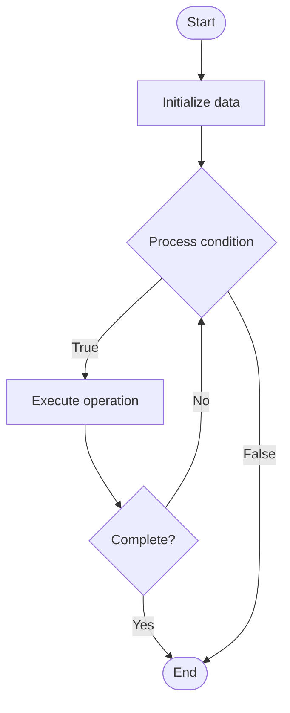

# AIOps (Artificial Intelligence for IT Operations)

Name of Algorithm  

## Code Files


## Algorithm Visualization

### Flowchart (ASCII)


```
AIOps (Artificial Intelligence for IT Operations) Flowchart:

┌─────────────┐
│   Start     │
└──────┬──────┘
       │
       ▼
┌─────────────┐
│  Initialize │
│   data      │
└──────┬──────┘
       │
       ▼
┌─────────────┐      Yes
│  Process   ├──────┐
│  condition?│      │
└──────┬──────┘      │
       │ No          │
       ▼             │
┌─────────────┐      │
│  Execute   │      │
│  operation │      │
└──────┬──────┘      │
       │             │
       └─────────────┘
       │
       ▼
┌─────────────┐
│    End      │
└─────────────┘
```


### Step-by-Step Execution


```
AIOps (Artificial Intelligence for IT Operations) Step-by-Step Execution:

Input: [example data]

Step 1: Initialize
State: [initial state]

Step 2: Process
State: [intermediate state]

Step 3: Finalize
State: [final state]

Result: [output]
```


### Interactive Flowchart (Mermaid)





> **Note**: Mermaid diagrams are rendered automatically on GitHub. For local viewing, use a Mermaid-compatible Markdown viewer.
- [Python Implementation](/code/semester_11/lecture_78_observability_platform/aiops/algorithm.py)
- [Java Implementation](/code/semester_11/lecture_78_observability_platform/aiops/Algorithm.java)
- [Python Tests](/code/semester_11/lecture_78_observability_platform/aiops/test_algorithm.py)


   AIOps (Artificial Intelligence for IT Operations)

What problem does it solve? (1 sentence)  
Uses artificial intelligence and machine learning to automate IT operations, detect anomalies, predict issues, and optimize system performance and reliability.

Intuition (plain-language explanation)  
   Like a smart assistant for IT: AIOps is like having a smart assistant for IT operations - it watches everything (monitoring), learns patterns (ML), predicts problems (anomaly detection), and fixes issues automatically (automation) - just as a smart assistant helps you manage tasks, AIOps helps manage IT operations intelligently.

Inputs & Outputs  
   - Input: IT metrics, logs, traces, events, ML models, historical data, operational knowledge.  
   - Output: Automated operations, anomaly detection, predictions, root cause analysis, optimization recommendations, incident prevention.

Step-by-step description (5–10 lines max)  
Collect: collect IT data (metrics, logs, traces).
Ingest: ingest data into AIOps platform.
Analyze: analyze data using ML models.
Detect: detect anomalies and patterns.
Predict: predict potential issues and failures.
Correlate: correlate events to identify root causes.
Automate: automate responses and remediation.
Alert: alert on critical issues.
Learn: learn from incidents and outcomes.
Optimize: optimize operations based on insights.

Tiny example (hand-simulated)  
   AIOps: data: collect metrics, logs → analyze: ML detects anomaly pattern → predict: predicts disk failure in 2 days → alert: notify ops team → automate: auto-scale before traffic spike → result: proactive operations → AIOps operational.

Time & Space Complexity  
   - Time: O(c + a + p) where c is collection time, a is analysis time, p is prediction time (continuous, real-time).  
   - Space: O(d + m) where d is data storage, m is model storage (ML models, historical data).

Strengths  
- Automation: automates IT operations tasks.
- Intelligence: uses AI for intelligent decision-making.
- Proactive: enables proactive issue detection and prevention.

Weaknesses / limitations  
- Complexity: AIOps systems are complex to implement.
- Data: requires large amounts of quality data.
- Trust: requires trust in AI decisions.

Compare with alternatives  
    Alternatives: Manual Operations, Traditional Monitoring, Rule-Based Automation, ML-Assisted Operations

30-second explanation (your own words)  
Uses artificial intelligence and machine learning to automate IT operations, detect anomalies, predict issues, and optimize system performance and reliability.

*Sources: Adapted from standard university textbooks and Wikipedia summaries.*
