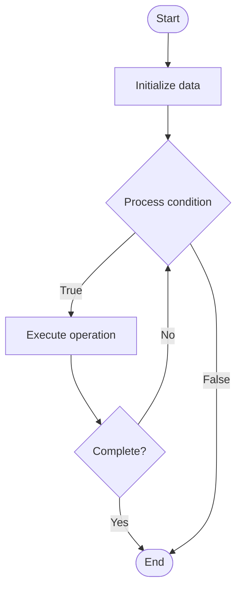

# Anomaly Detection in Observability

1. **Name of Algorithm**  

## Code Files


## Algorithm Visualization

### Flowchart (ASCII)


```
Anomaly Detection in Observability Flowchart:

┌─────────────┐
│   Start     │
└──────┬──────┘
       │
       ▼
┌─────────────┐
│  Initialize │
│   data      │
└──────┬──────┘
       │
       ▼
┌─────────────┐      Yes
│  Process   ├──────┐
│  condition?│      │
└──────┬──────┘      │
       │ No          │
       ▼             │
┌─────────────┐      │
│  Execute   │      │
│  operation │      │
└──────┬──────┘      │
       │             │
       └─────────────┘
       │
       ▼
┌─────────────┐
│    End      │
└─────────────┘
```


### Step-by-Step Execution


```
Anomaly Detection in Observability Step-by-Step Execution:

Input: [example data]

Step 1: Initialize
State: [initial state]

Step 2: Process
State: [intermediate state]

Step 3: Finalize
State: [final state]

Result: [output]
```


### Interactive Flowchart (Mermaid)





> **Note**: Mermaid diagrams are rendered automatically on GitHub. For local viewing, use a Mermaid-compatible Markdown viewer.
- [Python Implementation](semester_11/lecture_78_observability_platform/anomaly_detection/algorithm.py)
- [Java Implementation](semester_11/lecture_78_observability_platform/anomaly_detection/Algorithm.java)
- [Python Tests](semester_11/lecture_78_observability_platform/anomaly_detection/test_algorithm.py)


   Anomaly Detection in Observability

2. **What problem does it solve? (1 sentence)**  
   Detects unusual patterns, behaviors, or events in system metrics, logs, and traces that deviate from normal baselines, enabling early detection of issues and incidents.

3. **Intuition (plain-language explanation)**  
   Like a smoke detector: Anomaly Detection is like a smoke detector for systems - it watches for unusual patterns (smoke) that indicate problems (fire) - just as smoke detectors alert you to fires early, anomaly detection alerts you to system issues early.

4. **Inputs & Outputs**  
   - Input: Time-series metrics, logs, traces, baseline patterns, detection algorithms, thresholds.  
   - Output: Detected anomalies, anomaly scores, alerts, root cause indicators, incident triggers.

5. **Step-by-step description (5–10 lines max)**  
1. Establish baseline: establish baseline of normal behavior.
2. Collect data: collect metrics, logs, and traces.
3. Analyze: analyze data for deviations from baseline.
4. Detect: detect anomalies using algorithms (statistical, ML).
5. Score: score anomalies by severity and confidence.
6. Correlate: correlate anomalies across systems.
7. Alert: alert on significant anomalies.
8. Investigate: investigate anomalies for root causes.
9. Learn: learn from anomalies to improve detection.
10. Tune: tune detection algorithms based on feedback.

6. **Tiny example (hand-simulated)**  
   Anomaly Detection: baseline: CPU usage 40-60% → detect: CPU spikes to 95% → score: high severity anomaly → correlate: correlates with database query spike → alert: alert ops team → investigate: find slow query → Anomaly Detection successful.

7. **Time & Space Complexity**  
   - Time: O(c + a + d) where c is collection time, a is analysis time, d is detection time (real-time, continuous).  
   - Space: O(d + b) where d is data storage, b is baseline storage (historical patterns).

8. **Strengths**  
- Early detection: enables early detection of issues.
- Automation: automates issue detection.
- Coverage: can detect issues across multiple dimensions.

9. **Weaknesses / limitations**  
- False positives: may generate false positive alerts.
- Baseline: requires good baseline for accurate detection.
- Tuning: requires tuning to reduce false positives.

10. **Compare with alternatives**  
    Alternatives: Threshold-Based Alerts, Manual Monitoring, Rule-Based Detection, ML-Based Detection

11. **30-second explanation (your own words)**  
    Detects unusual patterns, behaviors, or events in system metrics, logs, and traces that deviate from normal baselines, enabling early detection of issues and incidents.

*Sources: Adapted from standard university textbooks and Wikipedia summaries.*
