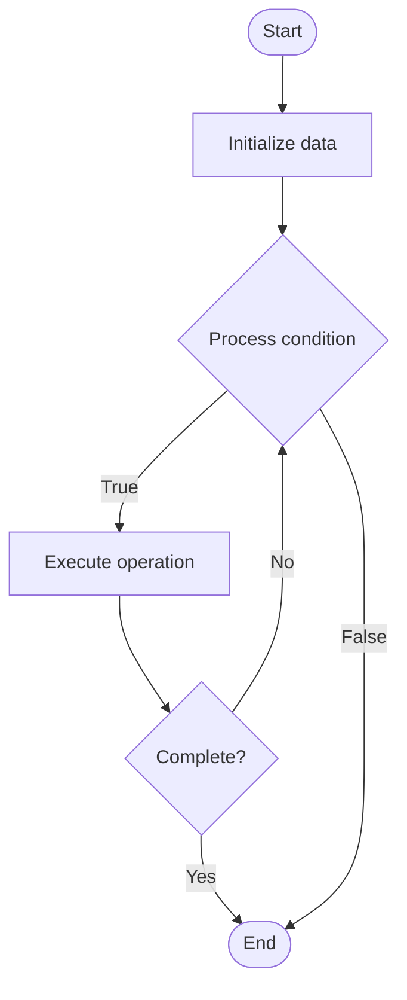

# Incident Management in Observability

## Учебные материалы

- [Школьный уровень](school.ru.md)
- [Университетский уровень](univer.ru.md)

## Algorithm Visualization

### Flowchart (ASCII)

```
Incident Management in Observability Flowchart:

┌─────────────┐
│   Start     │
└──────┬──────┘
       │
       ▼
┌─────────────┐
│  Initialize │
│   data      │
└──────┬──────┘
       │
       ▼
┌─────────────┐      Yes
│  Process   ├──────┐
│  condition?│      │
└──────┬──────┘      │
       │ No          │
       ▼             │
┌─────────────┐      │
│  Execute   │      │
│  operation │      │
└──────┬──────┘      │
       │             │
       └─────────────┘
       │
       ▼
┌─────────────┐
│    End      │
└─────────────┘
```

### Step-by-Step Execution

```
Incident Management in Observability Step-by-Step Execution:

Input: [example data]

Step 1: Initialize
State: [initial state]

Step 2: Process
State: [intermediate state]

Step 3: Finalize
State: [final state]

Result: [output]
```

### Interactive Flowchart (Mermaid)



> **Note**: Mermaid diagrams are rendered automatically on GitHub. For local viewing, use a Mermaid-compatible Markdown viewer.

- [Python Implementation](/code/semester_11/lecture_78_observability_platform/incident_management/algorithm.py)
- [Java Implementation](/code/semester_11/lecture_78_observability_platform/incident_management/Algorithm.java)
- [Python Tests](/code/semester_11/lecture_78_observability_platform/incident_management/test_algorithm.py)

   Incident Management in Observability

What problem does it solve? (1 sentence)  
   Manages the lifecycle of incidents from detection through resolution, coordinating response, communication, and post-incident analysis to minimize impact and improve system reliability.

Intuition (plain-language explanation)  
   Like emergency response: Incident Management is like emergency response for systems - when something breaks (incident), you coordinate a response (fix it), communicate (notify stakeholders), and learn (post-mortem) - just as emergency response saves lives, incident management minimizes system downtime and impact.

Inputs & Outputs  

  - Input: Incident alerts, system state, team members, runbooks, communication channels, post-mortem templates.  
  - Output: Resolved incidents, incident reports, post-mortems, improvement actions, reliability improvements.

Step-by-step description (5–10 lines max)  
Detect: detect incident through monitoring or alerts.
Triage: triage incident for severity and priority.
Assign: assign incident to response team.
Respond: respond to incident (investigate, fix).
Communicate: communicate status to stakeholders.
Resolve: resolve incident and restore service.
Verify: verify resolution and system health.
Document: document incident details.
Post-mortem: conduct post-incident review.
Improve: implement improvements based on learnings.

Tiny example (hand-simulated)  
   Incident Management: detect: service down alert → triage: P1 severity → assign: on-call engineer → respond: identify root cause, apply fix → communicate: status updates to stakeholders → resolve: service restored in 30 min → post-mortem: identify improvements → Incident Management successful.

Time & Space Complexity  

  - Time: O(d + r + p) where d is detection time, r is resolution time, p is post-mortem time (varies by incident).  
  - Space: O(i + d) where i is incident storage, d is documentation storage (incident records).

Strengths  

- Coordination: coordinates effective incident response.
- Learning: enables learning from incidents.
- Improvement: drives continuous reliability improvement.

Weaknesses / limitations  

- Time: incident management can be time-consuming.
- Stress: incidents can be stressful for teams.
- Documentation: requires discipline to document properly.

Compare with alternatives  
    Alternatives: Ad-Hoc Response, No Process, Basic Ticketing, Advanced Platforms

30-second explanation (your own words)  
    Manages the lifecycle of incidents from detection through resolution, coordinating response, communication, and post-incident analysis to minimize impact and improve system reliability.

*Sources: Adapted from standard university textbooks and Wikipedia summaries.*
