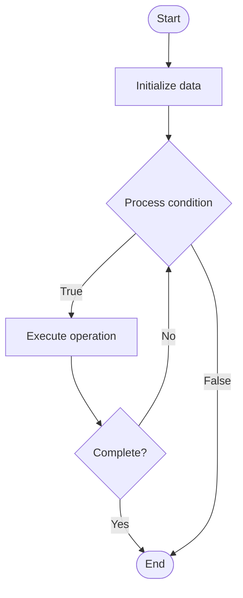

# Observability Stack

## Учебные материалы

- [Школьный уровень](school.ru.md)
- [Университетский уровень](univer.ru.md)

## Algorithm Visualization

### Flowchart (ASCII)

```
Observability Stack Flowchart:

┌─────────────┐
│   Start     │
└──────┬──────┘
       │
       ▼
┌─────────────┐
│  Initialize │
│   data      │
└──────┬──────┘
       │
       ▼
┌─────────────┐      Yes
│  Process   ├──────┐
│  condition?│      │
└──────┬──────┘      │
       │ No          │
       ▼             │
┌─────────────┐      │
│  Execute   │      │
│  operation │      │
└──────┬──────┘      │
       │             │
       └─────────────┘
       │
       ▼
┌─────────────┐
│    End      │
└─────────────┘
```

### Step-by-Step Execution

```
Observability Stack Step-by-Step Execution:

Input: [example data]

Step 1: Initialize
State: [initial state]

Step 2: Process
State: [intermediate state]

Step 3: Finalize
State: [final state]

Result: [output]
```

### Interactive Flowchart (Mermaid)



> **Note**: Mermaid diagrams are rendered automatically on GitHub. For local viewing, use a Mermaid-compatible Markdown viewer.

- [Python Implementation](/code/semester_11/lecture_78_observability_platform/observability_stack/algorithm.py)
- [Java Implementation](/code/semester_11/lecture_78_observability_platform/observability_stack/Algorithm.java)
- [Python Tests](/code/semester_11/lecture_78_observability_platform/observability_stack/test_algorithm.py)

What problem does it solve? (1 sentence)  
   Integrates multiple observability tools (metrics, logs, traces) into a unified stack that provides comprehensive visibility into system behavior, performance, and health.

Intuition (plain-language explanation)  
   Like a dashboard: Observability Stack is like a comprehensive dashboard for your car - it combines speed (metrics), engine sounds (logs), and GPS tracking (traces) to give you complete visibility - just as a car dashboard shows everything you need, an observability stack shows everything about your systems.

Inputs & Outputs  

  - Input: Metrics tools, logging tools, tracing tools, visualization tools, alerting systems, integration APIs.  
  - Output: Unified observability, integrated dashboards, correlated insights, comprehensive visibility, centralized monitoring.

Step-by-step description (5–10 lines max)  
Select tools: select observability tools (Prometheus, ELK, Jaeger).
Integrate: integrate tools into unified stack.
Collect: collect metrics, logs, and traces.
Correlate: correlate data across tools.
Visualize: create unified dashboards.
Alert: set up integrated alerting.
Query: enable unified querying across data.
Analyze: analyze data across dimensions.
Optimize: optimize stack for performance.
Maintain: maintain and update stack.

Tiny example (hand-simulated)  
   Observability Stack: tools: Prometheus (metrics), ELK (logs), Jaeger (traces) → integrate: unified stack → correlate: correlate metrics with logs and traces → dashboard: unified dashboard → result: complete system visibility → Observability Stack operational.

Time & Space Complexity  

  - Time: O(i + c + a) where i is integration time, c is collection time, a is analysis time (continuous).  
  - Space: O(s + d) where s is stack storage, d is data storage (metrics, logs, traces).

Strengths  

- Comprehensive: provides comprehensive system visibility.
- Integration: integrates multiple observability dimensions.
- Efficiency: enables efficient troubleshooting through correlation.

Weaknesses / limitations  

- Complexity: observability stacks can be complex to manage.
- Cost: multiple tools can be expensive.
- Integration: integrating tools requires effort.

Compare with alternatives  
    Alternatives: Single Tool, Ad-Hoc Tools, Basic Monitoring, Unified Platforms

30-second explanation (your own words)  
    Integrates multiple observability tools (metrics, logs, traces) into a unified stack that provides comprehensive visibility into system behavior, performance, and health.

*Sources: Adapted from standard university textbooks and Wikipedia summaries.*
