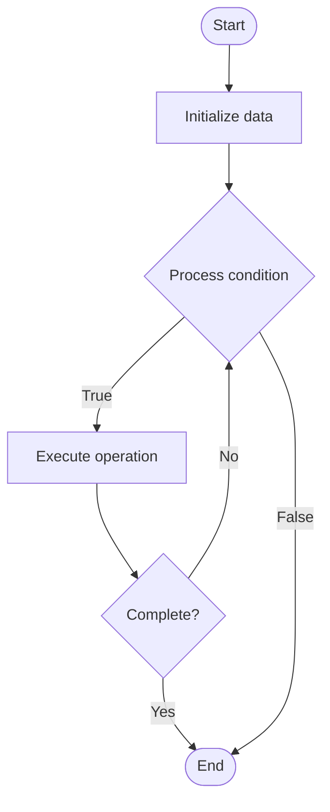

# Root Cause Analysis (RCA)

## Учебные материалы

- [Школьный уровень](school.ru.md)
- [Университетский уровень](univer.ru.md)

## Algorithm Visualization

### Flowchart (ASCII)

```
Root Cause Analysis (RCA) Flowchart:

┌─────────────┐
│   Start     │
└──────┬──────┘
       │
       ▼
┌─────────────┐
│  Initialize │
│   data      │
└──────┬──────┘
       │
       ▼
┌─────────────┐      Yes
│  Process   ├──────┐
│  condition?│      │
└──────┬──────┘      │
       │ No          │
       ▼             │
┌─────────────┐      │
│  Execute   │      │
│  operation │      │
└──────┬──────┘      │
       │             │
       └─────────────┘
       │
       ▼
┌─────────────┐
│    End      │
└─────────────┘
```

### Step-by-Step Execution

```
Root Cause Analysis (RCA) Step-by-Step Execution:

Input: [example data]

Step 1: Initialize
State: [initial state]

Step 2: Process
State: [intermediate state]

Step 3: Finalize
State: [final state]

Result: [output]
```

### Interactive Flowchart (Mermaid)



> **Note**: Mermaid diagrams are rendered automatically on GitHub. For local viewing, use a Mermaid-compatible Markdown viewer.

- [Python Implementation](/code/semester_11/lecture_78_observability_platform/root_cause_analysis/algorithm.py)
- [Java Implementation](/code/semester_11/lecture_78_observability_platform/root_cause_analysis/Algorithm.java)
- [Python Tests](/code/semester_11/lecture_78_observability_platform/root_cause_analysis/test_algorithm.py)

   Root Cause Analysis (RCA)

What problem does it solve? (1 sentence)  
   Systematically identifies the underlying root cause of incidents and problems, enabling permanent fixes rather than temporary workarounds and preventing recurrence.

Intuition (plain-language explanation)  
   Like detective work: Root Cause Analysis is like detective work for incidents - you investigate clues (logs, metrics), trace back to find the real cause (root cause), not just the symptoms - just as detectives solve crimes by finding the real culprit, RCA solves incidents by finding the real cause.

Inputs & Outputs  

  - Input: Incident data, logs, metrics, traces, system state, timeline, team knowledge.  
  - Output: Root cause identification, incident analysis, improvement recommendations, permanent fixes, prevention measures.

Step-by-step description (5–10 lines max)  
Gather data: gather all relevant data (logs, metrics, traces).
Timeline: create timeline of events leading to incident.
Analyze: analyze data and timeline.
Hypothesize: form hypotheses about root cause.
Investigate: investigate hypotheses.
Identify: identify root cause.
Verify: verify root cause through testing or evidence.
Document: document root cause and analysis.
Fix: implement permanent fix for root cause.
Prevent: implement measures to prevent recurrence.

Tiny example (hand-simulated)  
   Root Cause Analysis: incident: service outage → gather: logs, metrics, traces → timeline: database connection pool exhausted → analyze: connection leak in code → identify: root cause: missing connection cleanup → fix: add connection cleanup → prevent: add monitoring → RCA successful.

Time & Space Complexity  

  - Time: O(g + a + i) where g is data gathering time, a is analysis time, i is investigation time (hours to days).  
  - Space: O(d + a) where d is data storage, a is analysis storage (RCA documents).

Strengths  

- Permanent fixes: enables permanent fixes rather than workarounds.
- Prevention: prevents recurrence of incidents.
- Learning: provides deep learning about system behavior.

Weaknesses / limitations  

- Time: thorough RCA takes significant time.
- Complexity: complex incidents may have multiple root causes.
- Skills: requires analytical and investigative skills.

Compare with alternatives  
    Alternatives: Symptom Fixing, Quick Fixes, Blame Assignment, No Analysis

30-second explanation (your own words)  
    Systematically identifies the underlying root cause of incidents and problems, enabling permanent fixes rather than temporary workarounds and preventing recurrence.

*Sources: Adapted from standard university textbooks and Wikipedia summaries.*


## References

- [Root-cause analysis](https://en.wikipedia.org/wiki/Root-cause_analysis) - Wikipedia
