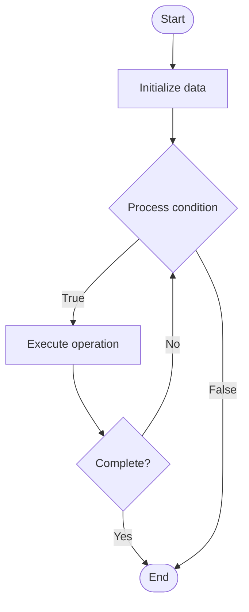

# Unified Observability

## Учебные материалы

- [Школьный уровень](school.ru.md)
- [Университетский уровень](univer.ru.md)

## Algorithm Visualization

### Flowchart (ASCII)

```
Unified Observability Flowchart:

┌─────────────┐
│   Start     │
└──────┬──────┘
       │
       ▼
┌─────────────┐
│  Initialize │
│   data      │
└──────┬──────┘
       │
       ▼
┌─────────────┐      Yes
│  Process   ├──────┐
│  condition?│      │
└──────┬──────┘      │
       │ No          │
       ▼             │
┌─────────────┐      │
│  Execute   │      │
│  operation │      │
└──────┬──────┘      │
       │             │
       └─────────────┘
       │
       ▼
┌─────────────┐
│    End      │
└─────────────┘
```

### Step-by-Step Execution

```
Unified Observability Step-by-Step Execution:

Input: [example data]

Step 1: Initialize
State: [initial state]

Step 2: Process
State: [intermediate state]

Step 3: Finalize
State: [final state]

Result: [output]
```

### Interactive Flowchart (Mermaid)



> **Note**: Mermaid diagrams are rendered automatically on GitHub. For local viewing, use a Mermaid-compatible Markdown viewer.

- [Python Implementation](/code/semester_11/lecture_78_observability_platform/unified_observability/algorithm.py)
- [Java Implementation](/code/semester_11/lecture_78_observability_platform/unified_observability/Algorithm.java)
- [Python Tests](/code/semester_11/lecture_78_observability_platform/unified_observability/test_algorithm.py)

What problem does it solve? (1 sentence)  
Provides a single, unified view of system observability by integrating metrics, logs, traces, and events into one platform, enabling efficient troubleshooting and comprehensive system understanding.

Intuition (plain-language explanation)  
   Like a unified control center: Unified Observability is like a unified control center - instead of looking at separate screens for different things (metrics here, logs there), everything is in one place - just as a control center gives you everything at a glance, unified observability gives you complete system visibility in one place.

Inputs & Outputs  

  - Input: Metrics, logs, traces, events, observability data, integration APIs, correlation rules.  
- Output: Unified platform, integrated views, correlated insights, efficient troubleshooting, comprehensive visibility.

Step-by-step description (5–10 lines max)  
Integrate: integrate metrics, logs, traces, and events.
Correlate: correlate data across observability dimensions.
Unify: create unified data model and storage.
Visualize: provide unified visualization and dashboards.
Query: enable unified querying across all data.
Analyze: enable analysis across observability dimensions.
Alert: provide unified alerting based on correlated data.
Investigate: enable efficient investigation through correlation.
Optimize: optimize for performance and usability.
Evolve: continuously evolve unified platform.

Tiny example (hand-simulated)  
   Unified Observability: data: metrics, logs, traces → integrate: unified platform → correlate: correlate error logs with slow traces → visualize: unified dashboard → query: query across all data → result: troubleshoot issues 3x faster → Unified Observability operational.

Time & Space Complexity  

  - Time: O(i + c + q) where i is integration time, c is correlation time, q is query time (real-time, optimized).  
  - Space: O(u + d) where u is unified storage, d is data storage (all observability data).

Strengths  

- Efficiency: enables efficient troubleshooting through correlation.
- Comprehensive: provides comprehensive system visibility.
- Usability: single platform is easier to use than multiple tools.

Weaknesses / limitations  

- Complexity: building unified observability is complex.
- Integration: integrating diverse data sources is challenging.
- Performance: unified platform must handle large data volumes.

Compare with alternatives  
    Alternatives: Separate Tools, Ad-Hoc Observability, Basic Monitoring, Integrated Stacks

30-second explanation (your own words)  
Provides a single, unified view of system observability by integrating metrics, logs, traces, and events into one platform, enabling efficient troubleshooting and comprehensive system understanding.

*Sources: Adapted from standard university textbooks and Wikipedia summaries.*
