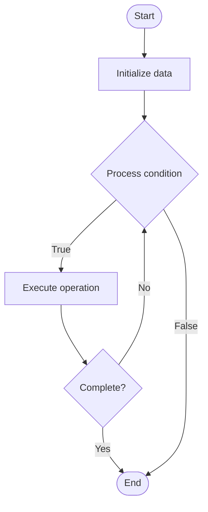

# Quantum Cryptography

## Учебные материалы

- [Школьный уровень](school.ru.md)
- [Университетский уровень](univer.ru.md)

## Algorithm Visualization

### Flowchart (ASCII)

```
Quantum Cryptography Flowchart:

┌─────────────┐
│   Start     │
└──────┬──────┘
       │
       ▼
┌─────────────┐
│  Initialize │
│   data      │
└──────┬──────┘
       │
       ▼
┌─────────────┐      Yes
│  Process   ├──────┐
│  condition?│      │
└──────┬──────┘      │
       │ No          │
       ▼             │
┌─────────────┐      │
│  Execute   │      │
│  operation │      │
└──────┬──────┘      │
       │             │
       └─────────────┘
       │
       ▼
┌─────────────┐
│    End      │
└─────────────┘
```

### Step-by-Step Execution

```
Quantum Cryptography Step-by-Step Execution:

Input: [example data]

Step 1: Initialize
State: [initial state]

Step 2: Process
State: [intermediate state]

Step 3: Finalize
State: [final state]

Result: [output]
```

### Interactive Flowchart (Mermaid)



> **Note**: Mermaid diagrams are rendered automatically on GitHub. For local viewing, use a Mermaid-compatible Markdown viewer.

- [Python Implementation](/code/semester_12/lecture_79_quantum_algorithms_advanced/quantum_cryptography/algorithm.py)
- [Java Implementation](/code/semester_12/lecture_79_quantum_algorithms_advanced/quantum_cryptography/Algorithm.java)
- [Python Tests](/code/semester_12/lecture_79_quantum_algorithms_advanced/quantum_cryptography/test_algorithm.py)

What problem does it solve? (1 sentence)  
   Uses quantum mechanical properties to provide secure communication protocols that are theoretically unbreakable, even against quantum computers, based on the laws of physics rather than computational complexity.

Intuition (plain-language explanation)  
   Like unbreakable locks: Quantum Cryptography is like unbreakable locks based on physics - instead of relying on math that might be broken (classical crypto), quantum crypto uses physics (quantum mechanics) - just as you can't break the laws of physics, you can't break quantum cryptography because it's based on fundamental physical principles.

Inputs & Outputs  

  - Input: Quantum states, quantum channels, measurement bases, encryption keys, quantum protocols.  
  - Output: Secure quantum keys, encrypted quantum communication, quantum key distribution, provably secure protocols.

Step-by-step description (5–10 lines max)  
Prepare: prepare quantum states (qubits) for key distribution.
Transmit: transmit qubits over quantum channel.
Measure: measure qubits using random bases.
Compare: compare measurement bases publicly.
Extract: extract secure key from matching bases.
Verify: verify key security through error checking.
Encrypt: use quantum key for encryption.
Decrypt: decrypt using shared quantum key.
Detect: detect eavesdropping attempts.
Renew: renew keys as needed.

Tiny example (hand-simulated)  
   Quantum Cryptography: Alice: prepare qubits → transmit: send qubits to Bob → measure: both measure randomly → compare: share bases publicly → extract: key from matching bases → verify: check for errors → result: secure key, eavesdropping detected → Quantum Cryptography successful.

Time & Space Complexity  

  - Time: O(n) where n is number of qubits (quantum operations are typically O(1) per qubit).  
  - Space: O(n) where n is number of qubits (quantum state storage).

Strengths  

- Security: theoretically unbreakable based on physics.
- Detection: detects eavesdropping attempts automatically.
- Future-proof: secure against quantum computers.

Weaknesses / limitations  

- Distance: limited by quantum channel distance.
- Infrastructure: requires quantum communication infrastructure.
- Cost: quantum hardware is expensive.

Compare with alternatives  
    Alternatives: Classical Cryptography, Post-Quantum Cryptography, Hybrid Approaches, Quantum Key Distribution

30-second explanation (your own words)  
    Uses quantum mechanical properties to provide secure communication protocols that are theoretically unbreakable, even against quantum computers, based on the laws of physics rather than computational complexity.

*Sources: Adapted from standard university textbooks and Wikipedia summaries.*


## References

- [Quantum cryptography](https://en.wikipedia.org/wiki/Quantum_cryptography) - Wikipedia


## Real-World Applications

- Social network analysis
- Route planning and navigation

- Social network analysis
- Route planning and navigation

- Social network analysis
- Route planning and navigation