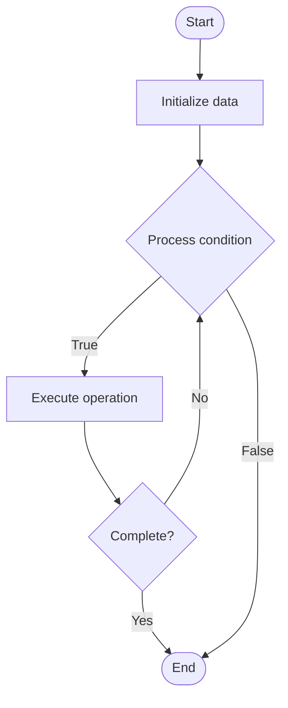

# Quantum Error Correction

1. **Name of Algorithm**  

## Code Files


## Algorithm Visualization

### Flowchart (ASCII)


```
Quantum Error Correction Flowchart:

┌─────────────┐
│   Start     │
└──────┬──────┘
       │
       ▼
┌─────────────┐
│  Initialize │
│   data      │
└──────┬──────┘
       │
       ▼
┌─────────────┐      Yes
│  Process   ├──────┐
│  condition?│      │
└──────┬──────┘      │
       │ No          │
       ▼             │
┌─────────────┐      │
│  Execute   │      │
│  operation │      │
└──────┬──────┘      │
       │             │
       └─────────────┘
       │
       ▼
┌─────────────┐
│    End      │
└─────────────┘
```


### Step-by-Step Execution


```
Quantum Error Correction Step-by-Step Execution:

Input: [example data]

Step 1: Initialize
State: [initial state]

Step 2: Process
State: [intermediate state]

Step 3: Finalize
State: [final state]

Result: [output]
```


### Interactive Flowchart (Mermaid)





> **Note**: Mermaid diagrams are rendered automatically on GitHub. For local viewing, use a Mermaid-compatible Markdown viewer.
- [Python Implementation](semester_12/lecture_79_quantum_algorithms_advanced/quantum_error_correction/algorithm.py)
- [Java Implementation](semester_12/lecture_79_quantum_algorithms_advanced/quantum_error_correction/Algorithm.java)
- [Python Tests](semester_12/lecture_79_quantum_algorithms_advanced/quantum_error_correction/test_algorithm.py)


   Quantum Error Correction

2. **What problem does it solve? (1 sentence)**  
   Protects quantum information from errors caused by decoherence and noise by encoding quantum states redundantly and detecting/correcting errors without destroying quantum superposition.

3. **Intuition (plain-language explanation)**  
   Like error correction for quantum: Quantum Error Correction is like error correction codes for quantum information - you encode quantum data redundantly (like RAID for qubits), detect errors, and fix them - just as error correction protects digital data, quantum error correction protects quantum information from noise and decoherence.

4. **Inputs & Outputs**  
   - Input: Logical qubits, error syndromes, quantum codes, ancilla qubits, error models.  
   - Output: Error-corrected qubits, error syndromes, corrected quantum states, fault-tolerant operations.

5. **Step-by-step description (5–10 lines max)**  
1. Encode: encode logical qubit into physical qubits (quantum code).
2. Protect: protect quantum state from errors.
3. Detect: detect errors through syndrome measurements.
4. Classify: classify error type from syndrome.
5. Correct: apply correction operations based on syndrome.
6. Verify: verify correction was successful.
7. Decode: decode logical qubit from physical qubits.
8. Iterate: repeat error correction as needed.
9. Fault-tolerant: perform fault-tolerant quantum operations.
10. Scale: scale to larger quantum systems.

6. **Tiny example (hand-simulated)**  
   Quantum Error Correction: logical qubit: |ψ⟩ → encode: encode into 3 physical qubits → detect: measure syndrome → error: bit-flip detected → correct: apply X gate → verify: syndrome cleared → decode: recover |ψ⟩ → Quantum Error Correction successful.

7. **Time & Space Complexity**  
   - Time: O(d) where d is code distance (error correction overhead).  
   - Space: O(n·d) where n is logical qubits, d is code distance (physical qubits needed).

8. **Strengths**  
- Protection: protects quantum information from errors.
- Fault-tolerance: enables fault-tolerant quantum computation.
- Scalability: enables scaling to larger quantum systems.

9. **Weaknesses / limitations**  
- Overhead: requires many physical qubits per logical qubit.
- Complexity: quantum error correction is complex.
- Threshold: requires error rates below threshold.

10. **Compare with alternatives**  
    Alternatives: No Error Correction, Error Mitigation, NISQ Approaches, Fault-Tolerant Codes

11. **30-second explanation (your own words)**  

*Sources: Adapted from standard university textbooks and Wikipedia summaries.*
