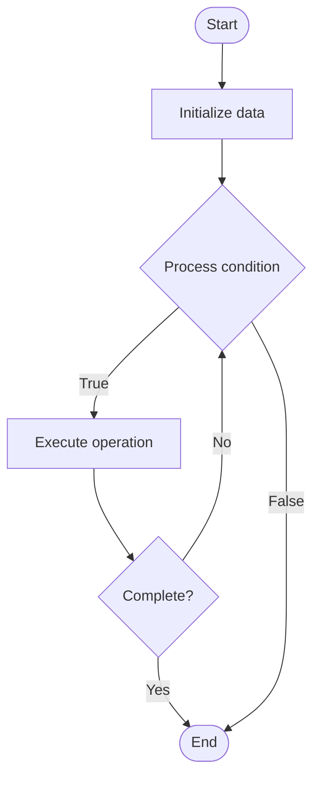

# Quantum Machine Learning

## Учебные материалы

- [Школьный уровень](school.ru.md)
- [Университетский уровень](univer.ru.md)

## Algorithm Visualization

### Flowchart (ASCII)

```
Quantum Machine Learning Flowchart:

┌─────────────┐
│   Start     │
└──────┬──────┘
       │
       ▼
┌─────────────┐
│  Initialize │
│   data      │
└──────┬──────┘
       │
       ▼
┌─────────────┐      Yes
│  Process   ├──────┐
│  condition?│      │
└──────┬──────┘      │
       │ No          │
       ▼             │
┌─────────────┐      │
│  Execute   │      │
│  operation │      │
└──────┬──────┘      │
       │             │
       └─────────────┘
       │
       ▼
┌─────────────┐
│    End      │
└─────────────┘
```

### Step-by-Step Execution

```
Quantum Machine Learning Step-by-Step Execution:

Input: [example data]

Step 1: Initialize
State: [initial state]

Step 2: Process
State: [intermediate state]

Step 3: Finalize
State: [final state]

Result: [output]
```

### Interactive Flowchart (Mermaid)



> **Note**: Mermaid diagrams are rendered automatically on GitHub. For local viewing, use a Mermaid-compatible Markdown viewer.

- [Python Implementation](/code/semester_12/lecture_79_quantum_algorithms_advanced/quantum_machine_learning/algorithm.py)
- [Java Implementation](/code/semester_12/lecture_79_quantum_algorithms_advanced/quantum_machine_learning/Algorithm.java)
- [Python Tests](/code/semester_12/lecture_79_quantum_algorithms_advanced/quantum_machine_learning/test_algorithm.py)

What problem does it solve? (1 sentence)  
   Uses quantum computers to accelerate machine learning tasks, potentially providing exponential speedups for certain problems like optimization, classification, and data analysis.

Intuition (plain-language explanation)  
   Like ML on quantum computers: Quantum Machine Learning is like running machine learning on quantum computers - you use quantum properties (superposition, entanglement) to process data in ways classical computers can't - just as quantum computers can solve some problems faster, quantum ML can train models or process data faster for certain problems.

Inputs & Outputs  

  - Input: Classical or quantum data, quantum ML models, training data, quantum circuits, optimization parameters.  
  - Output: Trained quantum models, quantum predictions, optimized parameters, quantum feature maps, quantum classifiers.

Step-by-step description (5–10 lines max)  
Encode: encode data into quantum states.
Design: design quantum ML model (variational circuit).
Initialize: initialize model parameters.
Forward: perform forward pass (quantum circuit execution).
Measure: measure quantum state to get predictions.
Loss: calculate loss function.
Gradient: compute gradients (parameter shift rule).
Update: update parameters using gradients.
Iterate: iterate training loop.
Evaluate: evaluate trained model.

Tiny example (hand-simulated)  
   Quantum Machine Learning: data: encode into qubits → model: variational quantum circuit → train: optimize parameters → forward: execute circuit → measure: get predictions → loss: calculate error → update: adjust parameters → result: trained quantum classifier → Quantum ML successful.

Time & Space Complexity  

  - Time: O(p·m) where p is parameters, m is measurements (varies by problem, potential speedup).  
  - Space: O(n) where n is number of qubits (quantum state space).

Strengths  

- Speedup: potential exponential speedup for certain problems.
- Expressivity: quantum models can represent complex functions.
- Novel: enables new ML approaches using quantum properties.

Weaknesses / limitations  

- Hardware: requires quantum hardware (currently limited).
- Noise: quantum noise affects training and inference.
- Applications: speedups not guaranteed for all problems.

Compare with alternatives  
    Alternatives: Classical ML, Hybrid Quantum-Classical, Quantum-Inspired, NISQ ML

30-second explanation (your own words)  
    Uses quantum computers to accelerate machine learning tasks, potentially providing exponential speedups for certain problems like optimization, classification, and data analysis.

*Sources: Adapted from standard university textbooks and Wikipedia summaries.*
