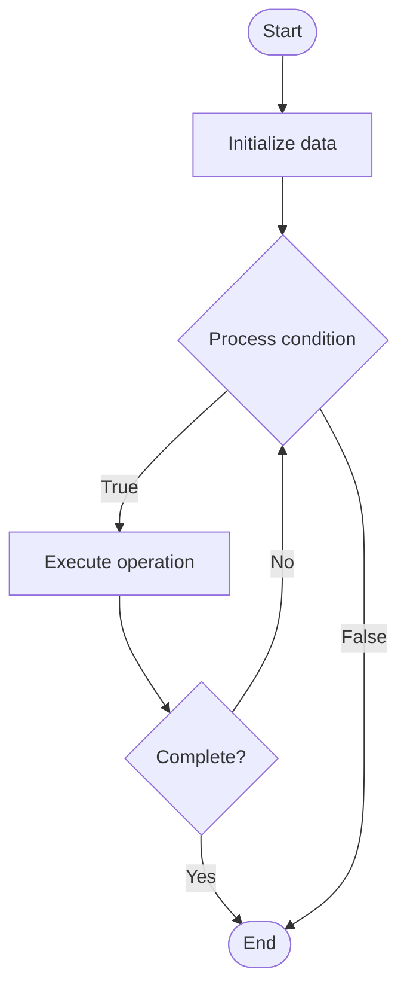

# Quantum Optimization

1. **Name of Algorithm**  

## Code Files


## Algorithm Visualization

### Flowchart (ASCII)


```
Quantum Optimization Flowchart:

┌─────────────┐
│   Start     │
└──────┬──────┘
       │
       ▼
┌─────────────┐
│  Initialize │
│   data      │
└──────┬──────┘
       │
       ▼
┌─────────────┐      Yes
│  Process   ├──────┐
│  condition?│      │
└──────┬──────┘      │
       │ No          │
       ▼             │
┌─────────────┐      │
│  Execute   │      │
│  operation │      │
└──────┬──────┘      │
       │             │
       └─────────────┘
       │
       ▼
┌─────────────┐
│    End      │
└─────────────┘
```


### Step-by-Step Execution


```
Quantum Optimization Step-by-Step Execution:

Input: [example data]

Step 1: Initialize
State: [initial state]

Step 2: Process
State: [intermediate state]

Step 3: Finalize
State: [final state]

Result: [output]
```


### Interactive Flowchart (Mermaid)





> **Note**: Mermaid diagrams are rendered automatically on GitHub. For local viewing, use a Mermaid-compatible Markdown viewer.
- [Python Implementation](semester_12/lecture_79_quantum_algorithms_advanced/quantum_optimization/algorithm.py)
- [Java Implementation](semester_12/lecture_79_quantum_algorithms_advanced/quantum_optimization/Algorithm.java)
- [Python Tests](semester_12/lecture_79_quantum_algorithms_advanced/quantum_optimization/test_algorithm.py)


   Quantum Optimization

2. **What problem does it solve? (1 sentence)**  
Uses quantum algorithms like QAOA (Quantum Approximate Optimization Algorithm) to solve optimization problems, potentially finding better solutions faster than classical methods for combinatorial optimization.

3. **Intuition (plain-language explanation)**  
Like quantum search for best solutions: Quantum Optimization is like using quantum search to find the best solution - quantum computers can explore many solutions simultaneously (superposition) and find optimal ones faster - just as quantum search finds items faster, quantum optimization finds optimal solutions faster.

4. **Inputs & Outputs**  
- Input: Optimization problem, cost function, constraints, quantum circuit parameters, optimization variables.
   - Output: Optimized solutions, optimal parameters, quantum states, cost values, approximation ratios.

5. **Step-by-step description (5–10 lines max)**  
1. Formulate: formulate problem as optimization (QUBO, Ising).
2. Encode: encode problem into quantum Hamiltonian.
3. Design: design QAOA circuit with parameters.
4. Initialize: initialize parameters randomly.
5. Execute: execute quantum circuit.
6. Measure: measure quantum state.
7. Evaluate: evaluate cost function.
8. Optimize: optimize parameters (classical optimizer).
9. Iterate: iterate QAOA layers.
10. Extract: extract best solution.

6. **Tiny example (hand-simulated)**  
   Quantum Optimization: problem: max-cut → encode: Ising Hamiltonian → QAOA: design circuit → execute: run on quantum computer → measure: get solution → evaluate: calculate cut value → optimize: improve parameters → result: better solution than classical → Quantum Optimization successful.

7. **Time & Space Complexity**  
   - Time: O(p·m·k) where p is parameters, m is measurements, k is QAOA layers (varies by problem).  
   - Space: O(n) where n is problem size (qubits needed).

8. **Strengths**  
- Speedup: potential speedup for combinatorial optimization.
- Quality: can find better solutions than classical methods.
- Applications: applicable to many optimization problems.

9. **Weaknesses / limitations**  
- Approximation: provides approximate solutions (not always optimal).
- Hardware: requires quantum hardware.
- Scaling: scaling to large problems is challenging.

10. **Compare with alternatives**  
    Alternatives: Classical Optimization, Simulated Annealing, Genetic Algorithms, Hybrid Approaches

11. **30-second explanation (your own words)**  
Uses quantum algorithms like QAOA (Quantum Approximate Optimization Algorithm) to solve optimization problems, potentially finding better solutions faster than classical methods for combinatorial optimization.

*Sources: Adapted from standard university textbooks and Wikipedia summaries.*
