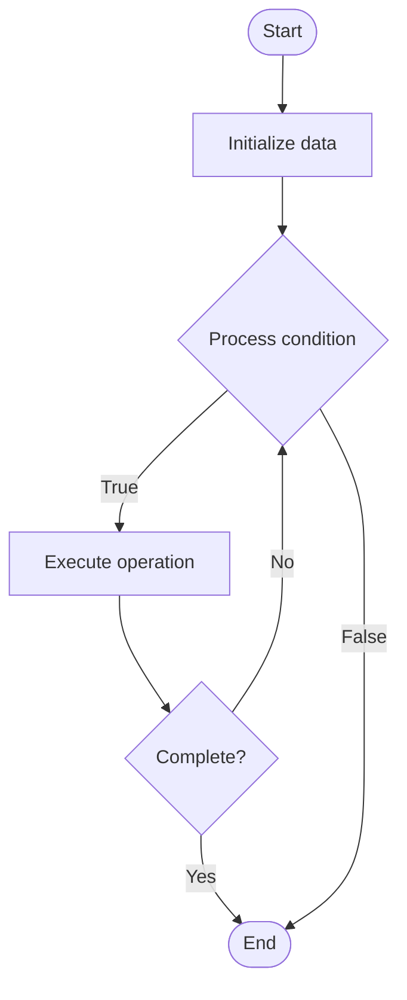

# Quantum Simulation

1. **Name of Algorithm**  

## Code Files


## Algorithm Visualization

### Flowchart (ASCII)


```
Quantum Simulation Flowchart:

┌─────────────┐
│   Start     │
└──────┬──────┘
       │
       ▼
┌─────────────┐
│  Initialize │
│   data      │
└──────┬──────┘
       │
       ▼
┌─────────────┐      Yes
│  Process   ├──────┐
│  condition?│      │
└──────┬──────┘      │
       │ No          │
       ▼             │
┌─────────────┐      │
│  Execute   │      │
│  operation │      │
└──────┬──────┘      │
       │             │
       └─────────────┘
       │
       ▼
┌─────────────┐
│    End      │
└─────────────┘
```


### Step-by-Step Execution


```
Quantum Simulation Step-by-Step Execution:

Input: [example data]

Step 1: Initialize
State: [initial state]

Step 2: Process
State: [intermediate state]

Step 3: Finalize
State: [final state]

Result: [output]
```


### Interactive Flowchart (Mermaid)





> **Note**: Mermaid diagrams are rendered automatically on GitHub. For local viewing, use a Mermaid-compatible Markdown viewer.
- [Python Implementation](semester_12/lecture_79_quantum_algorithms_advanced/quantum_simulation/algorithm.py)
- [Java Implementation](semester_12/lecture_79_quantum_algorithms_advanced/quantum_simulation/Algorithm.java)
- [Python Tests](semester_12/lecture_79_quantum_algorithms_advanced/quantum_simulation/test_algorithm.py)


   Quantum Simulation

2. **What problem does it solve? (1 sentence)**  
   Simulates quantum systems (molecules, materials, quantum many-body systems) using quantum computers, providing exponential speedup over classical simulation for quantum chemistry and physics.

3. **Intuition (plain-language explanation)**  
   Like simulating quantum with quantum: Quantum Simulation is like using quantum computers to simulate quantum systems - it's natural because quantum computers are quantum systems themselves - just as you'd use a weather simulator to simulate weather, you use quantum computers to simulate quantum systems, and they're much better at it than classical computers.

4. **Inputs & Outputs**  
   - Input: Quantum system Hamiltonian, initial quantum state, simulation parameters, quantum gates, time evolution.  
   - Output: Simulated quantum states, energy eigenvalues, molecular properties, quantum dynamics, simulation results.

5. **Step-by-step description (5–10 lines max)**  
1. Model: model quantum system (molecule, material).
2. Hamiltonian: construct system Hamiltonian.
3. Encode: encode Hamiltonian into quantum circuit.
4. Prepare: prepare initial quantum state.
5. Evolve: evolve state using quantum gates (Trotterization).
6. Measure: measure quantum state properties.
7. Extract: extract physical properties (energy, observables).
8. Iterate: iterate time evolution steps.
9. Analyze: analyze simulation results.
10. Validate: validate against known results.

6. **Tiny example (hand-simulated)**  
   Quantum Simulation: molecule: H2O → Hamiltonian: construct molecular Hamiltonian → encode: map to qubits → evolve: simulate time evolution → measure: measure energy → result: ground state energy calculated → Quantum Simulation successful.

7. **Time & Space Complexity**  
   - Time: O(poly(n)·t) where n is system size, t is simulation time (exponential speedup over classical).  
   - Space: O(n) where n is number of qubits (logarithmic in system size).

8. **Strengths**  
- Speedup: exponential speedup over classical simulation.
- Accuracy: can simulate quantum systems accurately.
- Applications: enables drug discovery, material design.

9. **Weaknesses / limitations**  
- Noise: quantum noise affects simulation accuracy.
- Scaling: scaling to large systems is challenging.
- Hardware: requires quantum hardware.

10. **Compare with alternatives**  
    Alternatives: Classical Simulation, Approximate Methods, Hybrid Approaches, Quantum-Classical

11. **30-second explanation (your own words)**  
    Simulates quantum systems (molecules, materials, quantum many-body systems) using quantum computers, providing exponential speedup over classical simulation for quantum chemistry and physics.

*Sources: Adapted from standard university textbooks and Wikipedia summaries.*
