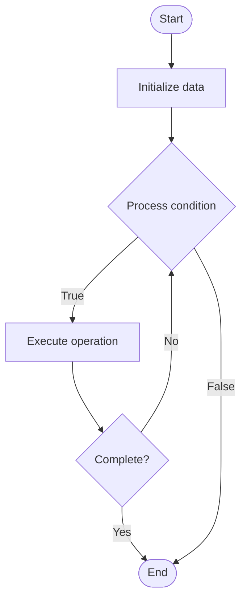

# Quantum Teleportation

## Учебные материалы

- [Школьный уровень](school.ru.md)
- [Университетский уровень](univer.ru.md)

## Algorithm Visualization

### Flowchart (ASCII)

```
Quantum Teleportation Flowchart:

┌─────────────┐
│   Start     │
└──────┬──────┘
       │
       ▼
┌─────────────┐
│  Initialize │
│   data      │
└──────┬──────┘
       │
       ▼
┌─────────────┐      Yes
│  Process   ├──────┐
│  condition?│      │
└──────┬──────┘      │
       │ No          │
       ▼             │
┌─────────────┐      │
│  Execute   │      │
│  operation │      │
└──────┬──────┘      │
       │             │
       └─────────────┘
       │
       ▼
┌─────────────┐
│    End      │
└─────────────┘
```

### Step-by-Step Execution

```
Quantum Teleportation Step-by-Step Execution:

Input: [example data]

Step 1: Initialize
State: [initial state]

Step 2: Process
State: [intermediate state]

Step 3: Finalize
State: [final state]

Result: [output]
```

### Interactive Flowchart (Mermaid)



> **Note**: Mermaid diagrams are rendered automatically on GitHub. For local viewing, use a Mermaid-compatible Markdown viewer.

- [Python Implementation](/code/semester_12/lecture_79_quantum_algorithms_advanced/quantum_teleportation/algorithm.py)
- [Java Implementation](/code/semester_12/lecture_79_quantum_algorithms_advanced/quantum_teleportation/Algorithm.java)
- [Python Tests](/code/semester_12/lecture_79_quantum_algorithms_advanced/quantum_teleportation/test_algorithm.py)

What problem does it solve? (1 sentence)  
   Transfers an unknown quantum state from one location to another using quantum entanglement and classical communication, without physically transporting the quantum particle.

Intuition (plain-language explanation)  
   Like teleporting quantum information: Quantum Teleportation is like teleporting quantum information - you don't send the qubit itself, you use entanglement (spooky action) and send classical information to recreate the state elsewhere - just as teleportation in sci-fi moves objects instantly, quantum teleportation moves quantum states using entanglement.

Inputs & Outputs  

  - Input: Unknown quantum state, entangled pair (Bell state), classical communication channel, measurement results.  
  - Output: Teleported quantum state, measurement outcomes, classical bits, reconstructed state.

Step-by-step description (5–10 lines max)  
Prepare: prepare entangled pair (Bell state).
Share: share one qubit with sender, one with receiver.
Entangle: entangle unknown state with sender's qubit.
Measure: measure both qubits at sender.
Communicate: send measurement results classically.
Apply: receiver applies correction based on results.
Reconstruct: receiver reconstructs original state.
Verify: verify teleportation was successful.
Destroy: original state is destroyed (no-cloning).
Complete: teleportation complete.

Tiny example (hand-simulated)  
   Quantum Teleportation: state: |ψ⟩ unknown → prepare: Bell pair |Φ+⟩ → entangle: |ψ⟩ with Alice's qubit → measure: Alice measures → communicate: send 2 classical bits → apply: Bob applies corrections → result: |ψ⟩ teleported to Bob → Quantum Teleportation successful.

Time & Space Complexity  

  - Time: O(1) for teleportation protocol (constant time quantum operations).  
  - Space: O(1) for single qubit teleportation (3 qubits: 1 unknown + 2 entangled).

Strengths  

- Transfer: enables transfer of quantum states.
- Networking: foundation for quantum networks.
- No transport: doesn't require physical transport of qubits.

Weaknesses / limitations  

- Classical: requires classical communication.
- Entanglement: requires pre-shared entanglement.
- Distance: limited by entanglement distribution.

Compare with alternatives  
    Alternatives: Physical Transport, Quantum Repeaters, Direct Transmission, Quantum Networks

30-second explanation (your own words)  
    Transfers an unknown quantum state from one location to another using quantum entanglement and classical communication, without physically transporting the quantum particle.

*Sources: Adapted from standard university textbooks and Wikipedia summaries.*


## References

- [Quantum teleportation](https://en.wikipedia.org/wiki/Quantum_teleportation) - Wikipedia
