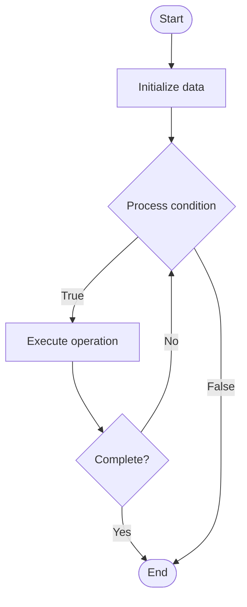

# Quantum Architectures

## Учебные материалы

- [Школьный уровень](school.ru.md)
- [Университетский уровень](univer.ru.md)

## Algorithm Visualization

### Flowchart (ASCII)

```
Quantum Architectures Flowchart:

┌─────────────┐
│   Start     │
└──────┬──────┘
       │
       ▼
┌─────────────┐
│  Initialize │
│   data      │
└──────┬──────┘
       │
       ▼
┌─────────────┐      Yes
│  Process   ├──────┐
│  condition?│      │
└──────┬──────┘      │
       │ No          │
       ▼             │
┌─────────────┐      │
│  Execute   │      │
│  operation │      │
└──────┬──────┘      │
       │             │
       └─────────────┘
       │
       ▼
┌─────────────┐
│    End      │
└─────────────┘
```

### Step-by-Step Execution

```
Quantum Architectures Step-by-Step Execution:

Input: [example data]

Step 1: Initialize
State: [initial state]

Step 2: Process
State: [intermediate state]

Step 3: Finalize
State: [final state]

Result: [output]
```

### Interactive Flowchart (Mermaid)



> **Note**: Mermaid diagrams are rendered automatically on GitHub. For local viewing, use a Mermaid-compatible Markdown viewer.

- [Python Implementation](/code/semester_12/lecture_80_quantum_computing_advanced/quantum_architectures/algorithm.py)
- [Java Implementation](/code/semester_12/lecture_80_quantum_computing_advanced/quantum_architectures/Algorithm.java)
- [Python Tests](/code/semester_12/lecture_80_quantum_computing_advanced/quantum_architectures/test_algorithm.py)

What problem does it solve? (1 sentence)  
   Designs and implements hardware architectures for quantum computers, including qubit technologies, connectivity, control systems, and error correction integration.

Intuition (plain-language explanation)  
   Like computer architecture for quantum: Quantum Architectures is like computer architecture but for quantum computers - you design how qubits are arranged (layout), how they connect (topology), and how they're controlled (gates) - just as computer architecture designs CPUs, quantum architecture designs quantum processors.

Inputs & Outputs  

  - Input: Qubit technologies, connectivity requirements, gate sets, error rates, scalability goals, control systems.  
  - Output: Quantum architectures, qubit layouts, connectivity topologies, gate implementations, control designs, scalable systems.

Step-by-step description (5–10 lines max)  
Select: select qubit technology (superconducting, trapped ions, etc.).
Design: design qubit layout and connectivity.
Connect: design connectivity topology (nearest-neighbor, all-to-all).
Implement: implement quantum gates.
Control: design control systems.
Integrate: integrate error correction.
Optimize: optimize for performance and scalability.
Fabricate: fabricate quantum processor.
Test: test and characterize architecture.
Scale: scale to larger systems.

Tiny example (hand-simulated)  
   Quantum Architectures: technology: superconducting qubits → layout: 2D grid → connectivity: nearest-neighbor → gates: implement CNOT, single-qubit gates → control: microwave pulses → error correction: integrate surface code → result: scalable quantum architecture → Quantum Architectures successful.

Time & Space Complexity  

  - Time: O(1) for gate operations (varies by architecture, typically constant per gate).  
  - Space: O(n) where n is number of qubits (physical qubit layout).

Strengths  

- Scalability: enables scaling to larger quantum systems.
- Performance: optimized architectures improve performance.
- Flexibility: different architectures for different applications.

Weaknesses / limitations  

- Complexity: designing quantum architectures is complex.
- Technology: limited by qubit technology constraints.
- Noise: architecture affects error rates.

Compare with alternatives  
    Alternatives: Fixed Architectures, Ad-Hoc Designs, Technology-Specific, Modular Approaches

30-second explanation (your own words)  
    Designs and implements hardware architectures for quantum computers, including qubit technologies, connectivity, control systems, and error correction integration.

*Sources: Adapted from standard university textbooks and Wikipedia summaries.*


## References

- [Quantum Architectures - Wikipedia](https://en.wikipedia.org/wiki/Quantum%20Architectures)
