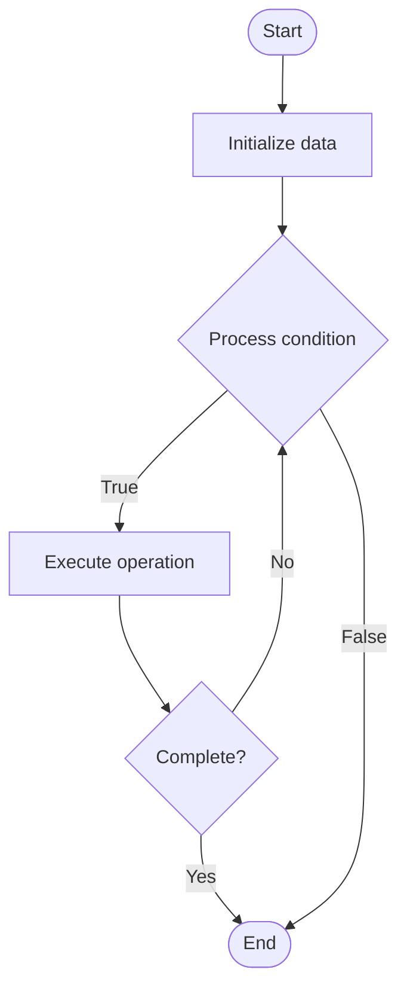

# Quantum Benchmarking

1. **Name of Algorithm**  

## Code Files


## Algorithm Visualization

### Flowchart (ASCII)


```
Quantum Benchmarking Flowchart:

┌─────────────┐
│   Start     │
└──────┬──────┘
       │
       ▼
┌─────────────┐
│  Initialize │
│   data      │
└──────┬──────┘
       │
       ▼
┌─────────────┐      Yes
│  Process   ├──────┐
│  condition?│      │
└──────┬──────┘      │
       │ No          │
       ▼             │
┌─────────────┐      │
│  Execute   │      │
│  operation │      │
└──────┬──────┘      │
       │             │
       └─────────────┘
       │
       ▼
┌─────────────┐
│    End      │
└─────────────┘
```


### Step-by-Step Execution


```
Quantum Benchmarking Step-by-Step Execution:

Input: [example data]

Step 1: Initialize
State: [initial state]

Step 2: Process
State: [intermediate state]

Step 3: Finalize
State: [final state]

Result: [output]
```


### Interactive Flowchart (Mermaid)





> **Note**: Mermaid diagrams are rendered automatically on GitHub. For local viewing, use a Mermaid-compatible Markdown viewer.
- [Python Implementation](semester_12/lecture_80_quantum_computing_advanced/quantum_benchmarking/algorithm.py)
- [Java Implementation](semester_12/lecture_80_quantum_computing_advanced/quantum_benchmarking/Algorithm.java)
- [Python Tests](semester_12/lecture_80_quantum_computing_advanced/quantum_benchmarking/test_algorithm.py)


   Quantum Benchmarking

2. **What problem does it solve? (1 sentence)**  
   Measures and evaluates the performance of quantum computers through standardized tests, characterizing gate fidelities, error rates, and overall system quality.

3. **Intuition (plain-language explanation)**  
   Like performance benchmarks: Quantum Benchmarking is like performance benchmarks for quantum computers - you run standardized tests (like CPU benchmarks) to measure how well the quantum computer performs - just as benchmarks test computer speed, quantum benchmarks test quantum computer quality and error rates.

4. **Inputs & Outputs**  
   - Input: Quantum circuits, benchmark protocols, test sequences, measurement data, error models.  
   - Output: Benchmark results, gate fidelities, error rates, system metrics, performance reports, quality assessments.

5. **Step-by-step description (5–10 lines max)**  
1. Select: select benchmark protocol (RB, XEB, etc.).
2. Design: design benchmark circuits.
3. Execute: execute circuits on quantum computer.
4. Measure: measure quantum states.
5. Collect: collect measurement data.
6. Analyze: analyze data for errors and fidelities.
7. Calculate: calculate benchmark metrics.
8. Compare: compare with other systems.
9. Report: report benchmark results.
10. Improve: use results to improve system.

6. **Tiny example (hand-simulated)**  
   Quantum Benchmarking: protocol: randomized benchmarking → circuits: random Clifford circuits → execute: run on quantum computer → measure: collect data → analyze: calculate gate fidelity → result: 99.5% fidelity → Quantum Benchmarking successful.

7. **Time & Space Complexity**  
   - Time: O(m·d) where m is measurements, d is circuit depth (varies by benchmark).  
   - Space: O(n) where n is number of qubits (quantum state space).

8. **Strengths**  
- Standardization: provides standardized performance metrics.
- Characterization: characterizes quantum system quality.
- Comparison: enables comparison between quantum systems.

9. **Weaknesses / limitations**  
- Time: benchmarking can be time-consuming.
- Coverage: may not cover all aspects of performance.
- Interpretation: results require careful interpretation.

10. **Compare with alternatives**  
    Alternatives: No Benchmarking, Ad-Hoc Testing, Application-Specific, Custom Benchmarks

11. **30-second explanation (your own words)**  
    Measures and evaluates the performance of quantum computers through standardized tests, characterizing gate fidelities, error rates, and overall system quality.

*Sources: Adapted from standard university textbooks and Wikipedia summaries.*
