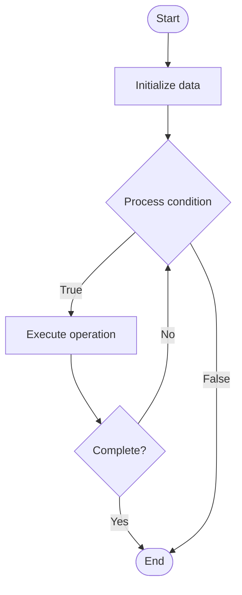

# Quantum Circuits

Name of Algorithm  

## Code Files


## Algorithm Visualization

### Flowchart (ASCII)


```
Quantum Circuits Flowchart:

┌─────────────┐
│   Start     │
└──────┬──────┘
       │
       ▼
┌─────────────┐
│  Initialize │
│   data      │
└──────┬──────┘
       │
       ▼
┌─────────────┐      Yes
│  Process   ├──────┐
│  condition?│      │
└──────┬──────┘      │
       │ No          │
       ▼             │
┌─────────────┐      │
│  Execute   │      │
│  operation │      │
└──────┬──────┘      │
       │             │
       └─────────────┘
       │
       ▼
┌─────────────┐
│    End      │
└─────────────┘
```


### Step-by-Step Execution


```
Quantum Circuits Step-by-Step Execution:

Input: [example data]

Step 1: Initialize
State: [initial state]

Step 2: Process
State: [intermediate state]

Step 3: Finalize
State: [final state]

Result: [output]
```


### Interactive Flowchart (Mermaid)





> **Note**: Mermaid diagrams are rendered automatically on GitHub. For local viewing, use a Mermaid-compatible Markdown viewer.
- [Python Implementation](/code/semester_12/lecture_80_quantum_computing_advanced/quantum_circuits/algorithm.py)
- [Java Implementation](/code/semester_12/lecture_80_quantum_computing_advanced/quantum_circuits/Algorithm.java)
- [Python Tests](/code/semester_12/lecture_80_quantum_computing_advanced/quantum_circuits/test_algorithm.py)


   Quantum Circuits

What problem does it solve? (1 sentence)  
   Designs and implements quantum circuits (sequences of quantum gates) to perform quantum computations, algorithms, and operations on qubits.

Intuition (plain-language explanation)  
   Like circuits for quantum: Quantum Circuits are like electrical circuits but for quantum information - you connect quantum gates (like logic gates) to process qubits - just as circuits process bits, quantum circuits process qubits using quantum gates.

Inputs & Outputs  
- Input: Quantum gates, qubits, circuit specifications, algorithm requirements, gate parameters.
   - Output: Quantum circuits, gate sequences, compiled circuits, optimized circuits, executable quantum programs.

Step-by-step description (5–10 lines max)  
Specify: specify quantum algorithm or operation.
Design: design quantum circuit structure.
Select: select appropriate quantum gates.
Compose: compose gates into circuit.
Optimize: optimize circuit (reduce gates, depth).
Compile: compile to target quantum hardware.
Validate: validate circuit correctness.
Execute: execute circuit on quantum computer.
Measure: measure quantum state.
Analyze: analyze results.

Tiny example (hand-simulated)  
   Quantum Circuits: algorithm: Grover's search → design: oracle + diffusion → gates: H, X, CNOT, Z → compose: build circuit → optimize: reduce gate count → compile: map to hardware → execute: run on quantum computer → result: search result found → Quantum Circuits successful.

Time & Space Complexity  
   - Time: O(d) where d is circuit depth (number of gate layers).  
   - Space: O(n) where n is number of qubits (quantum register size).

Strengths  
- Flexibility: enables implementation of any quantum algorithm.
- Composability: gates compose into complex circuits.
- Standardization: quantum gates provide standard operations.

Weaknesses / limitations  
- Noise: circuit depth affects error accumulation.
- Compilation: compilation to hardware can be complex.
- Optimization: circuit optimization is challenging.

Compare with alternatives  
    Alternatives: Ad-Hoc Operations, Fixed Algorithms, High-Level Languages, Quantum Compilers

30-second explanation (your own words)  
    Designs and implements quantum circuits (sequences of quantum gates) to perform quantum computations, algorithms, and operations on qubits.

*Sources: Adapted from standard university textbooks and Wikipedia summaries.*
