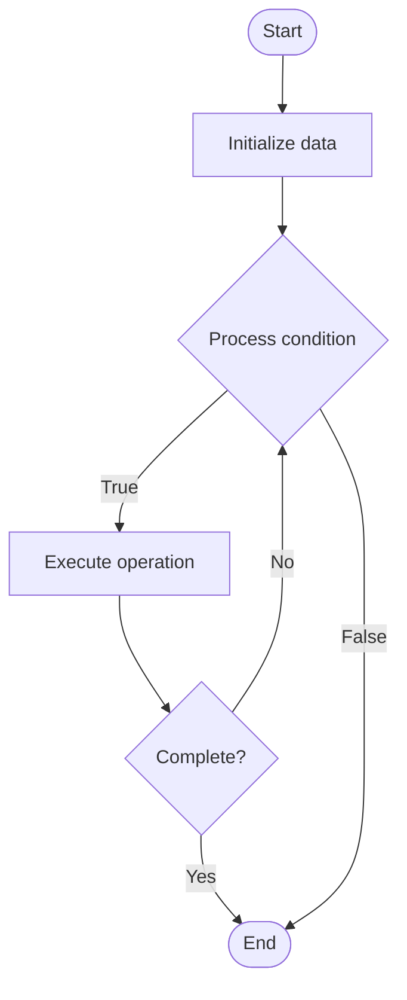

# Quantum Compilation

## Учебные материалы

- [Школьный уровень](school.ru.md)
- [Университетский уровень](univer.ru.md)

## Algorithm Visualization

### Flowchart (ASCII)

```
Quantum Compilation Flowchart:

┌─────────────┐
│   Start     │
└──────┬──────┘
       │
       ▼
┌─────────────┐
│  Initialize │
│   data      │
└──────┬──────┘
       │
       ▼
┌─────────────┐      Yes
│  Process   ├──────┐
│  condition?│      │
└──────┬──────┘      │
       │ No          │
       ▼             │
┌─────────────┐      │
│  Execute   │      │
│  operation │      │
└──────┬──────┘      │
       │             │
       └─────────────┘
       │
       ▼
┌─────────────┐
│    End      │
└─────────────┘
```

### Step-by-Step Execution

```
Quantum Compilation Step-by-Step Execution:

Input: [example data]

Step 1: Initialize
State: [initial state]

Step 2: Process
State: [intermediate state]

Step 3: Finalize
State: [final state]

Result: [output]
```

### Interactive Flowchart (Mermaid)



> **Note**: Mermaid diagrams are rendered automatically on GitHub. For local viewing, use a Mermaid-compatible Markdown viewer.

- [Python Implementation](/code/semester_12/lecture_80_quantum_computing_advanced/quantum_compilation/algorithm.py)
- [Java Implementation](/code/semester_12/lecture_80_quantum_computing_advanced/quantum_compilation/Algorithm.java)
- [Python Tests](/code/semester_12/lecture_80_quantum_computing_advanced/quantum_compilation/test_algorithm.py)

What problem does it solve? (1 sentence)  
   Compiles high-level quantum algorithms into optimized, hardware-specific quantum circuits that can be executed on quantum computers, optimizing for gate count, depth, and fidelity.

Intuition (plain-language explanation)  
Like compiling code: Quantum Compilation is like compiling high-level code to machine code - you take a quantum algorithm (high-level) and compile it to quantum gates (low-level) optimized for specific hardware - just as compilers optimize code, quantum compilers optimize quantum circuits.

Inputs & Outputs  

  - Input: High-level quantum algorithms, target hardware, gate sets, connectivity constraints, optimization goals.  
  - Output: Compiled circuits, optimized gate sequences, hardware-mapped circuits, reduced depth circuits, executable programs.

Step-by-step description (5–10 lines max)  
Parse: parse high-level quantum program.
Decompose: decompose into basic gates.
Optimize: optimize gate sequences.
Map: map to hardware topology.
Route: route qubits for connectivity.
Schedule: schedule gate execution.
Validate: validate compiled circuit.
Optimize: further optimize for target hardware.
Generate: generate executable circuit.
Verify: verify correctness.

Tiny example (hand-simulated)  
   Quantum Compilation: algorithm: Shor's algorithm → parse: high-level description → decompose: into CNOT, H, T gates → optimize: reduce gate count → map: to 2D grid topology → route: route qubits → result: optimized hardware circuit → Quantum Compilation successful.

Time & Space Complexity  

  - Time: O(n²·d) where n is qubits, d is depth (compilation optimization).  
  - Space: O(n + g) where n is qubits, g is gates (circuit representation).

Strengths  

- Optimization: optimizes circuits for performance.
- Hardware: adapts to hardware constraints.
- Abstraction: enables high-level quantum programming.

Weaknesses / limitations  

- Complexity: compilation can be complex.
- Optimality: optimal compilation is NP-hard.
- Hardware: must adapt to different hardware.

Compare with alternatives  
    Alternatives: Manual Circuit Design, Direct Gate Programming, Hardware-Specific, Template-Based

30-second explanation (your own words)  
    Compiles high-level quantum algorithms into optimized, hardware-specific quantum circuits that can be executed on quantum computers, optimizing for gate count, depth, and fidelity.

*Sources: Adapted from standard university textbooks and Wikipedia summaries.*
