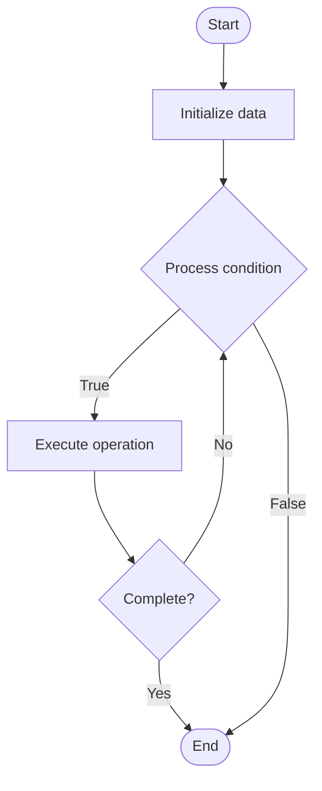

# Quantum Networking

Name of Algorithm  

## Code Files


## Algorithm Visualization

### Flowchart (ASCII)


```
Quantum Networking Flowchart:

┌─────────────┐
│   Start     │
└──────┬──────┘
       │
       ▼
┌─────────────┐
│  Initialize │
│   data      │
└──────┬──────┘
       │
       ▼
┌─────────────┐      Yes
│  Process   ├──────┐
│  condition?│      │
└──────┬──────┘      │
       │ No          │
       ▼             │
┌─────────────┐      │
│  Execute   │      │
│  operation │      │
└──────┬──────┘      │
       │             │
       └─────────────┘
       │
       ▼
┌─────────────┐
│    End      │
└─────────────┘
```


### Step-by-Step Execution


```
Quantum Networking Step-by-Step Execution:

Input: [example data]

Step 1: Initialize
State: [initial state]

Step 2: Process
State: [intermediate state]

Step 3: Finalize
State: [final state]

Result: [output]
```


### Interactive Flowchart (Mermaid)





> **Note**: Mermaid diagrams are rendered automatically on GitHub. For local viewing, use a Mermaid-compatible Markdown viewer.
- [Python Implementation](/code/semester_12/lecture_80_quantum_computing_advanced/quantum_networking/algorithm.py)
- [Java Implementation](/code/semester_12/lecture_80_quantum_computing_advanced/quantum_networking/Algorithm.java)
- [Python Tests](/code/semester_12/lecture_80_quantum_computing_advanced/quantum_networking/test_algorithm.py)


   Quantum Networking

What problem does it solve? (1 sentence)  
   Connects multiple quantum computers and quantum devices into quantum networks, enabling distributed quantum computing, quantum communication, and quantum internet.

Intuition (plain-language explanation)  
   Like internet for quantum: Quantum Networking is like the internet but for quantum computers - you connect quantum devices (like connecting computers) to share quantum information and compute together - just as the internet connects computers, quantum networks connect quantum computers.

Inputs & Outputs  
   - Input: Quantum nodes, quantum channels, entanglement distribution, quantum repeaters, network protocols.  
   - Output: Quantum networks, distributed quantum systems, quantum communication links, entangled states, network connectivity.

Step-by-step description (5–10 lines max)  
Deploy: deploy quantum nodes.
Connect: connect nodes with quantum channels.
Distribute: distribute entanglement between nodes.
Route: route quantum information through network.
Teleport: use quantum teleportation for communication.
Repeat: use quantum repeaters for long distances.
Protocol: implement quantum network protocols.
Secure: implement quantum cryptography.
Scale: scale network to more nodes.
Optimize: optimize network performance.

Tiny example (hand-simulated)  
   Quantum Networking: nodes: 3 quantum computers → connect: quantum channels → distribute: create entanglement → route: route qubits → teleport: teleport quantum states → result: distributed quantum computation → Quantum Networking operational.

Time & Space Complexity  
   - Time: O(d + r) where d is distance, r is routing time (network operations).  
   - Space: O(n) where n is number of nodes (network topology).

Strengths  
- Scalability: enables scaling beyond single quantum computer.
- Distribution: enables distributed quantum computing.
- Communication: enables quantum communication and internet.

Weaknesses / limitations  
- Distance: limited by quantum channel distance.
- Infrastructure: requires quantum network infrastructure.
- Complexity: quantum networking is complex.

Compare with alternatives  
    Alternatives: Single Quantum Computer, Classical Networking, Hybrid Networks, Quantum Repeaters

30-second explanation (your own words)  

*Sources: Adapted from standard university textbooks and Wikipedia summaries.*
