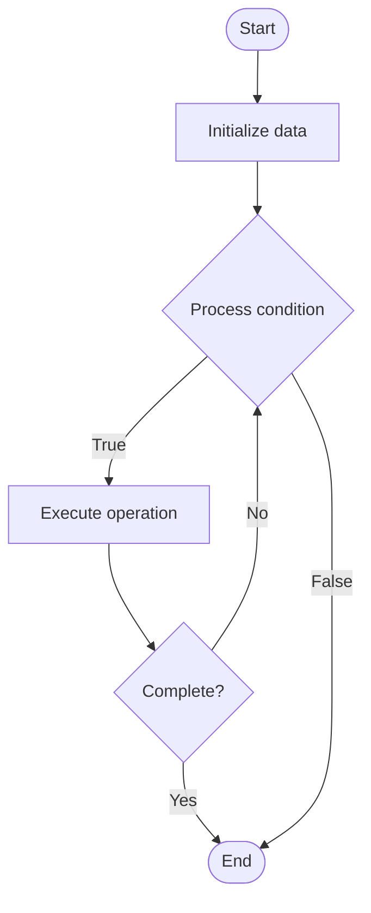

# Quantum Noise

Name of Algorithm  

## Code Files


## Algorithm Visualization

### Flowchart (ASCII)


```
Quantum Noise Flowchart:

┌─────────────┐
│   Start     │
└──────┬──────┘
       │
       ▼
┌─────────────┐
│  Initialize │
│   data      │
└──────┬──────┘
       │
       ▼
┌─────────────┐      Yes
│  Process   ├──────┐
│  condition?│      │
└──────┬──────┘      │
       │ No          │
       ▼             │
┌─────────────┐      │
│  Execute   │      │
│  operation │      │
└──────┬──────┘      │
       │             │
       └─────────────┘
       │
       ▼
┌─────────────┐
│    End      │
└─────────────┘
```


### Step-by-Step Execution


```
Quantum Noise Step-by-Step Execution:

Input: [example data]

Step 1: Initialize
State: [initial state]

Step 2: Process
State: [intermediate state]

Step 3: Finalize
State: [final state]

Result: [output]
```


### Interactive Flowchart (Mermaid)





> **Note**: Mermaid diagrams are rendered automatically on GitHub. For local viewing, use a Mermaid-compatible Markdown viewer.
- [Python Implementation](/code/semester_12/lecture_80_quantum_computing_advanced/quantum_noise/algorithm.py)
- [Java Implementation](/code/semester_12/lecture_80_quantum_computing_advanced/quantum_noise/Algorithm.java)
- [Python Tests](/code/semester_12/lecture_80_quantum_computing_advanced/quantum_noise/test_algorithm.py)


   Quantum Noise

What problem does it solve? (1 sentence)  
   Characterizes, models, and mitigates noise and errors in quantum systems caused by decoherence, gate errors, and environmental interactions that degrade quantum information.

Intuition (plain-language explanation)  
   Like noise in signals: Quantum Noise is like noise in signals but for quantum information - unwanted interactions (like static) corrupt quantum states - just as noise corrupts audio signals, quantum noise corrupts quantum information, and you need to understand and reduce it.

Inputs & Outputs  
   - Input: Quantum states, noise models, error rates, environmental parameters, gate fidelities, decoherence times.  
   - Output: Noise characterization, error models, noise mitigation strategies, error rates, decoherence parameters, mitigation results.

Step-by-step description (5–10 lines max)  
Characterize: characterize noise sources and types.
Model: model noise mathematically (Kraus operators, noise channels).
Measure: measure noise parameters (T1, T2, gate errors).
Analyze: analyze noise impact on quantum operations.
Mitigate: apply noise mitigation techniques.
Correct: use error correction to combat noise.
Optimize: optimize operations to reduce noise.
Monitor: continuously monitor noise levels.
Calibrate: calibrate gates to reduce errors.
Improve: improve system to reduce noise.

Tiny example (hand-simulated)  
   Quantum Noise: characterize: T1=100μs, T2=50μs, gate error=0.1% → model: depolarizing noise → measure: measure actual errors → analyze: noise limits circuit depth → mitigate: error correction → result: noise reduced, longer circuits possible → Quantum Noise mitigation successful.

Time & Space Complexity  
   - Time: O(m·n) where m is measurements, n is qubits (noise characterization).  
   - Space: O(n²) where n is qubits (noise model storage, density matrices).

Strengths  
- Understanding: enables understanding of quantum system limitations.
- Mitigation: enables noise mitigation strategies.
- Improvement: guides system improvements.

Weaknesses / limitations  
- Complexity: noise characterization is complex.
- Variability: noise varies over time and conditions.
- Limitation: noise Basically limits quantum computation.

Compare with alternatives  
    Alternatives: Ignore Noise, Error Correction Only, Noise-Free Systems, Error Mitigation

30-second explanation (your own words)  
    Characterizes, models, and mitigates noise and errors in quantum systems caused by decoherence, gate errors, and environmental interactions that degrade quantum information.

*Sources: Adapted from standard university textbooks and Wikipedia summaries.*
