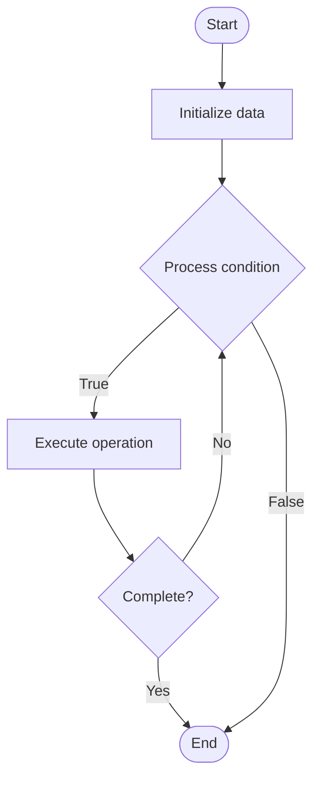

# Quantum AI

1. **Name of Algorithm**  

## Code Files


## Algorithm Visualization

### Flowchart (ASCII)


```
Quantum AI Flowchart:

┌─────────────┐
│   Start     │
└──────┬──────┘
       │
       ▼
┌─────────────┐
│  Initialize │
│   data      │
└──────┬──────┘
       │
       ▼
┌─────────────┐      Yes
│  Process   ├──────┐
│  condition?│      │
└──────┬──────┘      │
       │ No          │
       ▼             │
┌─────────────┐      │
│  Execute   │      │
│  operation │      │
└──────┬──────┘      │
       │             │
       └─────────────┘
       │
       ▼
┌─────────────┐
│    End      │
└─────────────┘
```


### Step-by-Step Execution


```
Quantum AI Step-by-Step Execution:

Input: [example data]

Step 1: Initialize
State: [initial state]

Step 2: Process
State: [intermediate state]

Step 3: Finalize
State: [final state]

Result: [output]
```


### Interactive Flowchart (Mermaid)





> **Note**: Mermaid diagrams are rendered automatically on GitHub. For local viewing, use a Mermaid-compatible Markdown viewer.
- [Python Implementation](semester_12/lecture_81_quantum_applications/quantum_ai/algorithm.py)
- [Java Implementation](semester_12/lecture_81_quantum_applications/quantum_ai/Algorithm.java)
- [Python Tests](semester_12/lecture_81_quantum_applications/quantum_ai/test_algorithm.py)


   Quantum AI

2. **What problem does it solve? (1 sentence)**  
   Combines quantum computing with artificial intelligence, using quantum algorithms to accelerate AI tasks like optimization, pattern recognition, and machine learning, potentially providing exponential speedups.

3. **Intuition (plain-language explanation)**  
   Like AI on quantum computers: Quantum AI runs AI algorithms on quantum computers - quantum properties (superposition, entanglement) can process information in ways classical computers can't, potentially making AI faster - just as quantum computers can solve some problems faster, quantum AI can train models or process data faster for certain problems.

4. **Inputs & Outputs**  
   - Input: AI tasks, quantum algorithms, training data, quantum models, optimization problems, quantum circuits.  
   - Output: Quantum AI models, quantum-accelerated solutions, optimized parameters, quantum learning results, enhanced AI capabilities.

5. **Step-by-step description (5–10 lines max)**  
1. Identify: identify AI tasks suitable for quantum acceleration.
2. Design: design quantum AI algorithms.
3. Encode: encode data into quantum states.
4. Train: train quantum models using quantum algorithms.
5. Optimize: optimize using quantum optimization.
6. Execute: execute on quantum computers.
7. Measure: measure quantum states for predictions.
8. Learn: learn from quantum-enhanced results.
9. Hybrid: combine quantum and classical AI.
10. Deploy: deploy quantum AI applications.

6. **Tiny example (hand-simulated)**  
   Quantum AI: task: portfolio optimization → encode: encode into quantum state → QAOA: use quantum optimization → train: optimize portfolio weights → execute: run on quantum computer → result: better portfolio than classical → Quantum AI successful.

7. **Time & Space Complexity**  
   - Time: O(p·m·k) where p is parameters, m is measurements, k is iterations (varies by application, potential speedup).  
   - Space: O(n) where n is number of qubits (quantum state space).

8. **Strengths**  
- Speedup: potential exponential speedup for certain AI tasks.
- Novel: enables new AI approaches using quantum properties.
- Optimization: quantum optimization can find better solutions.

9. **Weaknesses / limitations**  
- Early: field is still in early stages.
- Hardware: requires quantum hardware.
- Applications: speedups not guaranteed for all tasks.

10. **Compare with alternatives**  
    Alternatives: Classical AI, Hybrid Quantum-Classical AI, Quantum-Inspired, NISQ AI

11. **30-second explanation (your own words)**  
    Combines quantum computing with artificial intelligence, using quantum algorithms to accelerate AI tasks like optimization, pattern recognition, and machine learning, potentially providing exponential speedups.

*Sources: Adapted from standard university textbooks and Wikipedia summaries.*
