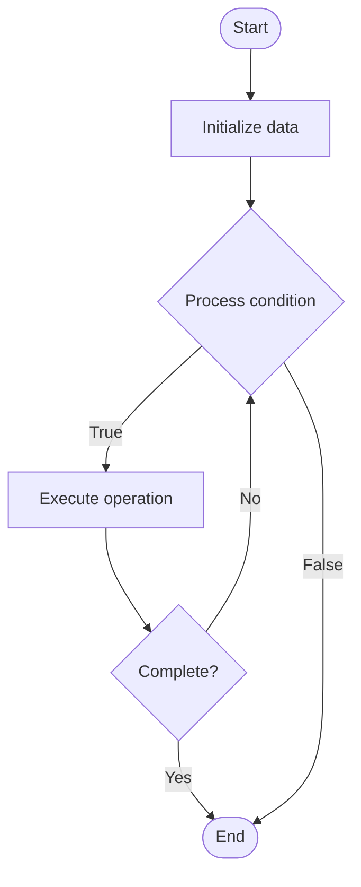

# Quantum Chemistry

Name of Algorithm  

## Code Files


## Algorithm Visualization

### Flowchart (ASCII)


```
Quantum Chemistry Flowchart:

┌─────────────┐
│   Start     │
└──────┬──────┘
       │
       ▼
┌─────────────┐
│  Initialize │
│   data      │
└──────┬──────┘
       │
       ▼
┌─────────────┐      Yes
│  Process   ├──────┐
│  condition?│      │
└──────┬──────┘      │
       │ No          │
       ▼             │
┌─────────────┐      │
│  Execute   │      │
│  operation │      │
└──────┬──────┘      │
       │             │
       └─────────────┘
       │
       ▼
┌─────────────┐
│    End      │
└─────────────┘
```


### Step-by-Step Execution


```
Quantum Chemistry Step-by-Step Execution:

Input: [example data]

Step 1: Initialize
State: [initial state]

Step 2: Process
State: [intermediate state]

Step 3: Finalize
State: [final state]

Result: [output]
```


### Interactive Flowchart (Mermaid)





> **Note**: Mermaid diagrams are rendered automatically on GitHub. For local viewing, use a Mermaid-compatible Markdown viewer.
- [Python Implementation](/code/semester_12/lecture_81_quantum_applications/quantum_chemistry/algorithm.py)
- [Java Implementation](/code/semester_12/lecture_81_quantum_applications/quantum_chemistry/Algorithm.java)
- [Python Tests](/code/semester_12/lecture_81_quantum_applications/quantum_chemistry/test_algorithm.py)


   Quantum Chemistry

What problem does it solve? (1 sentence)  
   Uses quantum computers to simulate molecular systems and solve quantum chemistry problems, enabling accurate calculation of molecular properties, reaction mechanisms, and material design.

Intuition (plain-language explanation)  
   Like simulating molecules with quantum: Quantum Chemistry uses quantum computers to simulate molecules - since molecules are quantum systems, quantum computers can simulate them naturally and accurately - just as you'd use a physics simulator to simulate physics, you use quantum computers to simulate quantum chemistry.

Inputs & Outputs  
   - Input: Molecular structures, quantum Hamiltonians, basis sets, initial states, simulation parameters.  
   - Output: Molecular energies, electronic structures, reaction pathways, material properties, quantum chemistry results.

Step-by-step description (5–10 lines max)  
Model: model molecular system (atoms, electrons).
Hamiltonian: construct molecular Hamiltonian.
Encode: encode Hamiltonian into qubits.
Prepare: prepare initial quantum state.
Evolve: evolve state using quantum gates.
Measure: measure molecular properties.
Extract: extract energies and observables.
Analyze: analyze electronic structure.
Optimize: optimize molecular geometry.
Validate: validate against experimental data.

Tiny example (hand-simulated)  
   Quantum Chemistry: molecule: H2O → Hamiltonian: construct molecular Hamiltonian → encode: map to qubits → evolve: simulate → measure: ground state energy → result: -76.4 Hartree (accurate) → Quantum Chemistry successful.

Time & Space Complexity  
   - Time: O(poly(n)·t) where n is system size, t is simulation time (exponential speedup over classical).  
   - Space: O(n) where n is number of qubits (logarithmic in system size).

Strengths  
- Accuracy: provides accurate quantum chemistry calculations.
- Speedup: exponential speedup for large molecules.
- Applications: enables drug discovery and material design.

Weaknesses / limitations  
- Noise: quantum noise affects accuracy.
- Scaling: scaling to large molecules is challenging.
- Hardware: requires quantum hardware.

Compare with alternatives  
    Alternatives: Classical Quantum Chemistry, DFT Methods, Hybrid Approaches, Quantum-Classical

30-second explanation (your own words)  
    Uses quantum computers to simulate molecular systems and solve quantum chemistry problems, enabling accurate calculation of molecular properties, reaction mechanisms, and material design.

*Sources: Adapted from standard university textbooks and Wikipedia summaries.*
