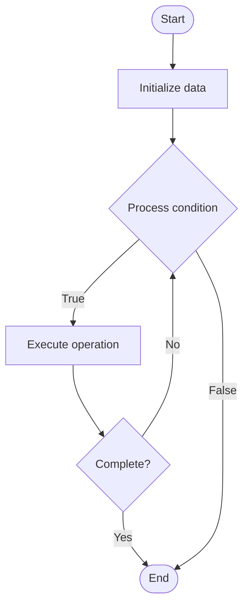

# Quantum Database

Name of Algorithm  

## Code Files


## Algorithm Visualization

### Flowchart (ASCII)


```
Quantum Database Flowchart:

┌─────────────┐
│   Start     │
└──────┬──────┘
       │
       ▼
┌─────────────┐
│  Initialize │
│   data      │
└──────┬──────┘
       │
       ▼
┌─────────────┐      Yes
│  Process   ├──────┐
│  condition?│      │
└──────┬──────┘      │
       │ No          │
       ▼             │
┌─────────────┐      │
│  Execute   │      │
│  operation │      │
└──────┬──────┘      │
       │             │
       └─────────────┘
       │
       ▼
┌─────────────┐
│    End      │
└─────────────┘
```


### Step-by-Step Execution


```
Quantum Database Step-by-Step Execution:

Input: [example data]

Step 1: Initialize
State: [initial state]

Step 2: Process
State: [intermediate state]

Step 3: Finalize
State: [final state]

Result: [output]
```


### Interactive Flowchart (Mermaid)





> **Note**: Mermaid diagrams are rendered automatically on GitHub. For local viewing, use a Mermaid-compatible Markdown viewer.
- [Python Implementation](/code/semester_12/lecture_81_quantum_applications/quantum_database/algorithm.py)
- [Java Implementation](/code/semester_12/lecture_81_quantum_applications/quantum_database/Algorithm.java)
- [Python Tests](/code/semester_12/lecture_81_quantum_applications/quantum_database/test_algorithm.py)


   Quantum Database

What problem does it solve? (1 sentence)  
   Uses quantum algorithms to accelerate database operations like search, query processing, and data retrieval, potentially providing speedups for certain database queries.

Intuition (plain-language explanation)  
   Like quantum search for databases: Quantum Database uses quantum algorithms to search databases faster - quantum superposition lets you search many records simultaneously, then amplify the correct result - just as quantum search finds items faster, quantum databases can find data faster.

Inputs & Outputs  
   - Input: Database queries, quantum algorithms, data, search criteria, quantum circuits.  
   - Output: Query results, retrieved data, search results, optimized queries, quantum-accelerated operations.

Step-by-step description (5–10 lines max)  
Encode: encode database into quantum format.
Query: formulate quantum query.
Search: use quantum search algorithm (Grover).
Execute: execute quantum circuit.
Measure: measure quantum state.
Extract: extract query results.
Decode: decode quantum results.
Validate: validate results.
Optimize: optimize quantum queries.
Return: return results.

Tiny example (hand-simulated)  
   Quantum Database: database: 1M records → query: find record with ID=12345 → encode: encode into qubits → search: Grover's algorithm → execute: run on quantum computer → result: found in √N time (vs N time) → Quantum Database successful.

Time & Space Complexity  
   - Time: O(√N) where N is database size (quadratic speedup for unstructured search).  
   - Space: O(log N) where N is database size (qubits needed).

Strengths  
- Speedup: potential speedup for certain queries.
- Search: efficient for unstructured search.
- Novel: enables new database approaches.

Weaknesses / limitations  
- Limited: speedups limited to specific query types.
- Hardware: requires quantum hardware.
- Encoding: encoding databases into quantum format is challenging.

Compare with alternatives  
    Alternatives: Classical Databases, Quantum-Inspired, Hybrid Approaches, Specialized Quantum

30-second explanation (your own words)  
    Uses quantum algorithms to accelerate database operations like search, query processing, and data retrieval, potentially providing speedups for certain database queries.

*Sources: Adapted from standard university textbooks and Wikipedia summaries.*
