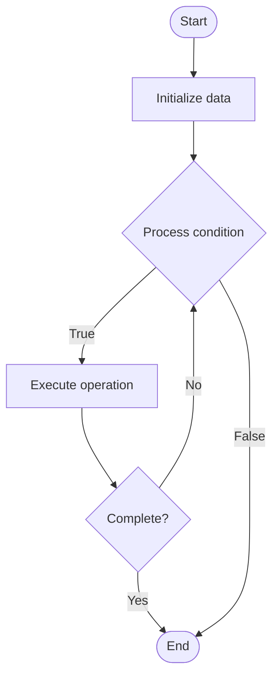

# Quantum Finance

Name of Algorithm  

## Code Files


## Algorithm Visualization

### Flowchart (ASCII)


```
Quantum Finance Flowchart:

┌─────────────┐
│   Start     │
└──────┬──────┘
       │
       ▼
┌─────────────┐
│  Initialize │
│   data      │
└──────┬──────┘
       │
       ▼
┌─────────────┐      Yes
│  Process   ├──────┐
│  condition?│      │
└──────┬──────┘      │
       │ No          │
       ▼             │
┌─────────────┐      │
│  Execute   │      │
│  operation │      │
└──────┬──────┘      │
       │             │
       └─────────────┘
       │
       ▼
┌─────────────┐
│    End      │
└─────────────┘
```


### Step-by-Step Execution


```
Quantum Finance Step-by-Step Execution:

Input: [example data]

Step 1: Initialize
State: [initial state]

Step 2: Process
State: [intermediate state]

Step 3: Finalize
State: [final state]

Result: [output]
```


### Interactive Flowchart (Mermaid)





> **Note**: Mermaid diagrams are rendered automatically on GitHub. For local viewing, use a Mermaid-compatible Markdown viewer.
- [Python Implementation](/code/semester_12/lecture_81_quantum_applications/quantum_finance/algorithm.py)
- [Java Implementation](/code/semester_12/lecture_81_quantum_applications/quantum_finance/Algorithm.java)
- [Python Tests](/code/semester_12/lecture_81_quantum_applications/quantum_finance/test_algorithm.py)


   Quantum Finance

What problem does it solve? (1 sentence)  
   Applies quantum computing to financial problems like portfolio optimization, risk analysis, option pricing, and fraud detection, potentially providing speedups for complex financial calculations.

Intuition (plain-language explanation)  
   Like quantum computing for finance: Quantum Finance uses quantum computers to solve financial problems faster - quantum algorithms can explore many investment combinations simultaneously (superposition) and find optimal portfolios - just as quantum search finds items faster, quantum finance finds optimal financial solutions faster.

Inputs & Outputs  
   - Input: Financial data, portfolio constraints, risk parameters, market models, optimization objectives.  
   - Output: Optimized portfolios, risk assessments, option prices, fraud detection results, financial predictions.

Step-by-step description (5–10 lines max)  
Formulate: formulate financial problem (portfolio optimization, pricing).
Encode: encode problem into quantum format.
Design: design quantum algorithm (QAOA, VQE).
Execute: execute on quantum computer.
Optimize: optimize parameters.
Measure: measure quantum state.
Extract: extract financial solution.
Analyze: analyze risk and returns.
Validate: validate against classical methods.
Deploy: deploy in financial systems.

Tiny example (hand-simulated)  
   Quantum Finance: problem: portfolio optimization → encode: QUBO formulation → QAOA: quantum optimization → execute: run on quantum computer → result: optimal portfolio with 15% better risk-return → Quantum Finance successful.

Time & Space Complexity  
   - Time: O(p·m·k) where p is parameters, m is measurements, k is layers (varies by problem).  
   - Space: O(n) where n is problem size (qubits needed).

Strengths  
- Speedup: potential speedup for complex financial problems.
- Optimization: can find better solutions than classical methods.
- Applications: applicable to many financial problems.

Weaknesses / limitations  
- Early: field is still in early stages.
- Hardware: requires quantum hardware.
- Validation: requires validation against classical methods.

Compare with alternatives  
    Alternatives: Classical Finance, Hybrid Approaches, Quantum-Inspired, Monte Carlo Methods

30-second explanation (your own words)  
    Applies quantum computing to financial problems like portfolio optimization, risk analysis, option pricing, and fraud detection, potentially providing speedups for complex financial calculations.

*Sources: Adapted from standard university textbooks and Wikipedia summaries.*
