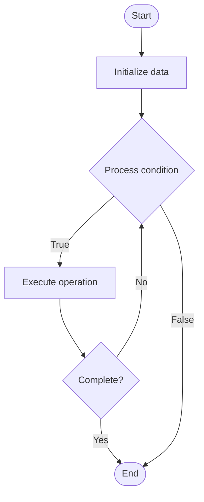

# Quantum Logistics

1. **Name of Algorithm**  

## Code Files


## Algorithm Visualization

### Flowchart (ASCII)


```
Quantum Logistics Flowchart:

┌─────────────┐
│   Start     │
└──────┬──────┘
       │
       ▼
┌─────────────┐
│  Initialize │
│   data      │
└──────┬──────┘
       │
       ▼
┌─────────────┐      Yes
│  Process   ├──────┐
│  condition?│      │
└──────┬──────┘      │
       │ No          │
       ▼             │
┌─────────────┐      │
│  Execute   │      │
│  operation │      │
└──────┬──────┘      │
       │             │
       └─────────────┘
       │
       ▼
┌─────────────┐
│    End      │
└─────────────┘
```


### Step-by-Step Execution


```
Quantum Logistics Step-by-Step Execution:

Input: [example data]

Step 1: Initialize
State: [initial state]

Step 2: Process
State: [intermediate state]

Step 3: Finalize
State: [final state]

Result: [output]
```


### Interactive Flowchart (Mermaid)





> **Note**: Mermaid diagrams are rendered automatically on GitHub. For local viewing, use a Mermaid-compatible Markdown viewer.
- [Python Implementation](semester_12/lecture_81_quantum_applications/quantum_logistics/algorithm.py)
- [Java Implementation](semester_12/lecture_81_quantum_applications/quantum_logistics/Algorithm.java)
- [Python Tests](semester_12/lecture_81_quantum_applications/quantum_logistics/test_algorithm.py)


   Quantum Logistics

2. **What problem does it solve? (1 sentence)**  
   Uses quantum computing to solve logistics and supply chain optimization problems like vehicle routing, warehouse optimization, and delivery scheduling, finding better solutions faster than classical methods.

3. **Intuition (plain-language explanation)**  
Like quantum optimization for logistics: Quantum Logistics uses quantum computers to optimize logistics - quantum algorithms can explore many routing and scheduling combinations simultaneously and find optimal solutions - just as quantum optimization finds best solutions, quantum logistics finds best logistics plans.

4. **Inputs & Outputs**  
   - Input: Logistics constraints, delivery locations, vehicle capacities, time windows, cost parameters.  
   - Output: Optimized routes, delivery schedules, warehouse layouts, cost reductions, logistics plans.

5. **Step-by-step description (5–10 lines max)**  
1. Model: model logistics problem (TSP, VRP).
2. Encode: encode into optimization problem.
3. Design: design quantum optimization algorithm.
4. Execute: execute on quantum computer.
5. Optimize: optimize for cost and time.
6. Measure: measure quantum solution.
7. Extract: extract optimal routes.
8. Validate: validate solution feasibility.
9. Deploy: deploy in logistics systems.
10. Monitor: monitor performance.

6. **Tiny example (hand-simulated)**  
   Quantum Logistics: problem: vehicle routing → encode: TSP formulation → QAOA: quantum optimization → execute: run on quantum computer → result: 20% cost reduction, faster delivery → Quantum Logistics successful.

7. **Time & Space Complexity**  
   - Time: O(p·m·k) where p is parameters, m is measurements, k is layers (varies by problem size).  
   - Space: O(n) where n is number of locations (qubits needed).

8. **Strengths**  
- Optimization: can find better logistics solutions.
- Speedup: potential speedup for large problems.
- Cost: can reduce logistics costs significantly.

9. **Weaknesses / limitations**  
- Scaling: scaling to very large problems is challenging.
- Hardware: requires quantum hardware.
- Integration: requires integration with logistics systems.

10. **Compare with alternatives**  
    Alternatives: Classical Optimization, Heuristic Methods, Hybrid Approaches, Quantum-Inspired

11. **30-second explanation (your own words)**  
    Uses quantum computing to solve logistics and supply chain optimization problems like vehicle routing, warehouse optimization, and delivery scheduling, finding better solutions faster than classical methods.

*Sources: Adapted from standard university textbooks and Wikipedia summaries.*
