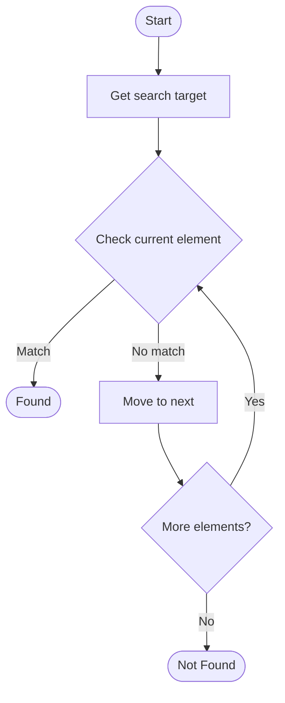

# Quantum Search (Grover's Algorithm)

Name of Algorithm  

## Code Files


## Algorithm Visualization

### Flowchart (ASCII)


```
Quantum Search (Grover's Algorithm) Flowchart:

┌─────────────┐
│   Start     │
└──────┬──────┘
       │
       ▼
┌─────────────┐
│  Get search │
│    target   │
└──────┬──────┘
       │
       ▼
┌─────────────┐      Yes
│  Check     ├──────┐
│  current   │      │
│  element?  │      │
└──────┬──────┘      │
       │ No          │
       ▼             │
┌─────────────┐      │
│   Move to   │      │
│   next      │      │
└──────┬──────┘      │
       │             │
       └─────────────┘
       │
       ▼
┌─────────────┐
│   Found?    │
└──────┬──────┘
       │
       ▼
┌─────────────┐
│    End      │
└─────────────┘
```


### Step-by-Step Execution


```
Quantum Search (Grover's Algorithm) Step-by-Step Execution:

Array: [1, 3, 5, 7, 9, 11]
Target: 7

Step 1: Check middle (index 2, value 5)
[1, 3, 5, 7, 9, 11]
         ↑
5 < 7, search right

Step 2: Check middle of right half (index 4, value 9)
[7, 9, 11]
    ↑
9 > 7, search left

Step 3: Check remaining (index 3, value 7)
[7]
 ↑
Found! Index 3
```


### Interactive Flowchart (Mermaid)





> **Note**: Mermaid diagrams are rendered automatically on GitHub. For local viewing, use a Mermaid-compatible Markdown viewer.
- [Python Implementation](/code/semester_12/lecture_81_quantum_applications/quantum_search/algorithm.py)
- [Java Implementation](/code/semester_12/lecture_81_quantum_applications/quantum_search/Algorithm.java)
- [Python Tests](/code/semester_12/lecture_81_quantum_applications/quantum_search/test_algorithm.py)


Quantum Search (Grover's Algorithm)

What problem does it solve? (1 sentence)  
   Searches an unsorted database of N items in O(√N) time using Grover's algorithm, providing quadratic speedup over classical search algorithms that require O(N) time.

Intuition (plain-language explanation)  
Like quantum search: Quantum Search is like searching a phone book with quantum powers - instead of checking each entry one by one (classical), quantum superposition lets you check many entries at once, then amplify the correct one - just as quantum search finds items faster, Grover's algorithm finds items in a database faster.

Inputs & Outputs  
   - Input: Unsorted database, search criteria, oracle function, number of items N.  
   - Output: Found item, search result, index of target, quantum state.

Step-by-step description (5–10 lines max)  
Initialize: initialize quantum register in superposition.
Oracle: apply oracle that marks target item.
Amplify: apply Grover diffusion operator.
Repeat: repeat oracle and diffusion √N times.
Measure: measure quantum register.
Extract: extract found item index.
Verify: verify result is correct.
Iterate: iterate if needed.
Optimize: optimize number of iterations.
Complete: search complete.

Tiny example (hand-simulated)  
   Quantum Search: database: 1 million items → initialize: superposition of all items → oracle: mark target → amplify: Grover diffusion → repeat: ~1000 iterations (√N) → measure: find target → result: found in √N time vs N time → Quantum Search successful.

Time & Space Complexity  
   - Time: O(√N) where N is database size (quadratic speedup over classical O(N)).  
   - Space: O(log N) where N is database size (qubits needed).

Strengths  
- Speedup: quadratic speedup over classical search.
- Optimal: optimal for unstructured search.
- General: applicable to many search problems.

Weaknesses / limitations  
- Oracle: requires efficient oracle implementation.
- Amplitude: requires exact number of iterations.
- Noise: quantum noise affects success probability.

Compare with alternatives  
    Alternatives: Classical Search, Hash Tables, Sorted Search, Quantum-Inspired

30-second explanation (your own words)  
    Searches an unsorted database of N items in O(√N) time using Grover's algorithm, providing quadratic speedup over classical search algorithms that require O(N) time.

*Sources: Adapted from standard university textbooks and Wikipedia summaries.*
