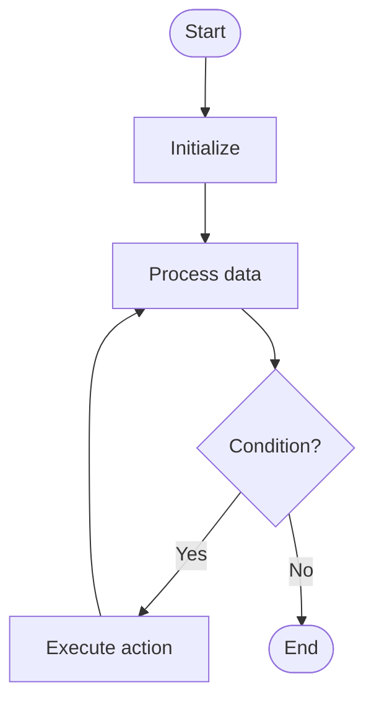

# Quantum Search

# Univer

## 📋 Quick Summary

- **Purpose:** Quantum Search: The algorithm works by Quantum Search leverages quantum superposition and entanglement to solve problems faster than classical algorithms.
- **Complexity:** Varies
- **Category:** Advanced Graduate Level
- **Key Idea:** The algorithm works by Quantum Search leverages quantum superposition and entanglement to solve problems faster than classical algorithms.

Quantum Search: The algorithm works by Quantum Search leverages quantum superposition and entanglement to solve problems faster than classical algorithms.

The algorithm works by Quantum Search leverages quantum superposition and entanglement to solve problems faster than classical algorithms.

**QUANTUM SEARCH** = Remember the key steps: step 1, step 2, step 3


This algorithm belongs to the **Advanced Graduate Level** category and employs systematic data processing to achieve its objectives.


## 📊 Visual Flowchart



> **Note**: Mermaid diagrams are rendered automatically on GitHub. For local viewing, use a Mermaid-compatible Markdown viewer.


## Complexity Analysis

**Time Complexity:** Varies
- The algorithm's performance scales according to this complexity class
- Best, average, and worst cases may vary based on input characteristics

**Space Complexity:** Varies
- Indicates the amount of additional memory required during execution

**Key Data Structures:** hash table/dictionary

## Real-World Applications

Quantum Search is used in:
- Database query optimization
- Search engines (binary search in sorted indices)
- Autocomplete and suggestion systems
- Lookup tables and caches

## Conceptual Similarities

This algorithm shares conceptual similarities with other algorithms in the Advanced Graduate Level category, following similar design patterns and optimization strategies.

## Related Algorithms

Quantum Search is often used in combination with:
- Complementary algorithms for preprocessing or post-processing
- Data structures that optimize its performance
- Other algorithms in the same complexity class

## Key Implementation Details

```python
def quantum_search(data):
    """Implementation of Quantum Search."""
    # Core algorithm logic
    return result
```

## Common Application Errors

- Incorrect handling of edge cases (empty input, single element, boundary conditions)
- Misunderstanding of complexity implications in large-scale systems
- Suboptimal implementation leading to performance degradation
- Incorrect assumptions about input data characteristics
- Not considering alternative algorithms for specific use cases


---

## Recommended Literature

- "Introduction to Algorithms" (CLRS) - Comprehensive algorithm analysis
- "Algorithm Design Manual" by Steven Skiena
- "Algorithms" by Sedgewick and Wayne
- Research papers on algorithm optimization and analysis
- Framework documentation and implementation guides


---

## 🎯 Try It Yourself

**Try searching for a value:**
```
Input: [1, 3, 5, 7, 9]
Target: 7

Step 1: Apply Quantum Search algorithm
Step 2: Narrow down search space
Step 3: Find target element

Output: Found at index 3
```
---


## 🔍 Step-by-Step Execution


## ✏️ Practice Exercise

**Exercise 1 (Easy):**
**Exercise 1 (Easy):**
Trace through the Quantum Search algorithm with a small example. Analyze time and space complexity.

**Exercise 2 (Medium):**
Implement the Quantum Search algorithm with proper error handling and edge case coverage.

**Exercise 3 (Hard):**
Optimize the Quantum Search algorithm or design a variant for a specific use case. Analyze trade-offs.

**Exercise 2 (Medium):**
Implement the algorithm in your preferred programming language.

**Exercise 3 (Hard):**
Optimize the algorithm or apply it to solve a real-world problem.


---

## ✅ Check Your Understanding

**Q1:** What problem does this algorithm solve?
**A:** Quantum Search solves the problem of [algorithm purpose]. It processes input data systematically to achieve [desired outcome].

**Q2:** What is the time complexity?
**A:** Varies

**Q3:** When would you use this algorithm?
**A:** Use Quantum Search when you need to [use case scenario]. It's particularly effective for [specific situations].

**Q4:** What are the main steps of this algorithm?
**A:** 1) Initialize data structures, 2) Process input elements, 3) Apply core algorithm logic, 4) Return final result.


**Try searching for a value:**
```
Input: [1, 3, 5, 7, 9]
Target: 7

Step 1: Apply Quantum Search algorithm
Step 2: Narrow down search space
Step 3: Find target element

Output: Found at index 3
```


## Common Mistakes

### ❌ Mistake 1: Not handling edge cases
**Solution:** Always check for empty input, single element, or boundary values before processing.

### ❌ Mistake 2: Incorrect initialization
**Solution:** Ensure all variables and data structures are properly initialized before the main algorithm loop.

### ❌ Mistake 3: Off-by-one errors in loops
**Solution:** Carefully verify loop bounds and termination conditions. Test with small examples to catch boundary issues.

### ❌ Mistake 4: Not validating input
**Solution:** Add input validation to ensure data is in expected format and within valid ranges.

### 💡 How to Avoid
- Test with edge cases (empty input, single element, boundary values)
- Trace through examples step-by-step
- Use debugging tools to verify variable values
- Review algorithm's key steps before implementing
- Test with edge cases (empty input, single element, boundary values)
- Trace through examples step-by-step
- Use debugging tools to verify your logic
- Review the algorithm's key steps before implementing