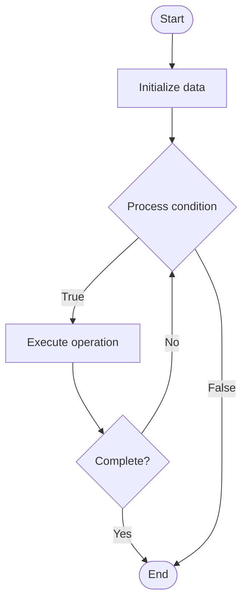

# Quantum-Classical Hybrid Algorithms

## Учебные материалы

- [Школьный уровень](school.ru.md)
- [Университетский уровень](univer.ru.md)

## Algorithm Visualization

### Flowchart (ASCII)

```
Quantum-Classical Hybrid Algorithms Flowchart:

┌─────────────┐
│   Start     │
└──────┬──────┘
       │
       ▼
┌─────────────┐
│  Initialize │
│   data      │
└──────┬──────┘
       │
       ▼
┌─────────────┐      Yes
│  Process   ├──────┐
│  condition?│      │
└──────┬──────┘      │
       │ No          │
       ▼             │
┌─────────────┐      │
│  Execute   │      │
│  operation │      │
└──────┬──────┘      │
       │             │
       └─────────────┘
       │
       ▼
┌─────────────┐
│    End      │
└─────────────┘
```

### Step-by-Step Execution

```
Quantum-Classical Hybrid Algorithms Step-by-Step Execution:

Input: [example data]

Step 1: Initialize
State: [initial state]

Step 2: Process
State: [intermediate state]

Step 3: Finalize
State: [final state]

Result: [output]
```

### Interactive Flowchart (Mermaid)



> **Note**: Mermaid diagrams are rendered automatically on GitHub. For local viewing, use a Mermaid-compatible Markdown viewer.

- [Python Implementation](/code/semester_12/lecture_82_hybrid_quantum/quantum_classical_hybrid/algorithm.py)
- [Java Implementation](/code/semester_12/lecture_82_hybrid_quantum/quantum_classical_hybrid/Algorithm.java)
- [Python Tests](/code/semester_12/lecture_82_hybrid_quantum/quantum_classical_hybrid/test_algorithm.py)

   Quantum-Classical Hybrid Algorithms

What problem does it solve? (1 sentence)  
   Combines quantum and classical computing resources to solve problems that leverage quantum advantages (superposition, entanglement) while using classical computers for optimization, error correction, and control.

Intuition (plain-language explanation)  
   Like a hybrid car: Quantum-classical hybrid algorithms are like hybrid cars that use both electric (quantum) and gas (classical) power - quantum computers handle parts that benefit from quantum mechanics (exploring many possibilities at once), while classical computers handle optimization, control, and error correction - together they're more powerful than either alone.

Inputs & Outputs  

- Input: Problem specification, quantum device, classical computer, hybrid algorithm parameters, optimization strategy.
- Output: Hybrid solution, optimized parameters, performance metrics, resource usage statistics.

Step-by-step description (5–10 lines max)  
Decompose: decompose problem into quantum and classical parts.
Quantum: identify parts that benefit from quantum computation.
Classical: identify parts best handled classically.
Design: design hybrid algorithm architecture.
Implement: implement quantum and classical components.
Interface: create interface between quantum and classical parts.
Execute: execute hybrid algorithm (alternate quantum/classical).
Optimize: optimize parameters using classical methods.
Iterate: iterate between quantum and classical steps.
Converge: converge to solution using hybrid approach.

Tiny example (hand-simulated)  
   VQE: quantum part computes energy expectation → classical part optimizes parameters → quantum part recomputes with new parameters → classical part evaluates → iterate → converge → hybrid VQE successful.

Time & Space Complexity  

  - Time: O(i * (q + c)) where i is iterations, q is quantum time, c is classical time (hybrid complexity).  
  - Space: O(n + m) where n is quantum qubits, m is classical memory (hybrid space).

Strengths  

- Advantages: leverages strengths of both quantum and classical.
- Practical: works with current quantum hardware limitations.
- Flexible: adaptable to various problem types.

Weaknesses / limitations  

- Complexity: requires expertise in both quantum and classical computing.
- Communication: quantum-classical communication overhead.
- Optimization: classical optimization can be bottleneck.

Compare with alternatives  
    Alternatives: Pure Quantum Algorithms, Pure Classical Algorithms, Quantum Simulators, Quantum Cloud Services

30-second explanation (your own words)  
    Algorithms that strategically combine quantum and classical computing to solve problems by leveraging quantum advantages while using classical resources for optimization and control.

*Sources: Adapted from standard university textbooks and Wikipedia summaries.*
